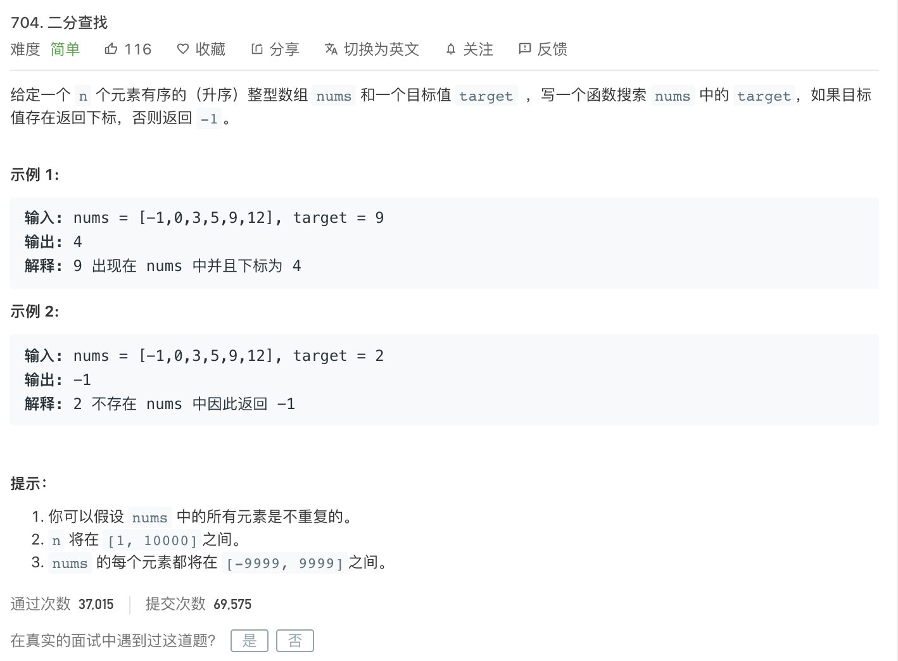

<br>

<br>

参见:

[二分查找](http://www.dashen.tech/2015/03/23/%E4%BA%8C%E5%88%86%E6%9F%A5%E6%89%BE/)

> 90%以上的程序员无法正确无误地写出二分查找代码。---- Jon Bentley  [Programming Pearls]


[704. 二分查找](https://leetcode-cn.com/problems/binary-search/)

难度:  <font color="green">**简单**</font>





<br>

---


<br>

```go
func binarySearch(nums []int, target int) int {
	low := 0
	high := len(nums) - 1
	for low <= high {
		middle := low + (high-low)/2
		midValue := nums[middle]
		if midValue == target {
			return middle
		} else if midValue > target {
			high = middle - 1
		} else {
			low = middle + 1
		}
	}
	return -1
}
```
