 

&此题为 **高频面试题-基本计算器** 类型的典型 &

[772. 基本计算器III]()

难度:  **困难**

 

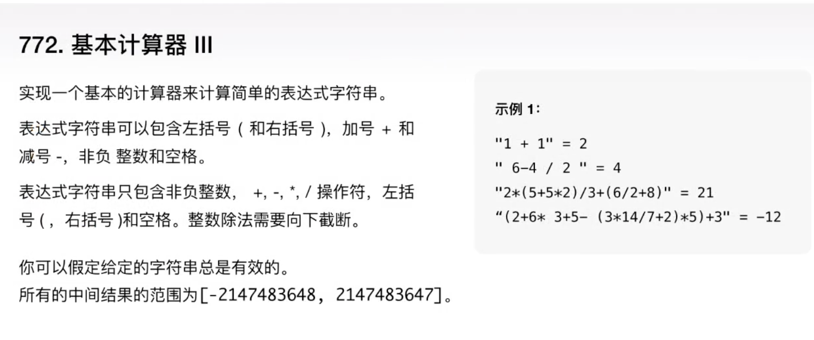

---

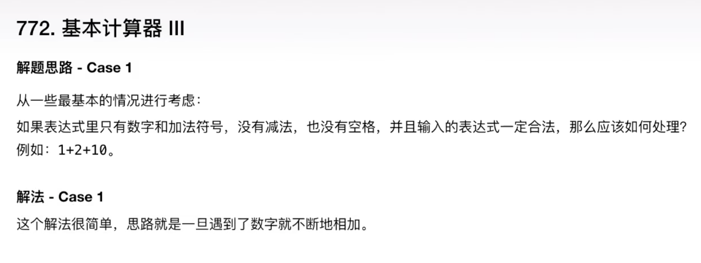
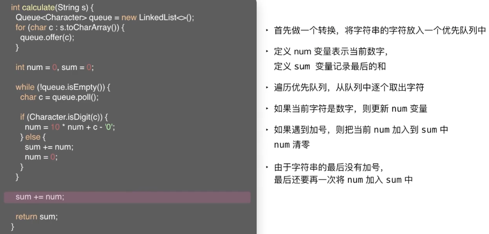

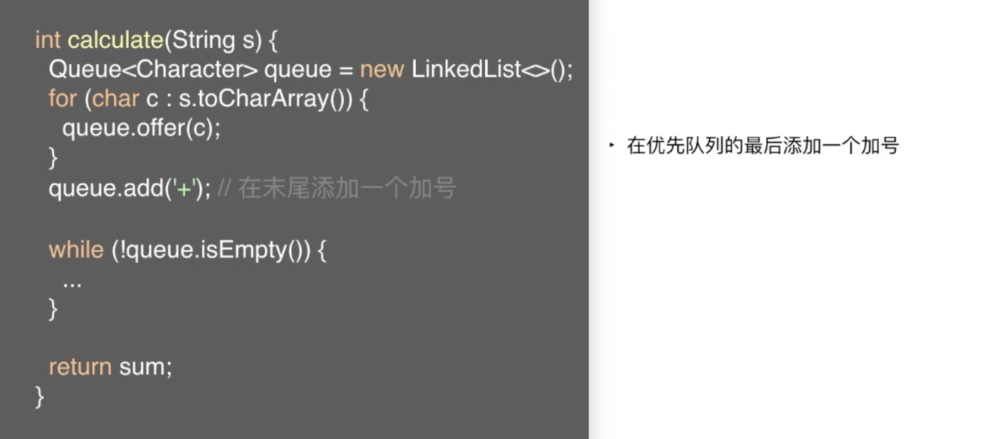

**升级一下:支持减法**

1. 借助两个stack

2. 将减号看做是加"负数"

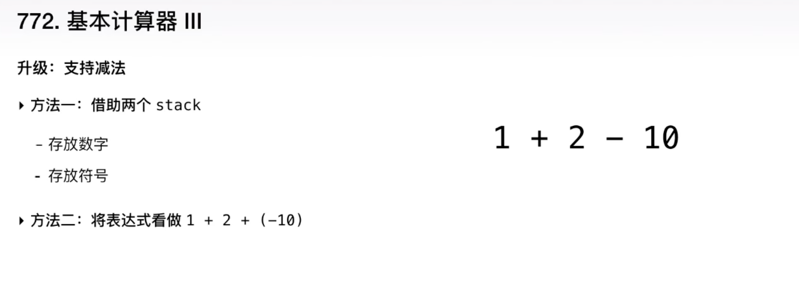
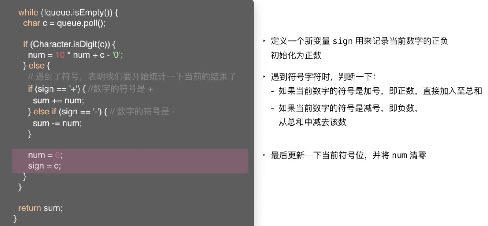

 

**继续升级:支持乘法和除法**

- 需要考虑符号的优先级

最开始堆栈为空

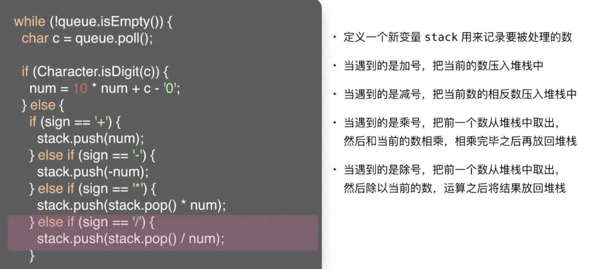
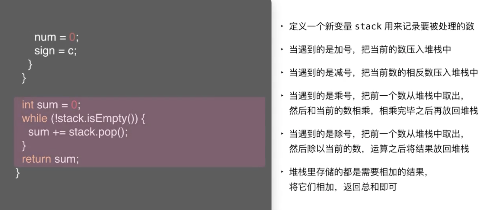

 

**继续升级:支持小括号**

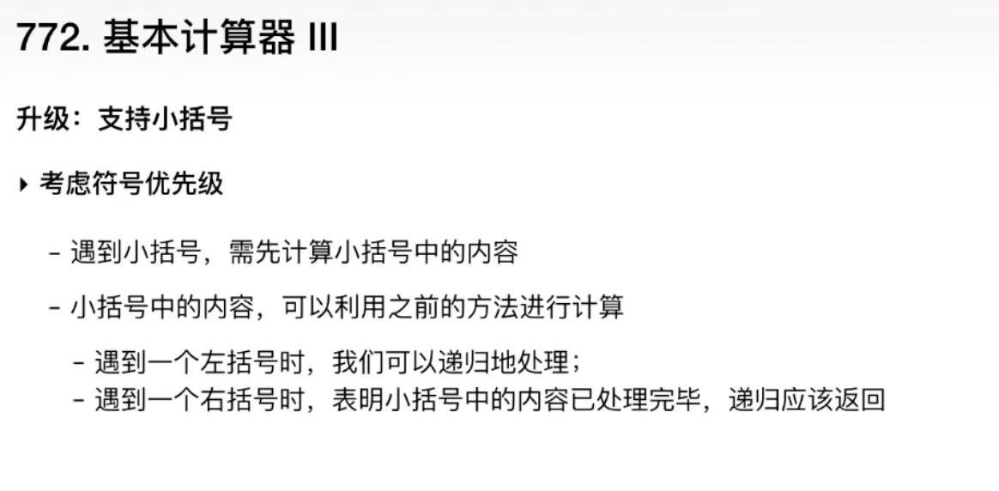

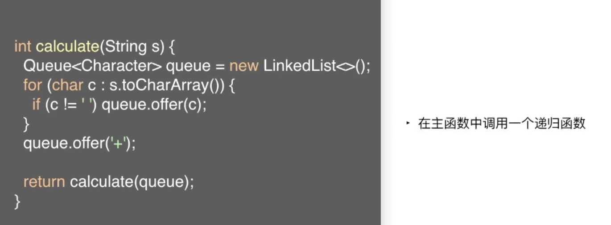
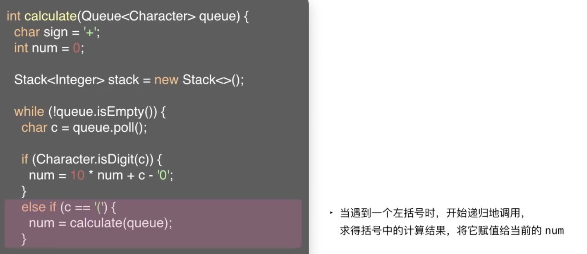
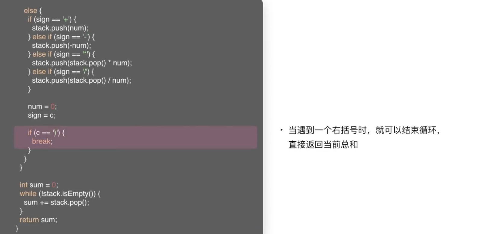

