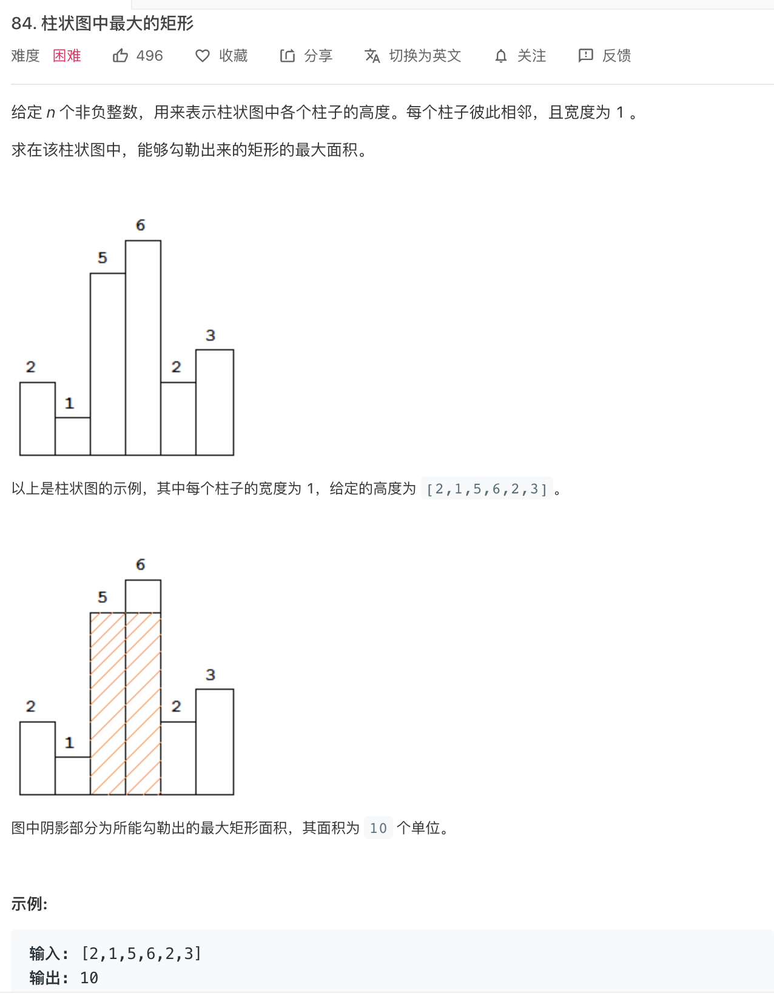
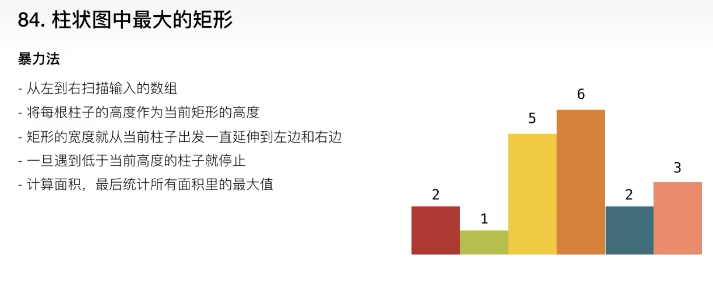
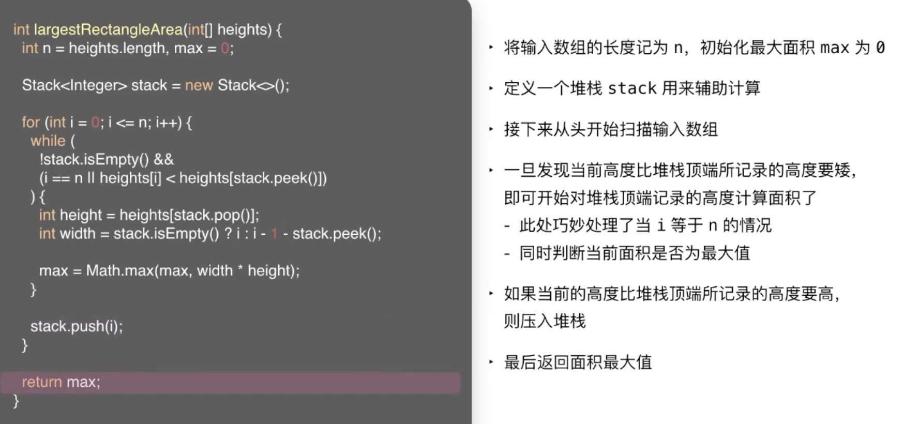
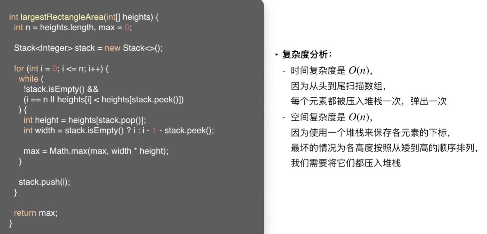

 

&此题为 **难题-柱状图中最大的矩形** 类型的典型 &

[84. 柱状图中最大的矩形](https://leetcode-cn.com/problems/largest-rectangle-in-histogram/)

难度:  **困难**

 

---

   

### 暴力法:

 

时间复杂度为O(n的平方);

---

当遇到一个下降的高度时,就可以开始计算

遇到一个上升的高度,不着急计算

**复杂度分析:**

