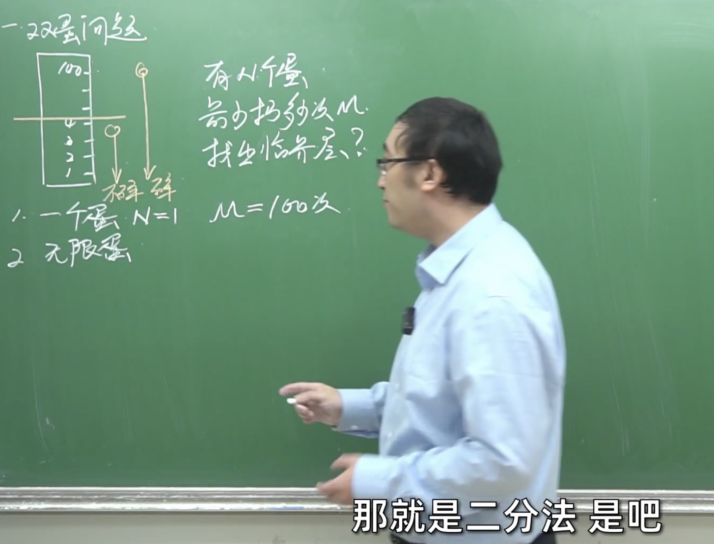

 

[887. 鸡蛋掉落](https://leetcode-cn.com/problems/super-egg-drop/)

难度:  **困难**

参考:

[复工复产找工作？先来看看这道面试题：双蛋问题](https://www.bilibili.com/video/BV1KE41137PK)

 

---

 

 

从第12分钟开始

 

### *递归和动态规划的关系*

 

[看动画轻松理解「递归」与「动态规划」](https://juejin.im/post/5c2308abf265da615304ce41)

在[递归、分治策略、动态规划以及贪心算法之间的关系](https://blog.csdn.net/tyhj_sf/article/details/53969072)一文中提到, 斐波那契数列,如果用"纯递归解法", 因为时间复杂度为指数,超过40就计算量就会非常大,但用"动态规划"则可以优化时间复杂度为O(n)

但凡DP，一定有递推关系，否则递推关系都没有就更别说什么子问题重复计算了。

**动态规划用于解决 子问题有重复求解 的情况，既可以用递归实现，也可以用迭代实现(for循环的形式)；**

理论上讲，任何递归写法的程序都可以改为for循环实现。

首先，"递归" 不是一种算法，而是一种编程写法。

递归是实现手段,动态规划则是解决问题的思想

[动态规划本质是不是就是递归算法，再加上记忆功能呢？](https://www.zhihu.com/question/323076638)

[递归和动态规划](https://wdxtub.com/interview/14520597062776.html)

[理解递归与动态规划--从 Fibonacci 函数的四种实现聊起](https://www.infoq.cn/article/ESQdKZE72vT17Hm5spBA)