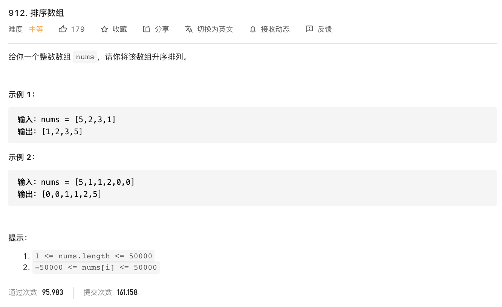

[912. 排序数组](https://leetcode-cn.com/problems/sort-an-array/)

难度:  <font color="orange">**中等**</font>





<br>


---


<br>

非常简单,排序,且没有要求时间复杂度,可以有10+种写法...

祭出快速排序


```go

func sortArray(nums []int) []int {
    quicksort(nums,0,len(nums)-1)
    return nums
}

func quicksort(nums []int, lo,hi int) {
    if lo >= hi {
        return
    }
    p := partition(nums,lo,hi)
    quicksort(nums,lo,p-1)
    quicksort(nums,p+1,hi)
}

func partition(nums []int,lo,hi int) int {
    pivot := nums[hi]
    i := lo-1
    for j:=lo;j<hi;j++ {

        //一进循环就是一个判断,不满足直接下一次循环
        if nums[j] < pivot  { //满足的条件是当前元素的值要小于枢轴值
            i++
            nums[i],nums[j] = nums[j],nums[i]
        }
    }
    //注意,这个swap是在循环之外!
    nums[i+1],nums[hi] = nums[hi],nums[i+1]
    return i+1
}

```


