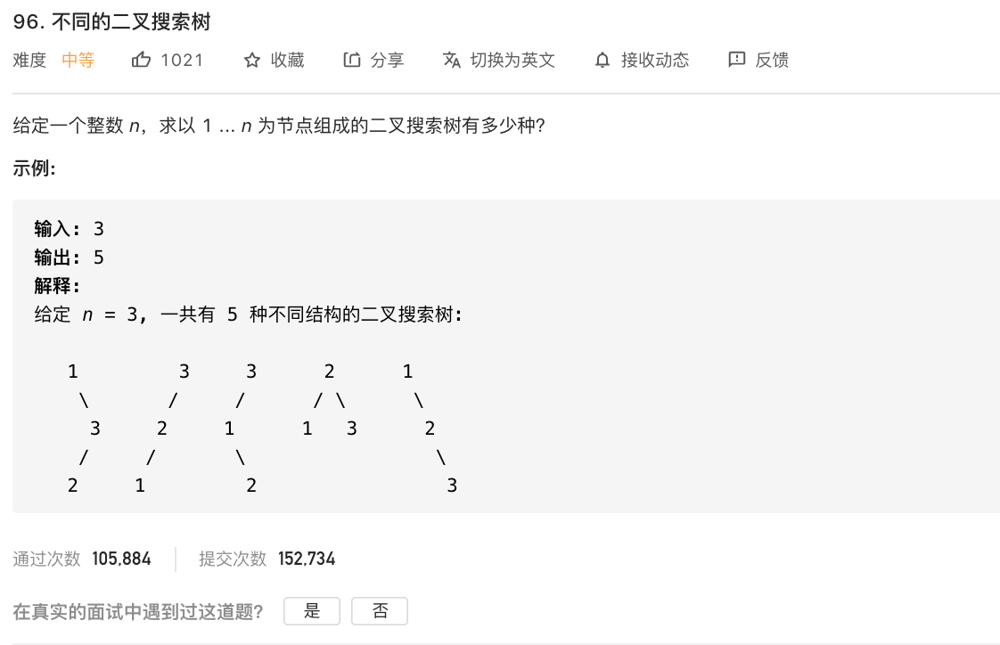

[96. 不同的二叉搜索树](https://leetcode-cn.com/problems/unique-binary-search-trees/)

难度:  <font color="orange">**中等**</font>




<br>


---

<br>


参考 [卡特兰数](https://dashen.tech/2021/02/28/%E5%8D%A1%E7%89%B9%E5%85%B0%E6%95%B0/)


```go
package main

import "fmt"

func main() {

	for i := 0; i <= 40; i++ {
		fmt.Printf("第%d个卡特兰数为:%d\n", i, numTrees(i))
	}

}
func numTrees(n int) int {

	rs := 1
	for i := 0; i < n; i++ {
		rs = rs * 2 * (2*i + 1) / (i + 2)
	}
	return rs
}

```

<br>


```rs
第0个卡特兰数为:1
第1个卡特兰数为:1
第2个卡特兰数为:2
第3个卡特兰数为:5
第4个卡特兰数为:14
第5个卡特兰数为:42
第6个卡特兰数为:132
第7个卡特兰数为:429
第8个卡特兰数为:1430
第9个卡特兰数为:4862
第10个卡特兰数为:16796
第11个卡特兰数为:58786
第12个卡特兰数为:208012
第13个卡特兰数为:742900
第14个卡特兰数为:2674440
第15个卡特兰数为:9694845
第16个卡特兰数为:35357670
第17个卡特兰数为:129644790
第18个卡特兰数为:477638700
第19个卡特兰数为:1767263190
第20个卡特兰数为:6564120420
第21个卡特兰数为:24466267020
第22个卡特兰数为:91482563640
第23个卡特兰数为:343059613650
第24个卡特兰数为:1289904147324
第25个卡特兰数为:4861946401452
第26个卡特兰数为:18367353072152
第27个卡特兰数为:69533550916004
第28个卡特兰数为:263747951750360
第29个卡特兰数为:1002242216651368
第30个卡特兰数为:3814986502092304
第31个卡特兰数为:14544636039226909
第32个卡特兰数为:55534064877048198
第33个卡特兰数为:212336130412243110
第34个卡特兰数为:-241155619205100756
第35个卡特兰数为:100389241586533302
第36个卡特兰数为:-113283020768157371
第37个卡特兰数为:50195343198909880
第38个卡特兰数为:193059012303499538
第39个卡特兰数为:-179060006317004359
第40个卡特兰数为:209805052422741817

```

<br>

第33位之后就发生了int64的溢出,之后的都不对了

<br>


<br>


最初使用了

$$f \left(n \right) = \frac{1}{n+1}  \frac{(2n)!}{n!\cdot n!}   = \frac{(2n)!}{(n+1)!\cdot n!}  $$

代码如下:

```go
package main

import (
	"fmt"
)

func main() {
	for i := 0; i <= 40; i++ {
		fmt.Println(numTrees1(i))
	}

}

func numTrees1(n int) int {

	a := getFactorial(2 * n)
	b := getFactorial(n)

	fmt.Println(a)

	return a / ((n + 1) * b * b)
}

// 返回x的阶乘
func getFactorial(x int) int {

	rs := 1
	for i := 1; i <= x; i++ {
		rs *= i
	}
	return rs
}

```

<br>

<font size=1>

factorial

adj. 因子的，阶乘的

n. [数] 阶乘
</font> ​​​​


但是,阶乘也是一个"爆炸型增长", 44!=2658271574788448768043625811014615890319638528000000000,

远远超出了`int64`的最大范围


使用了Go官方提供的 `math/big`包,但效果并不好

[Golang大整数计算示例-阶乘](https://blog.csdn.net/hudmhacker/article/details/90081630)

<br>

最后,用以为性能会很差的递归方式,用递推关系式


$$f \left(0 \right) = 1,  f \left(n+1 \right) = \frac{2(2n+1)}{n+2}  \cdot f \left(n \right)   $$

beat了100%的用户..


<br>

---

<br>

另外,也可以使用**动态规划**方法来求解

