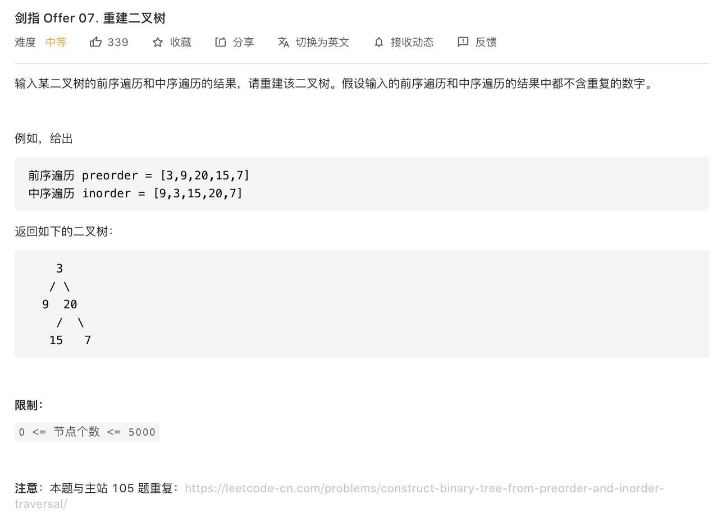

<br>


[剑指 Offer 07. 重建二叉树](https://leetcode-cn.com/problems/zhong-jian-er-cha-shu-lcof/)


难度:  <font color="orange">**中等**</font>





<br>


---


<br>

```go
/**
 * Definition for a binary tree node.
 * type TreeNode struct {
 *     Val int
 *     Left *TreeNode
 *     Right *TreeNode
 * }
 */
func buildTree(preorder []int, inorder []int) *TreeNode {

      if len(preorder) == 0 {
        return nil
    }
    root := &TreeNode{preorder[0], nil, nil}
    i := 0
    for ; i < len(inorder); i++ {
        if inorder[i] == preorder[0] {
            break
        }
    }
    root.Left = buildTree(preorder[1:len(inorder[:i])+1], inorder[:i])
    root.Right = buildTree(preorder[len(inorder[:i])+1:], inorder[i+1:])
    return root

}
```