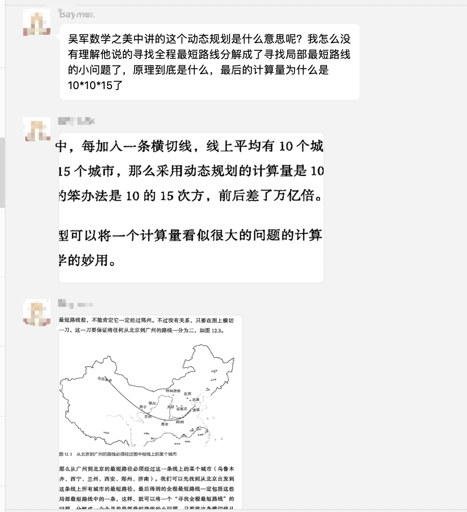
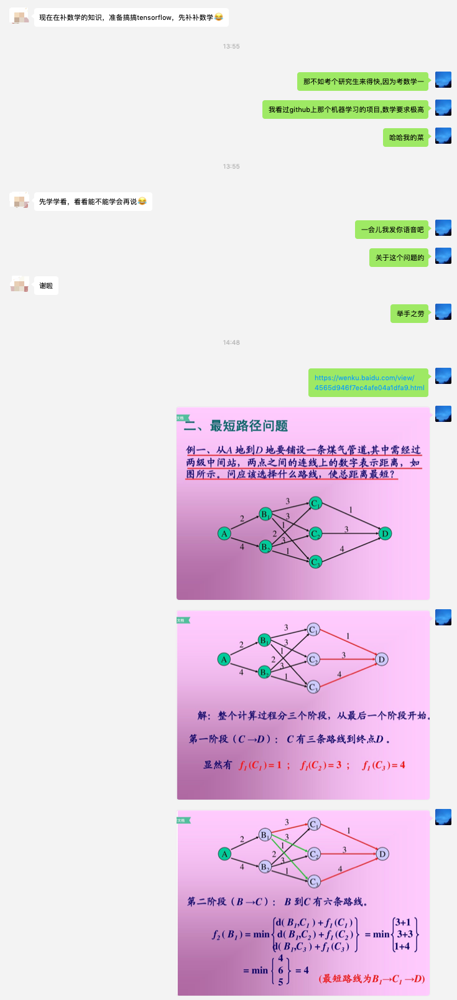
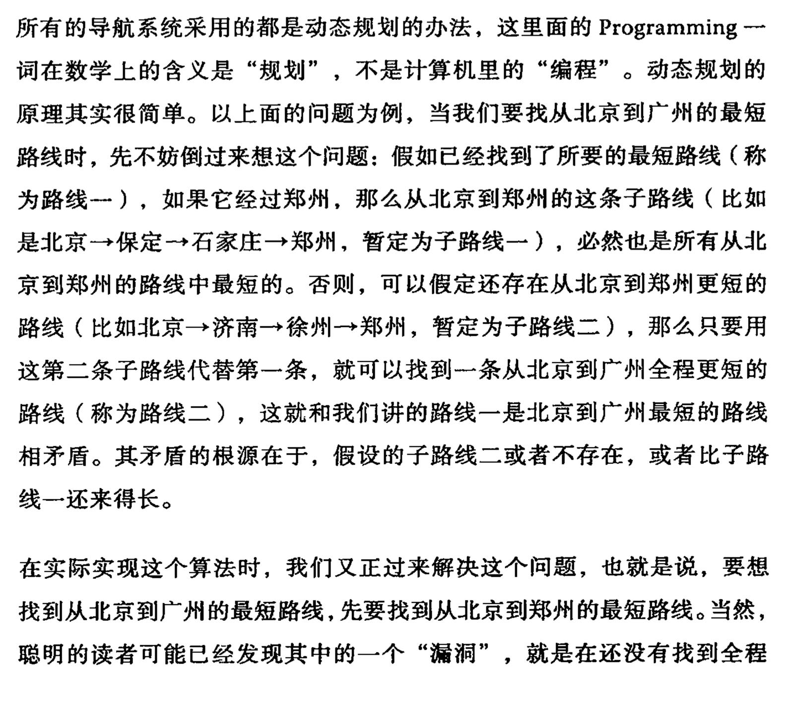
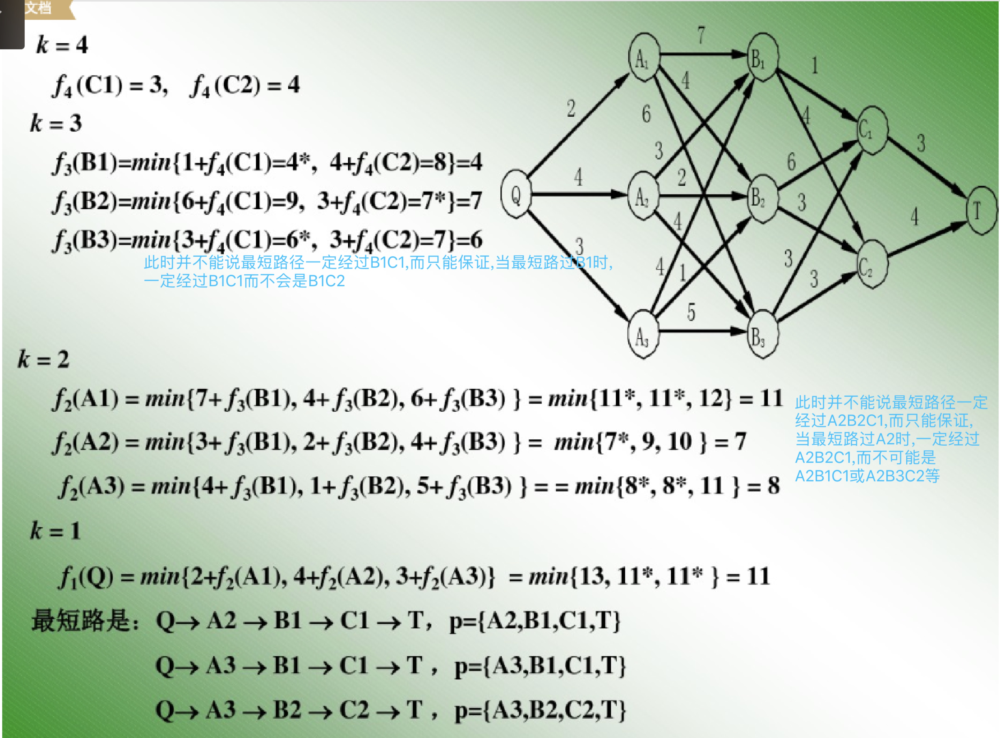
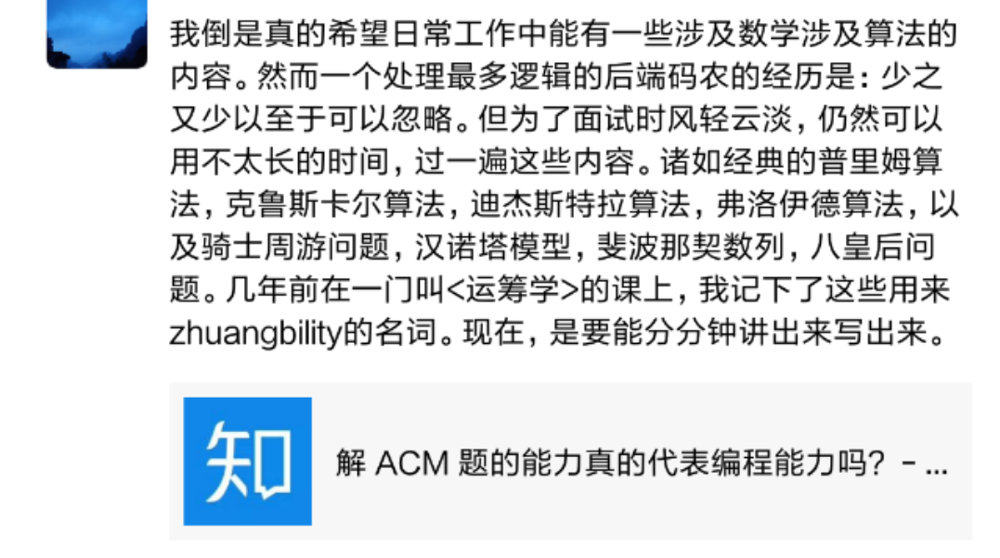
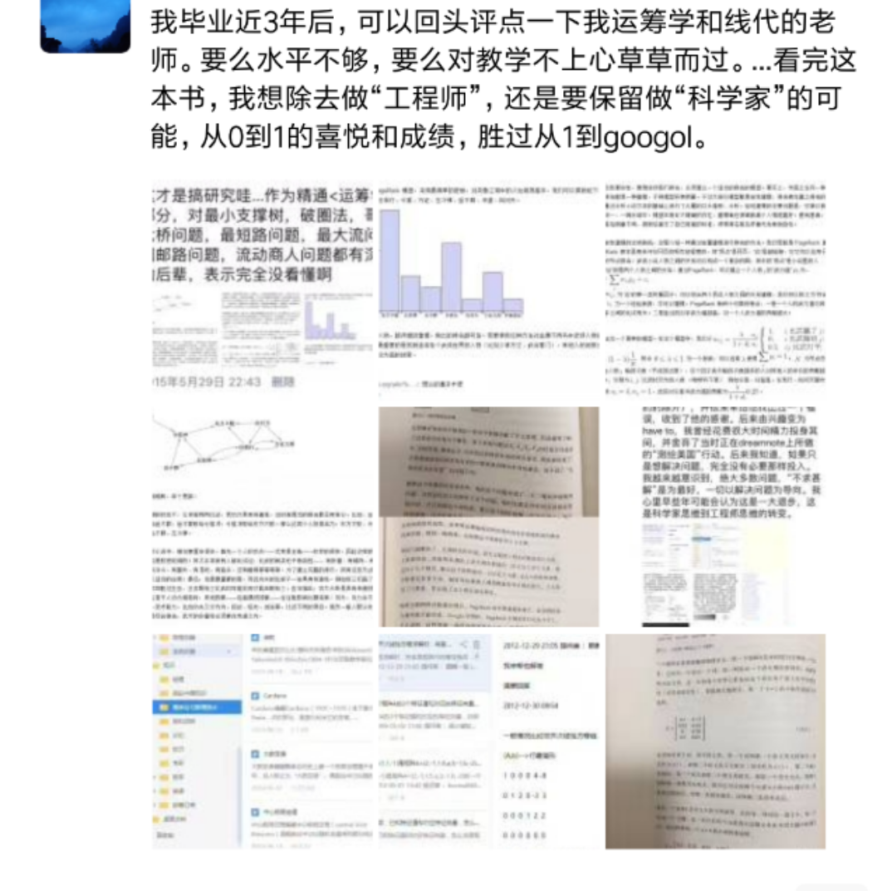
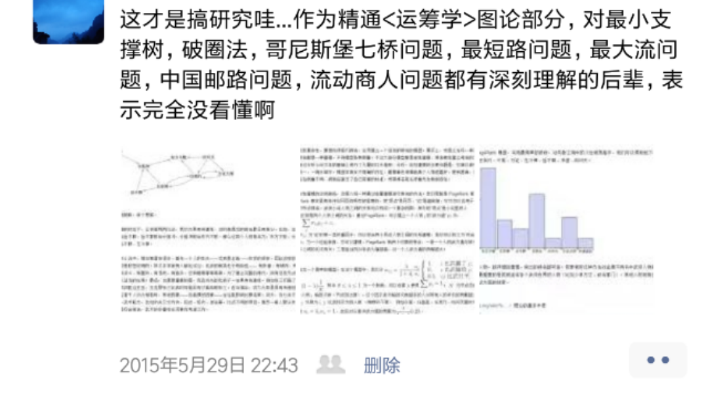

[首先补补课](https://wenku.baidu.com/view/23bfcbd8534de518964bcf84b9d528ea81c72ff1.html)

[详细可点此](http://www.cnblogs.com/KevinYang/archive/2009/02/01/1381805.html)

#### 先从此抛砖引玉

- 如果暴力遍历,需要 1x3x3x2x1=18次计算
- 用DP'剪枝',将乘法变加法,需要1x2+2x3+3x3+3x1=18次计算(从后向前算)
- 此时看上去计算次数相当,但如果层级一多,每层节点一多,暴力遍历将会是指数级增长,即<数学之美>中的10的15次方

 
#### 推演一下10的15次方的由来

假设北京为点X,广州为点Y,之间隔了15层A,B,C.....M,N,O,每一层有10个城市,如A层有A1,A2,...A10,
根据乘法原理,从X到Y,共有10x10x10...x10x1=10的15次方种可能的路线

 
#### 再解释一下如何"规划"(优化),变成了10x10x15
- *但凡降低时间复杂度,大多要通过借由增大空间复杂度,即用空间换时间*
- 从后向前推导,计算出从O到Y的距离,需经过10次计算(书中认为这步不需要计算),再计算从N到Y的距离,需经过10x10次计算,得出N1,N2,...N10到Y的最短距离,
假设这10段最短距离中,N5到Y距离最短,这时并不能说最短路一定经由N5到Y,而是N1,N2...N10都有可能,*不推到最后一步,永远不知道这条路线是不是最优;所能做就是每层的每个节点各司其职,算出当前节点到终点的最短距离,以备上一层级使用*

- 类似,从M到N又有10x10种不同路线,N1,N2..N10到Y的最短距离上一步已经算出,经过10x10次计算,可得出M1,M2...M10到Y的最短距离

- 依此类推,共需要10x10+10x10+...+10x10次计算,可以到达A层,且得出A1,A2,...A10到Y的最短距离A1Y,A2Y...A10Y;再进行10次计算,取最小值,即min(XA1+A1Y,XA2+A2Y...XA10+A10Y),
所得结果即最短路的距离,所经历的节点即最短路

- 可参照上图,进行简化和类比
- 在编码时,要维护一个map,来记录每一层的每个节点到终点的最短距离及经过的下层节点名称;最后的最短路未必经过该节点,却可保证,倘若经过该节点,最短路一定是我们维护的这个距离及路径

---

[更多动态规划内容,可点击](https://wenku.baidu.com/view/4565d946f7ec4afe04a1dfa9.html)

---

#### 回忆帖

