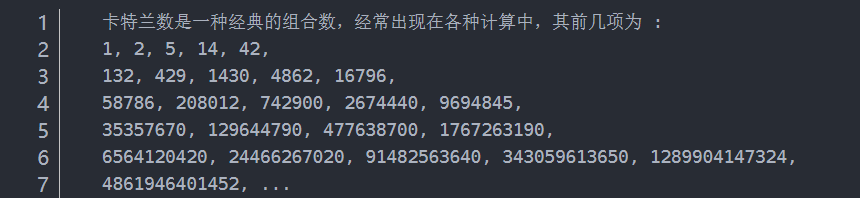
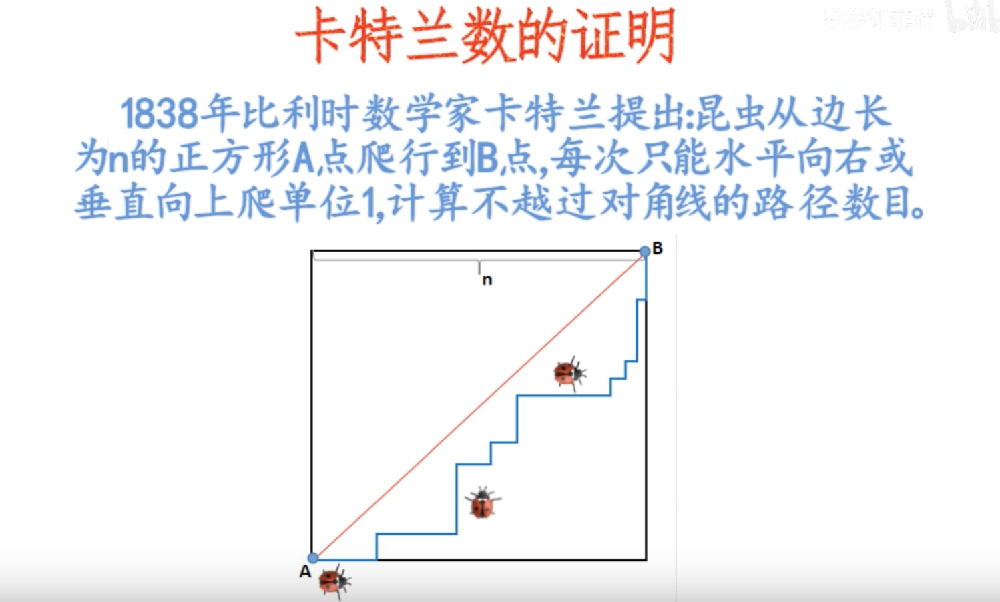
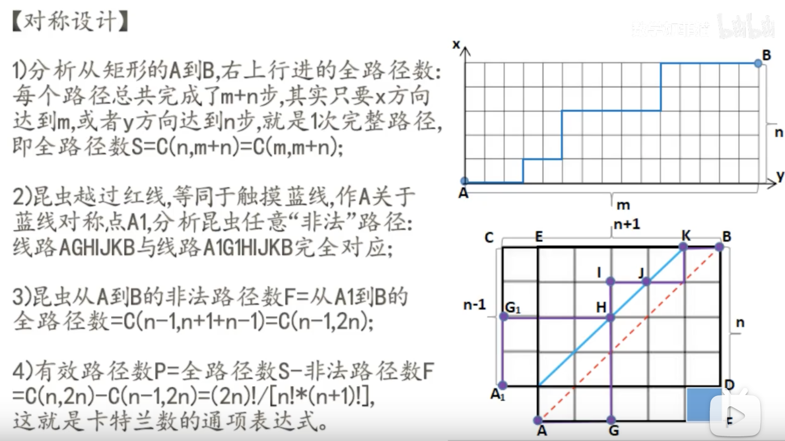
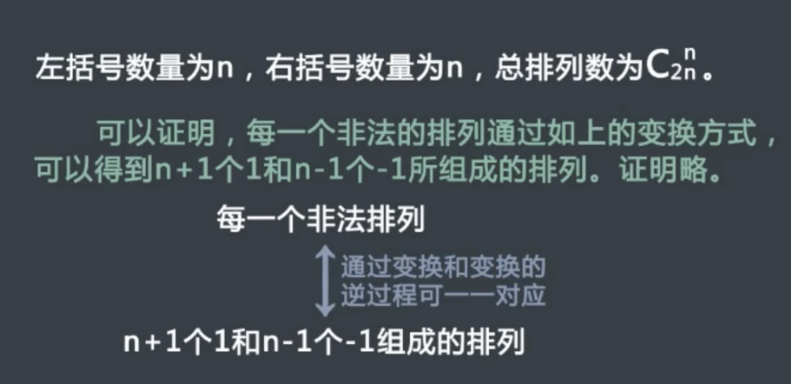
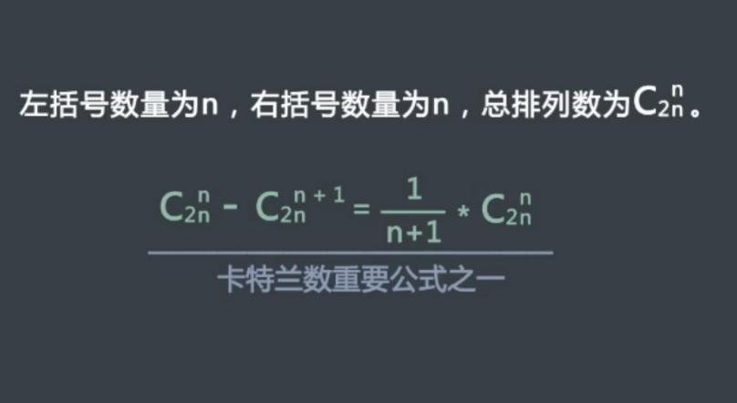
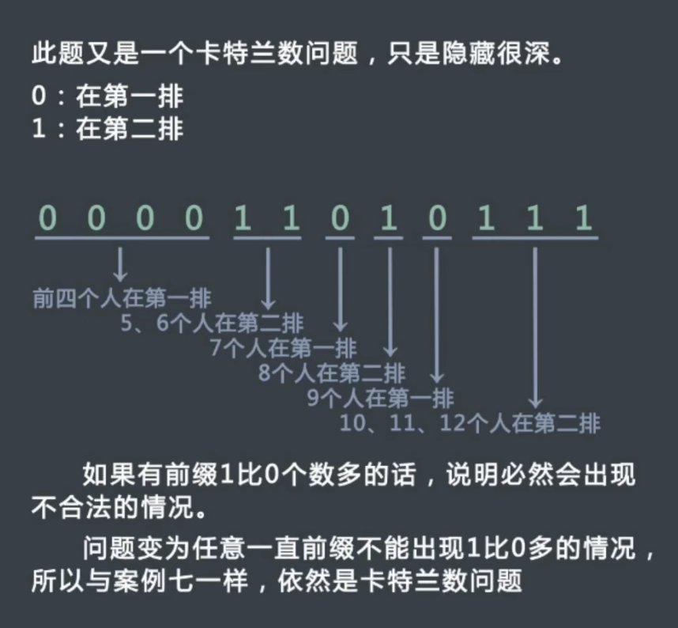
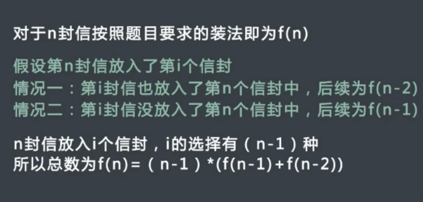
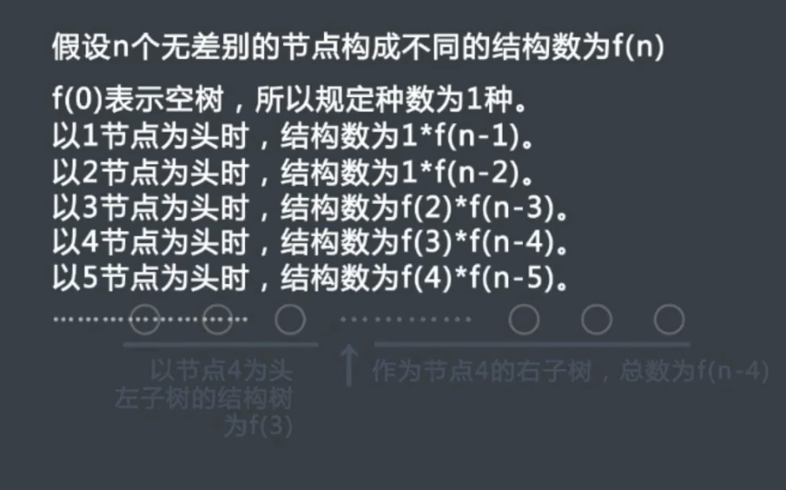
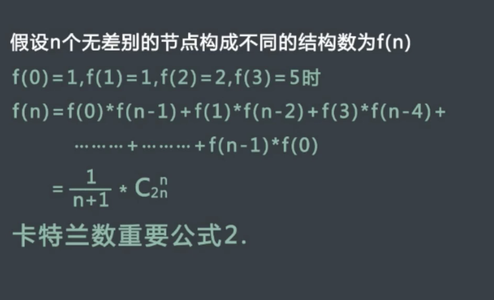

可以记住

 

### 概念

 

 

[卡特兰数](https://baike.baidu.com/item/%E5%8D%A1%E7%89%B9%E5%85%B0%E6%95%B0/6125746) 的通项公式为

$$f \left( n \right) = \frac{1}{n+1}  C_{2n}^{n}$$

又根据 *[组合数的计算公式](https://baike.baidu.com/item/%E7%BB%84%E5%90%88%E6%95%B0%E5%85%AC%E5%BC%8F/94872)*:

可得:

$$f \left(n \right) = \frac{1}{n+1}  \frac{(2n)!}{n!\cdot n!}   = \frac{(2n)!}{(n+1)!\cdot n!}  $$

 

同时满足递推关系式:

$$f \left(0 \right) = 1,  f \left(n+1 \right) = \frac{2(2n+1)}{n+2}  \cdot f \left(n \right)   $$

 

---

 

### 应用

 

#### 1.括号化问题（或者01的个数问题）

 

> 矩阵链乘： P=a1×a2×a3×……×an，依据乘法结合律，不改变其顺序，只用括号表示成对的乘积，试问有几种括号化的方案？(h(n)种)

 

#### 2.出栈次序问题

 

> 一个栈(无穷大)的进栈序列为1,2,3,…n,有多少个不同的出栈序列?

`与 问题1解法相同, 进栈相当于左括号,出栈相当于右括号`

 

另两个类似例子:

 

　　(1)有2n个人排成一行进入剧场（或者商店买东西）。入场费5元。其中只有n个人有一张5元钞票，另外n人只有10元钞票，剧院无其它钞票，问有多少中方法使得只要有10元的人买票，售票处就有5元的钞票找零？(将持5元者到达视作将5元入栈，持10元者到达视作使栈中某5元出栈)

`还是与1类似,5块钱相当于左括号,10块钱相当于右括号`

 

　　(2)在圆上选择2n个点,将这些点成对连接起来，使得所得到的n条线段不相交的方法数。

 

 

 

#### 3.凸多边形问题

 

（1）一个凸的n边形，用直线连接他的两个顶点使之分成多个三角形，每条直线不能相交，问一共有多少种划分方案。

(2)类似：一位大城市的律师在她住所以北n个街区和以东n个街区处工作。每天她走2n个街区去上班。如果她从不穿越（但可以碰到）从家到办公室的对角线，那　　 么有多少条可能的道路？

(3)类似：在圆上选择2n个点,将这些点成对连接起来使得所得到的n条线段不相交的方法数?
例如n+2个点的凸多边形，这里n=4，通过卡特兰数的推导可以得出h(4)=14。 

 

#### 4.给定节点组成二叉树的问题

 

> 给定N个节点，能构成多少种形状不同的二叉树？

 

`先取一个点作为顶点,然后左边依次可以取0至N-1个,相对应的,右边是N-1到0个,两两配对相乘,就是h(0)*h(n-1) + h(2)*h(n-2) +…+ h(n-1)h(0)=h(n)（能构成h(N)个）`

[leetcode-96 不同的二叉搜索树](https://dashen.tech/2015/03/01/leetcode-96-%E4%B8%8D%E5%90%8C%E7%9A%84%E4%BA%8C%E5%8F%89%E6%90%9C%E7%B4%A2%E6%A0%91/)

 

#### 5.n*n棋盘从左下角走到右上角而不穿过主对角线的走法

 

a.在 nn的格子中，只在下三角行走，每次横或竖走一格，有多少中走法？其实向右走相当于进栈， 向左走相当于出栈，本质就是n个数出栈次序的问题，所以答案就是卡特兰数。（利用这个模型，可以解决这个卡特兰问题的变形问题，并顺便给进出栈问题的解法一个几何解释）

 

b.有n+1个叶子的满二叉树的个数？事实上，向左记为+1，向右记为−1，按照向左优先的原则，从根节点开始遍历．例如第一个图记为+1,+1,+1,−1,−1,−1,于是由卡特兰数的含义可得满二叉树的个数为Cn。

 

---

 

参考:

[卡特兰(Catalan)数概念的简要介绍](http://www.nowamagic.net/academy/detail/40140308)

[史上最详细的卡特兰数浅谈](https://blog.csdn.net/qq_30115697/article/details/88906534)

[卡特兰数的证明](https://www.bilibili.com/video/BV1tE411R7mw)

[LeetCode 96之卡特兰数](https://blog.csdn.net/weixin_44565518/article/details/99731190)

[卡特兰数/概率/蓄水池抽样](https://www.bilibili.com/video/BV1N4411X7wQ?p=1)