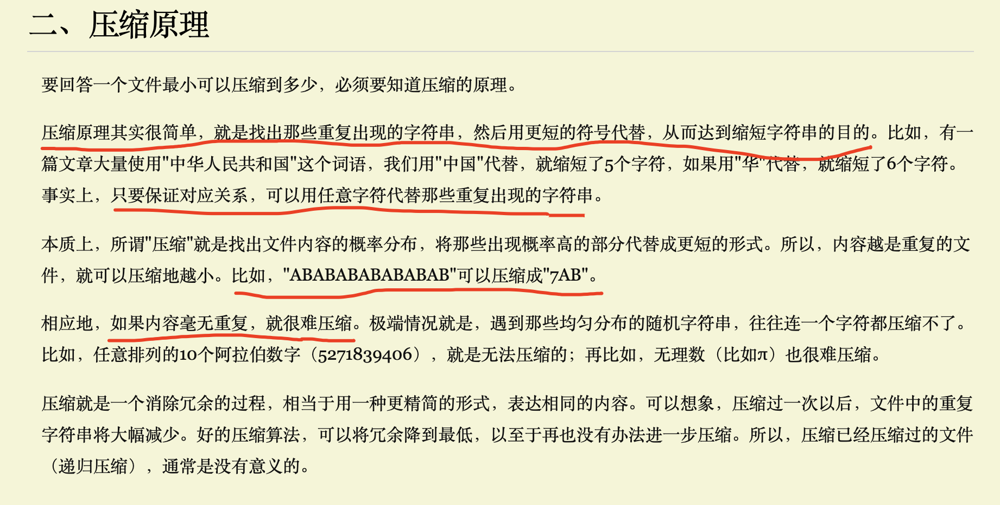
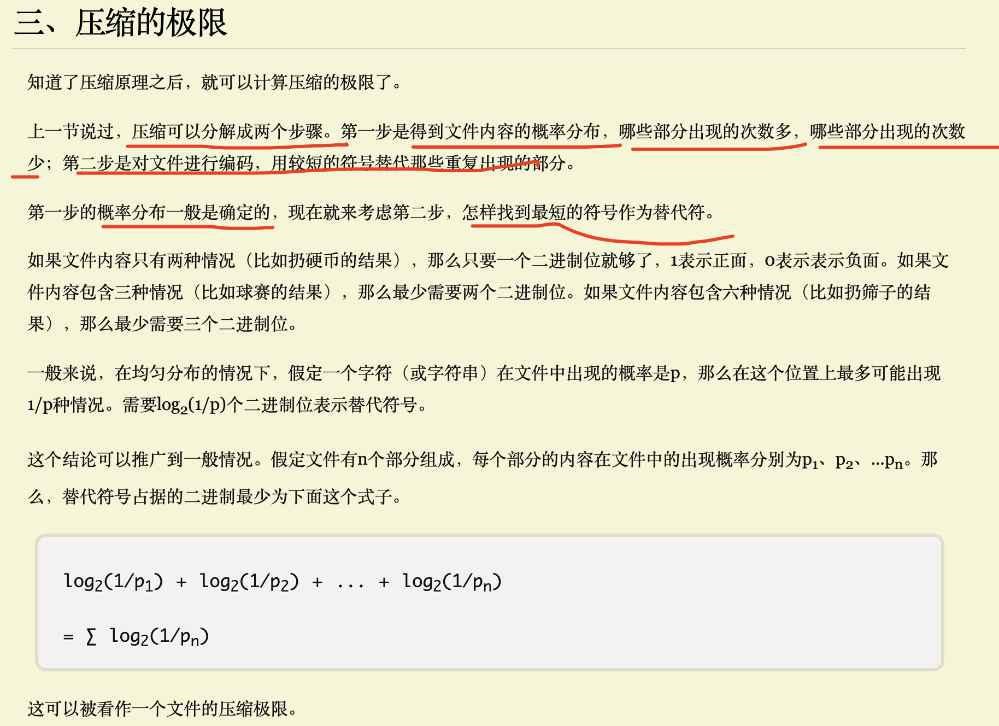
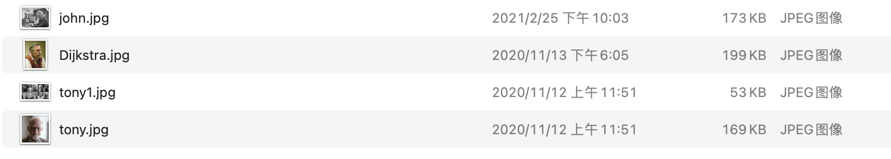
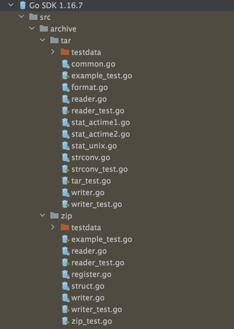

[阮一峰-数据压缩与信息熵](https://www.ruanyifeng.com/blog/2014/09/information-entropy.html)


<br>


压缩，典型的时间换空间


<font size=1 color="grey">

用到LRU，首选hashicorp/golang-lru，不过不知道啥时候，Go官方悄不溜整了一个groupcache，也提供了lru的实现…

顺道瞟了一眼，发现github.com/golang下除去有go，还有一整套配套的常用组件。比如vscode/sublime的插件，有性能测试工具perf，有错误处理库xerrors，有日志库glog，有用于单测的mock…甚至连压缩都提供了snappy，数据库有leveldb。。。这简直是想“自举”包圆整个产业链

</font>


<br>

### [golang/snappy](https://github.com/golang/snappy)


<br>


snappy是Google研发的压缩算法，优点是有非常高的速度和合理的压缩率(压缩率比gzip 小)

<br>


```go
package main

import (
	"fmt"
	"github.com/golang/snappy"
	"io/ioutil"
)

var (
	textMap = map[string]string{
		"a": `1234567890-=qwertyuiop[]\';lkjhgfdsazxcvbnm,./`,

		// a重复4次
		"b": `1234567890-=qwertyuiop[]\';lkjhgfdsazxcvbnm,./1234567890-=qwertyuiop[]\';lkjhgfdsazxcvbnm,./1234567890-=qwertyuiop[]\';lkjhgfdsazxcvbnm,./1234567890-=qwertyuiop[]\';lkjhgfdsazxcvbnm,./`,

		"c": `浕浉浄浀浂洉洡洣浐洘泚浌洼洽派洿浃浇浈浊测浍济浏浑浒浓浔泿洱涏洀洁洂洃洄洅洆洇洈洊洋洌洎洏洐洑洒洓洔洕洗洠洙洚洛洝洞洟洢洤津洦洧洨洩洪洫洬洭洮洲洳洴洵洶洷洸洹洺活涎`,

		// c重复3次
		"d": `浕浉浄浀浂洉洡洣浐洘泚浌洼洽派洿浃浇浈浊测浍济浏浑浒浓浔泿洱涏洀洁洂洃洄洅洆洇洈洊洋洌洎洏洐洑洒洓洔洕洗洠洙洚洛洝洞洟洢洤津洦洧洨洩洪洫洬洭洮洲洳洴洵洶洷洸洹洺活涎浕浉浄浀浂洉洡洣浐洘泚浌洼洽派洿浃浇浈浊测浍济浏浑浒浓浔泿洱涏洀洁洂洃洄洅洆洇洈洊洋洌洎洏洐洑洒洓洔洕洗洠洙洚洛洝洞洟洢洤津洦洧洨洩洪洫洬洭洮洲洳洴洵洶洷洸洹洺活涎浕浉浄浀浂洉洡洣浐洘泚浌洼洽派洿浃浇浈浊测浍济浏浑浒浓浔泿洱涏洀洁洂洃洄洅洆洇洈洊洋洌洎洏洐洑洒洓洔洕洗洠洙洚洛洝洞洟洢洤津洦洧洨洩洪洫洬洭洮洲洳洴洵洶洷洸洹洺活涎`,
	}

	imgSrc = []string{
		"john.jpg", "Dijkstra.jpg", "tony.jpg", "tony1.jpg",
	}
)

/*
	k: a len: 46 48
	k: b len: 184 58
	k: c len: 246 250
	k: d len: 738 274
	snappy jpg
*/
func main() {
	for k, v := range textMap {
		got := snappy.Encode(nil, []byte(v))
		//fmt.Println("原始信息为:",v, "压缩后的信息为:",string(got))
		fmt.Println("k:", k, ", 原长度:", len(v), ", 压缩后的长度:", len(got))
	}

	fmt.Println("snappy压缩 jpg：")
	for _, v := range imgSrc {
		buf, err := ioutil.ReadFile(v)
		if err == nil {
			got := snappy.Encode(nil, buf)
			fmt.Println("k:", v, ", 原长度:", len(buf), ", 压缩后的长度:", len(got))
		}
	}
}
```


执行结果：

```go
k: a , 原长度: 46 , 压缩后的长度: 48
k: b , 原长度: 184 , 压缩后的长度: 58
k: c , 原长度: 246 , 压缩后的长度: 250
k: d , 原长度: 738 , 压缩后的长度: 274
snappy压缩 jpg：
k: john.jpg , 原长度: 172909 , 压缩后的长度: 172921
k: Dijkstra.jpg , 原长度: 199459 , 压缩后的长度: 196799
k: tony.jpg , 原长度: 169282 , 压缩后的长度: 169026
k: tony1.jpg , 原长度: 52923 , 压缩后的长度: 52565
```

<br>

- 字符串包含较多的重复字符,压缩才有较大效果

- 对jpg 图片的压缩率不大，甚至还会使体积变大...

<br>


压缩 就是找出那些重复出现的字符串，然后用更短的符号代替。  如AAABBBBCC可以记为3A4B2C  （只要保证对应关系，可以用任意字符代替那些重复出现的字符串）

所以对于没有重复的数据，无法再进一步压缩。 而文件需要加校验字段，所以对于没有重复信息的数据会越压越大


.jpg本身又已经经过了压缩(有损压缩)，故而...


[图片格式jpg、png、gif、RAW、TIFF有啥区别，图片受损没法打开，能修复吗？](https://www.sohu.com/a/485790854_120293876)


<br>

4张图片的原始信息如下：





<br>


[golang中snappy的使用场合实例详解](jb51.net/article/130763.htm)


<br>


### 其他的压缩算法

<br>


- [lz4](https://github.com/lz4/lz4)：综合来看效率最高的压缩算法，更侧重压缩/解压速度，压缩比并不是第一。当前Android和iOS操作系统，内存压缩就使用的是lz4算法，及时压缩内存以节省出更多的内存空间。 使用C编写.  更多 [深入浅出lz4压缩算法](https://www.jianshu.com/p/824e1cf4f920)


- [zstd](https://github.com/facebook/zstd):  由Facebook研发的快速数据压缩算法,具有更好的压缩比。使用C编写.  更多 [zstd - 一种由Facebook使用的快速数据压缩算法](https://www.howtoing.com/zstd-fast-data-compression-algorithm-used-by-facebook)


- zip：作者[菲尔·卡茨](https://zh.wikipedia.org/wiki/%E8%8F%B2%E5%B0%94%C2%B7%E5%8D%A1%E8%8C%A8),不愿意为一个压缩软件付钱，索性自己写了一个更好的算法ZIP，然后无偿公开。2000年4月14日，饮酒过量导致急性脾出血,死于一家汽车旅馆，年仅37岁，死时手中握着一个空酒瓶 更多[ZIP,一个没落天才的故事](https://www.cnbeta.com/articles/tech/185863.htm)


<br>



