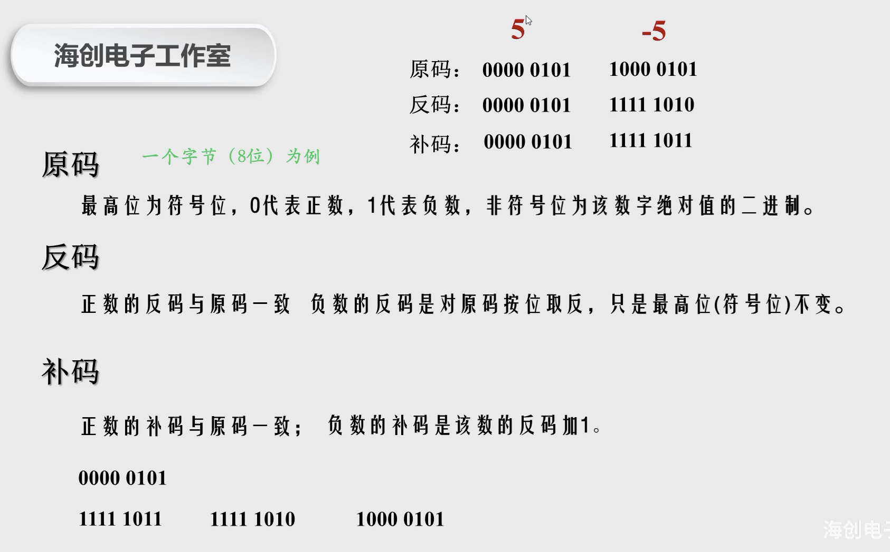
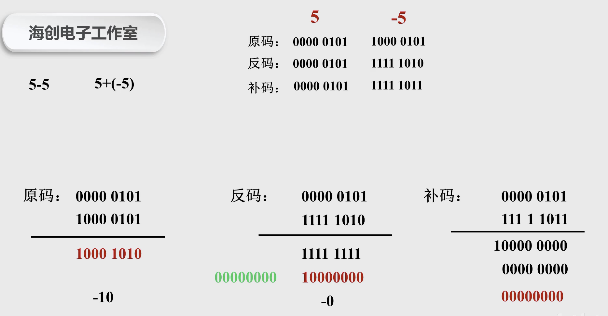

 

## 原码、反码、补码

 

计算机中都是以 <b>补码</b> 的形式存储数据!!!

机器只能识别0和1, 原码、反码、补码都只是二进制的某种表现形式~

 

 

- 最高位为1,说明为负值

- 最末位为1,说明为奇数(常用来判断奇偶数)

 

参考自:

[原码、反码和补码的相关知识点](https://www.bilibili.com/video/BV1Y7411t7Fj)

 

---

 

## 位运算

 

位运算符 主要是对位的操作,故而其 操作类型为**整型**

直接在位(bit)上进行操作,效率和性能都非常好..

> 在以前内存和处理能力（CPU）都是非常昂贵的，于是直接在位上编程就成为了处理信息的首选方式（在有些情况下也是唯一的方式）。如今，直接对位进行操作在底层系统、图像处理和密码学等领域还是至关重要的。

 

C#中的位运算符:

 

  

   

 

位取反,或称位异或,在C#中用`~`符号,而在Go中用`&^`

参考自:

[位运算符](https://www.bilibili.com/video/BV15W411v7hG)

[『GCTT 出品』Go 中的位运算](https://mp.weixin.qq.com/s/f7ZgIx_ZByAbEioTUrBCXA)

---

 

### & 操作符

 

#### 逻辑规则: **元素均为1,结果才为1**

 

 

#### 是一个很好的将整数的指定位清零的方式

 

#### 高效判断一个数字是奇数还是偶数

 

将数字n和值 1 使用 & 做 AND 运算 : 如果结果为 1,那说明数字n是一个奇数; 反之为偶数

 

### | 操作符

 

#### 逻辑规则: **任一元素为1,结果就为1**

 

即只有元素皆为0,结果才为0

 

#### 将一个整数中的指定位置修改为 1

 

 

 

---

 

### 使用位作为配置信息

 

 

> 调用 procstr("HELLO PEOPLE!", LOWER|REV|CAP) 将会把字符串转换成小写，反转并将每个单词的首字母转换成大写。当 conf 上的第 2、3、4 位为 1 时（conf 等于 14）将会执行上述操作。在内部我们使用 if 语句来取出这些位并且根据相应的配置操作字符串。

---

 

### ^ 操作符

 

#### 逻辑规则: **当两数不同时,结果为1;两数相同时,结果为0**

 

#### 可以使用 XOR 来切换指定位上的值

 

  

#### 使用 ^ 作为位非操作

 

 

### &^ 运算符

 

&^ 运算符叫做 AND NOT。它是一个 使用 AND 后，再使用 NOT 操作的简写

 

#### 逻辑规则: **123**

 

 

 

#### 如果第二个操作符返回 1。那么该位将会被清 0。

 

 

---

 

## 移位操作及其应用

 

 

 

 

---

 

更多参考:

[通过位运算理解原码、反码和补码](https://my.oschina.net/sallency/blog/1584171)

[原码、反码、补码与位运算](https://www.cnblogs.com/yqxx1116/archive/2019/10/13/11657307.html)

[位运算的常见操作和题目](http://static.kancloud.cn/digest/pieces-algorithm/163636)

[阮一峰-关于2的补码](https://www.ruanyifeng.com/blog/2009/08/twos_complement.html)

[读源码必备 | 万字长文！位运算面试看这篇就够了！](https://mp.weixin.qq.com/s/ONSNNTBhwuGrrVYYssrAiw)