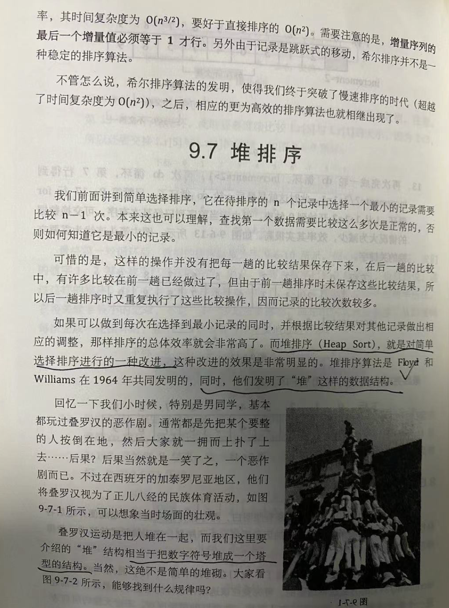
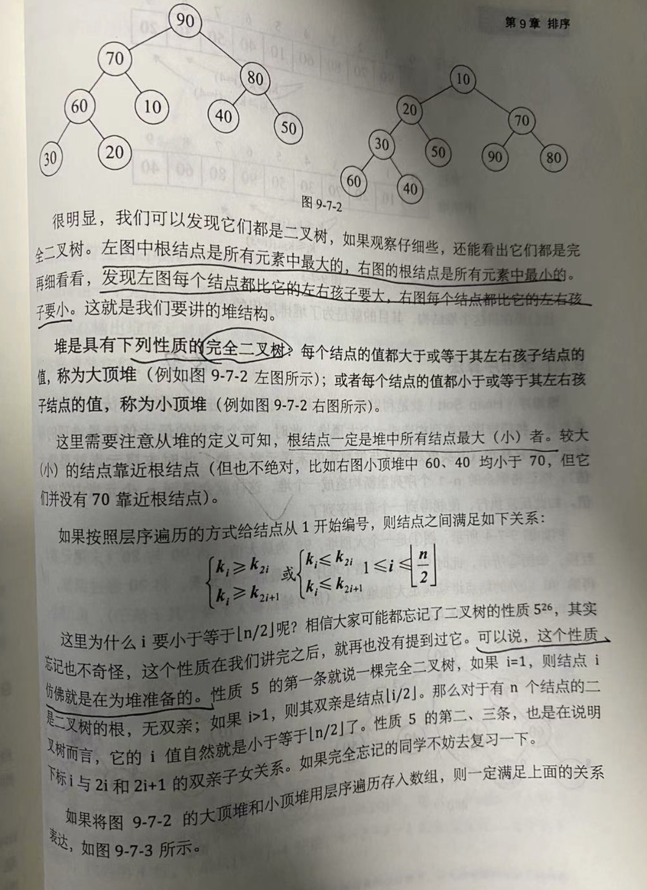
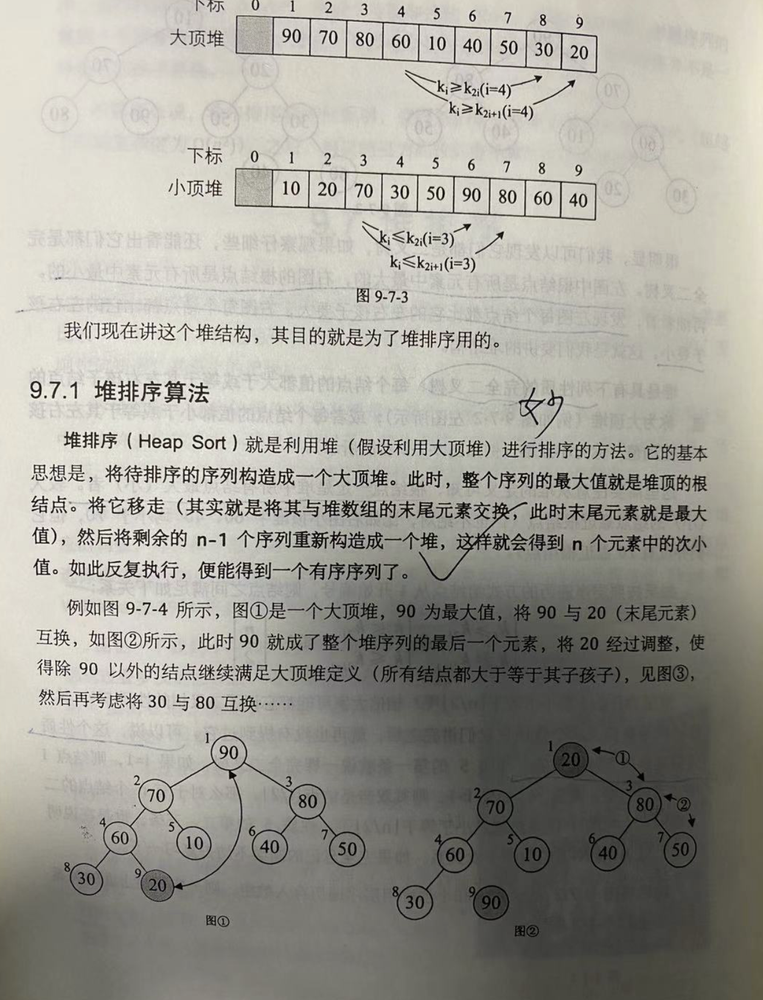
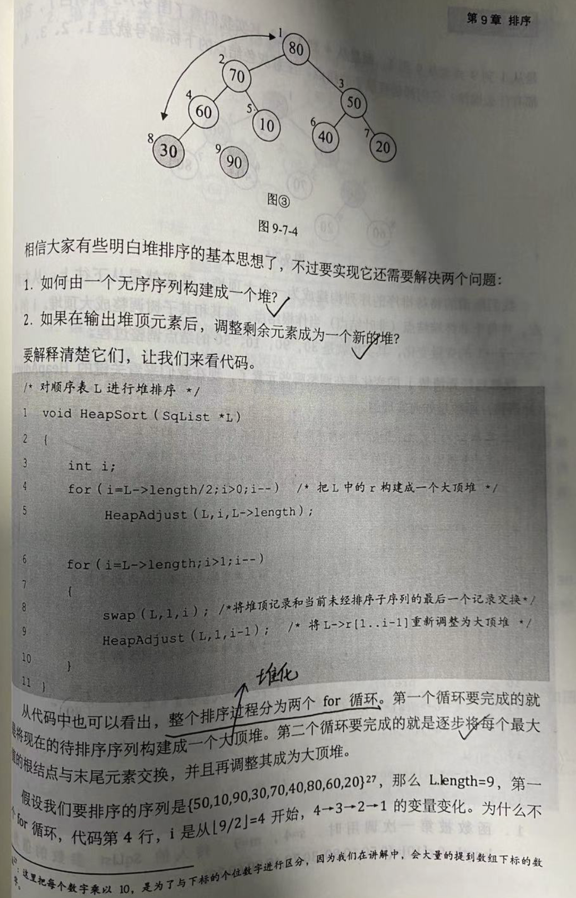
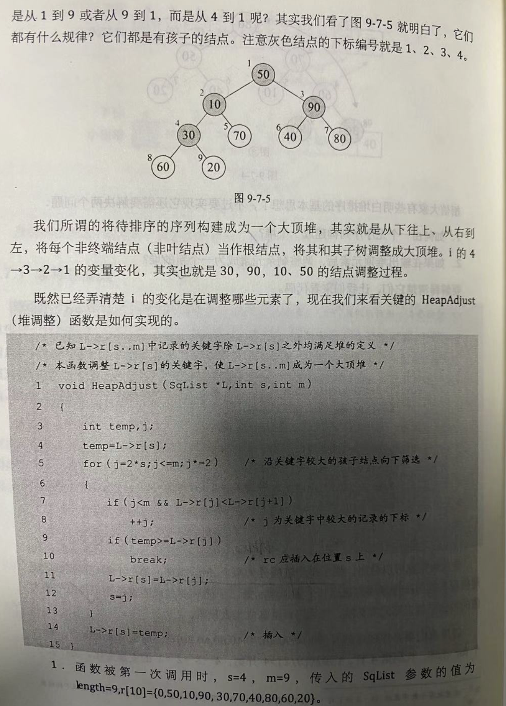

堆排序(Heap Sort)是对*简单选择排序*的一种改进


利用了(设计发明了)堆这种数据结构


堆及堆排序 于1964年由Floyd和Williams共同发明

<font size=1 color="orange">

突然意识到，1978年图灵奖得主[Robert W. Floyd](https://dashen.tech/2020/05/07/%E5%A4%A9%E7%A5%9E%E8%8D%9F%E8%90%83/#Robert-W-Floyd)，获奖的原因很可能不是因为[弗洛伊德算法](https://dashen.tech/2020/11/14/Floyd%E7%AE%97%E6%B3%95/)。而是提出了“堆”这种数据结构，及借此改进了简单快速排序（即堆排序）…

堆 这东西竟然是1964年才被提出，有些意想不到…

这个“逆袭”实在不够恰当，即便在众多高校中，斯坦福拥有最多图灵奖得主，也不过才28位，略多于mit和ucb。排名前15的学校有12所归属美国。

[学文科的他发明堆排序，逆袭成为斯坦福终身教授！](https://blog.csdn.net/xo3ylaf9kgs/article/details/102633985)

</font>


<br>


堆是一种比较特殊的**完全二叉树**,其还有如下特点:

如果每个节点的值都大于等于其左右孩子节点的值,则称为大顶堆;<br>
如果每个节点的值都小于等于其左右孩子节点的值,则称为小顶堆;

所以根节点一定是堆中所有节点最大(或最小)的


一定程度上,"堆"这个翻译还是比较贴切的~


<br>


```go
package main

import "fmt"

//堆排序
//s[0]不用，实际元素从角标1开始
//父节点元素大于子节点元素
//左子节点角标为2*k
//右子节点角标为2*k+1
//父节点角标为k/2
func HeapSort(s []int) {
	N := len(s) - 1 //s[0]不用，实际元素数量和最后一个元素的角标都为N
	//构造堆
	//如果给两个已构造好的堆添加一个共同父节点，
	//将新添加的节点作一次下沉将构造一个新堆，
	//由于叶子节点都可看作一个构造好的堆，所以
	//可以从最后一个非叶子节点开始下沉，直至
	//根节点，最后一个非叶子节点是最后一个叶子
	//节点的父节点，角标为N/2
	for k := N / 2; k >= 1; k-- {
		sink(s, k, N)
	}
	//下沉排序
	for N > 1 {
		swap(s, 1, N) //将大的放在数组后面，升序排序
		N--
		sink(s, 1, N)
	}
}

//下沉（由上至下的堆有序化）,也被称为堆化(heapify)
//给出一个整数数组，堆化操作就是把它变成一个最小堆数组。
//对于堆数组A，A[0]是堆的根，并对于每个A[i]，A [i * 2 + 1]是A[i]的左儿子并且A[i * 2 + 2]是A[i]的右儿子。

func sink(s []int, k, N int) {
	for {
		i := 2 * k
		if i > N { //保证该节点是非叶子节点
			break
		}
		if i < N && s[i+1] > s[i] { //选择较大的子节点
			i++
		}
		if s[k] >= s[i] { //没下沉到底就构造好堆了
			break
		}
		swap(s, k, i)
		k = i
	}
}

func swap(s []int, i int, j int) {
	s[i], s[j] = s[j], s[i]
}

func main() {
	var list []int
	list = []int{-1, 3, 7, 2, 3, 8, 0, 1, 9, 6, 5}

	fmt.Println(list[1:])
	HeapSort(list)

	fmt.Println(list[1:])

}

```

<br>

输出为:

```go
[3 7 2 3 8 0 1 9 6 5]
[0 1 2 3 3 5 6 7 8 9]
```

<br>


或


```go
package main

import "fmt"

func main() {
	data := []int{10, 1, 23, 24, 7, 8, 9, 6, 4, 288, 99, 3, 34}
	for i := 0; i < len(data)-2; i++ {
		//从最后一个父节点开始调整
		for j := len(data[i:])/2 - 1; j >= 0; j-- { //把这个二叉树变成可处理的二叉树
			heapSort(data[i:], j)
		}
	}
	fmt.Println(data)
}

//堆，即完全二叉树。所有的父节点都比其子节点大
func heapSort(data []int, i int) {
	child := 2*i + 1
	if 2*i+2 < len(data) { //如果存在右孩子并且
		if data[2*i+1] < data[2*i+2] {
			child = 2*i + 2
		}
	}
	if data[i] > data[child] {
		return
	} else {
		data[i], data[child] = data[child], data[i] //父节点小于子节点换位置
	}
	if child <= (len(data)/2 - 1) { //只要child 的序号还在 //只要当前孩子的索引在所有父节点索引内继续交换
		heapSort(data, child)
	}
}

```

<br>













<br>

---

<br>

参考:

[golang之堆排序](https://www.cnblogs.com/cbil/p/10015296.html)


todo:
Go语言的堆排序实现:https://blog.cyeam.com/golang/2014/08/29/go_heapsort