### 子网划分

 

①A类：占有1个字节（8位），定义最高位为 0 来标识此类地址，余下7位为真正的网络地址，支持$2^7-2=126$个网络；后面3个字节（24位）为主机地址，所包含的主机数量为：$2^{24}-2$（减去2，其中一个是全0的地址，另一个是全1的地址）。A类网络地址第一个字节的十进制值为000~127。

②B类：占有2个字节（16位），使用最高两位为 10 来标识此类地址，其余14位为真正的网络地址，支持$2^{14}-2$个网络；后面2个字节（16位）为主机地址，所包含的主机数量为：$2^{16}-2$。B类网络地址第一个字节的十进制值为128~191。

③C类：占有3个字节（24位），它是最通用的Internet地址，使用最高三位为 110 来标识此类地址，其余21位为真正的网络地址，支持$2^{21}-2$个网络；后面1个字节（8位）为主机地址，所包含的主机数量为：$2^8-2$。C类网络地址第一个字节的十进制值为192~223。

④D类：它的识别头是 1110，用于组播，例如用于路由器修改。D类网络地址第一个字节的十进制值为224~239。

⑤E类：实验保留，其识别头是 1111。E类网络地址第一个字节的十进制值为240~255。

 

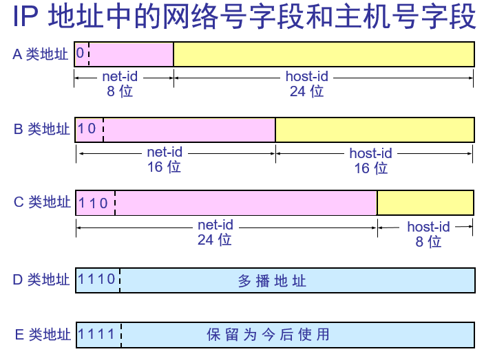

 

- A类：网络 ID 的第一位以 0 开始的地址。
- B类：网络 ID 的第一位以 10 开始的地址。
- C类：网络ID的第一位以 110 开始的地址。
- D类：地址以 1110 开始的地址。
- E类：地址以 11110 开始的地址。

 

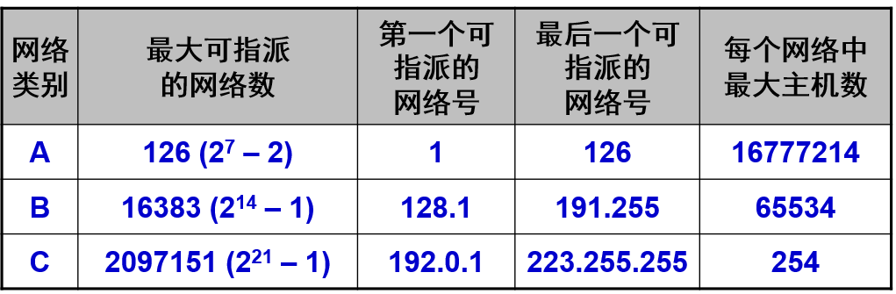

 

- A类：IP 地址范围为 0.0.0.0～127.255.255.255。
- B类：IP 地址范围为 128.0.0.0～191.255.255.255。
- C类：IP 地址范围为 192.0.0.0～223.255.255.255。
- D类：IP 地址范围为 224.0.0.0～239.255.255.255。
- E类：IP 地址范围为 240.0.0.0～255.255.255.254。

 

接下来是一组**图片赏鉴**:

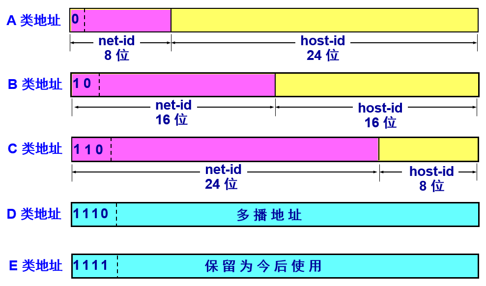

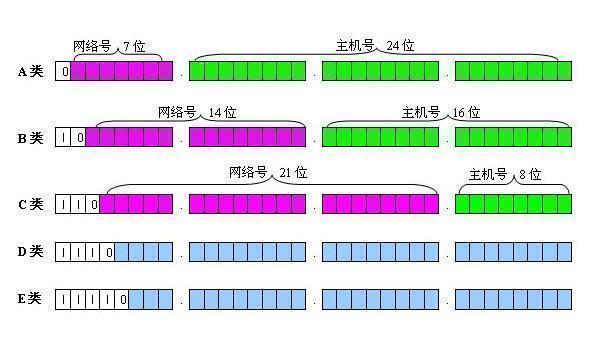

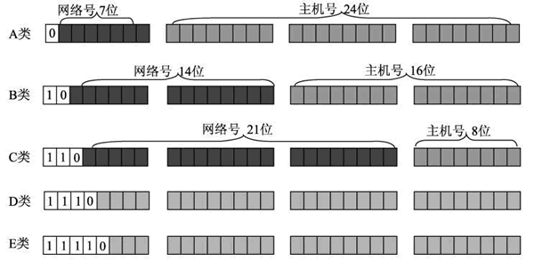

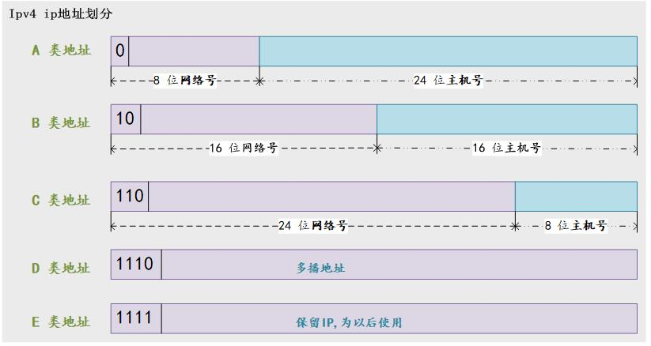

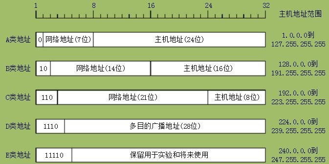

 

参考:

 

[计算机网络笔记（第二部分）](https://lrstyle.github.io/2018/05/28/Network/%E8%AE%A1%E7%AE%97%E6%9C%BA%E7%BD%91%E7%BB%9C2/)

[计算机网络-网络层-笔记](https://samanthachen.github.io/2016/08/15/%E8%AE%A1%E7%AE%97%E6%9C%BA%E7%BD%91%E7%BB%9C2/)

[IP地址分类（A类 B类 C类 D类 E类）](https://blog.csdn.net/kzadmxz/article/details/73658168)

[科普-IP地址详解-你,是谁？(二）-超有趣学网络](https://zhuanlan.zhihu.com/p/26098552)

 

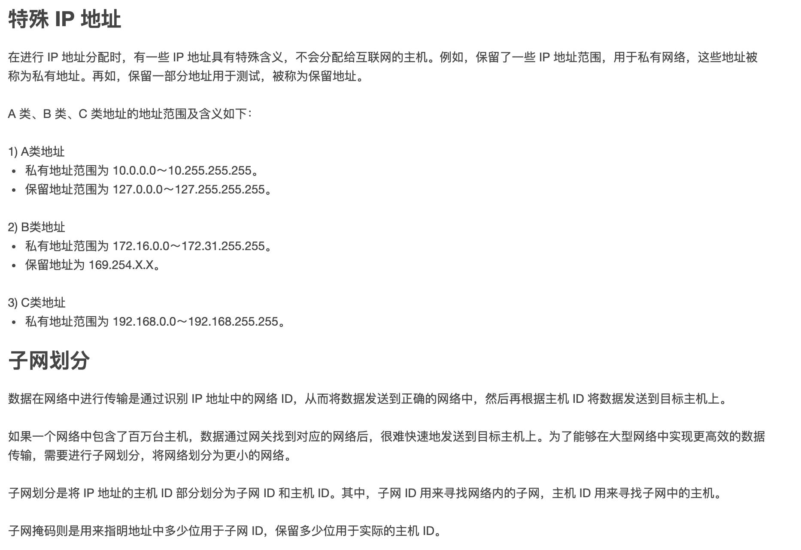

 

---

 

### 子网掩码 出现的原因 & 存在的意义

 

> 32位IPV4地址被分为两部分，即网络号和主机号。为提高IP地址的使用效率，子网编址的思想是将主机号部分进一步划分为子网号
和主机号：

> 即由 网络号—主机号, 再进一步变为：网络号—子网号—主机号

> 在原来的IP地址模式中，网络号部分就标识一个独立的物理网络, 引入子网模式后，网络号部分加上子网号才能全局唯一地标识一个物理网络。

> 子网编址使得IP地址具有一定的内部层次结构，这种层次结构便于IP地址分配和管理。它的使用关键在于选择合适的层次结构`---`如何既能适应各种现实的物理网络规模，又能充分地利用IP地址空间(即：从何处分隔子网号
和主机号)。

 

互联网是由许多小型网络构成的，每个网络上都有许多主机，这样便构成了一个有层次的结构。IP地址在设计时就考虑到地址分配的层次特点，<b>将每个IP地址都分割成 *网络号*和*主机号* 两部分</b>，从而实现 将网络进一步划分为若干子网，以避免主机过多而拥堵或过少而浪费IP。

但 IP地址的网络号和主机号各是多少位呢？如果不指定，就不知道哪些位是网络号、哪些是主机号，**这就需要通过子网掩码来实现**。

子网掩码只有一个作用，就是将某个IP地址划分成网络地址和主机地址两部分

故而 子网掩码不能单独存在，必须结合IP地址一起使用 才有意义

与IPV4地址相同，子网掩码的长度也是32位，左边是网络位，用二进制数字“1”表示；右边是主机位，用二进制数字“0”表示

 

假设IP地址为“192.168.1.1”,

子网掩码为“255.255.255.0”,  其中，“1”有24个，代表与此相对应的IP地址左边24位是网络号；“0”有8个，代表与此相对应的IP地址右边8位是主机号。这样，子网掩码就确定了这个IP地址的32位二进制数字中哪些是网络号、哪些是主机号。

这对于采用TCP/IP协议的网络来说非常重要，只有通过子网掩码，才能表明一台主机所在的子网与其他子网的关系，使网络正常工作。

 

 

---

 

### 子网掩码计算实例

 

**左边是网络位，用二进制数字“1”表示；右边是主机位，用二进制数字“0”表示**

引入子网模式后,网络号部分加上子网号才能全局唯一地标识一个物理网络, 即 *子网号部分 用1填充* 

 

> 例1. 将B类IP地址 `168.195.0.0` 划分成27个子网,子网掩码为多少?

 

因为B类IP地址中，前两个字节（16位）是**网络号**(net_id)，后两个字节（16位）是**主机号**(host_id)。

现将其划分成27个子网，即用若干个*主机位*来充当*子网号*。

取1个主机位，可以得到2个子网(因为一个bit有0,1两种情况)；取2个主机位，可以得到4个子网；取3个主机位，可以得到8个子网；

即所取主机位k与子网N的关系为：$2^k = N$（或者$2^k-2 = N$）

故而 27个子网需要取 5个*主机位*（$ 2^5 = 32 > 27 $）。

所以将原来的**网络号**位置(即前16位)全部改为1，并且将后面的5个**主机号**也改为1，再将其转为十进制，即为子网掩码:

原来的IP地址 `168.195.0.0` 转化为二进制格式如下:

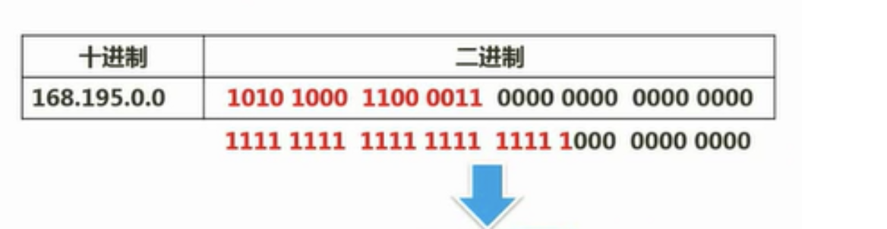

 

最终可得,子网掩码为

`255.255.248.0`

 

---

 

> 例2. 将B类IP地址 `168.195.0.0` 划分为若干子网,每个子网内有主机700台,则子网掩码为多少?

 

每个子网内有主机700台，根据所取**主机位k**与**子网N**的关系 $2^k = N（或者2^k - 2 = N）$，

此处需满足：$2^k ≥ 700$，解得：k=10。

所以对于这个B类IP地址，它的后10位就是**主机号**(这是算出来的)，而前面的16位都是**网络号**(这是B类IP的特点)，所以中间剩余的6位是 *子网号*,用1填充,其和之前的**网络号**(即前16位),一起构成新的**网络号**

最后将其转为十进制，即为子网掩码:

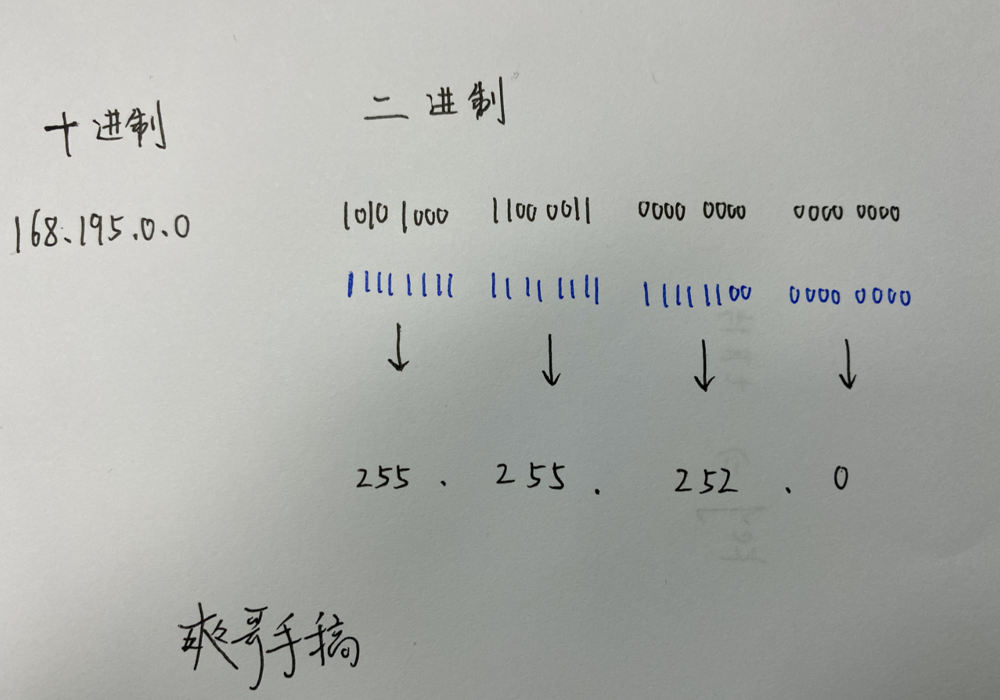

最终可得,子网掩码为

`255.255.252.0`

---

 

一般就是这种套路, 问 需要几个子网,或子网主机容量

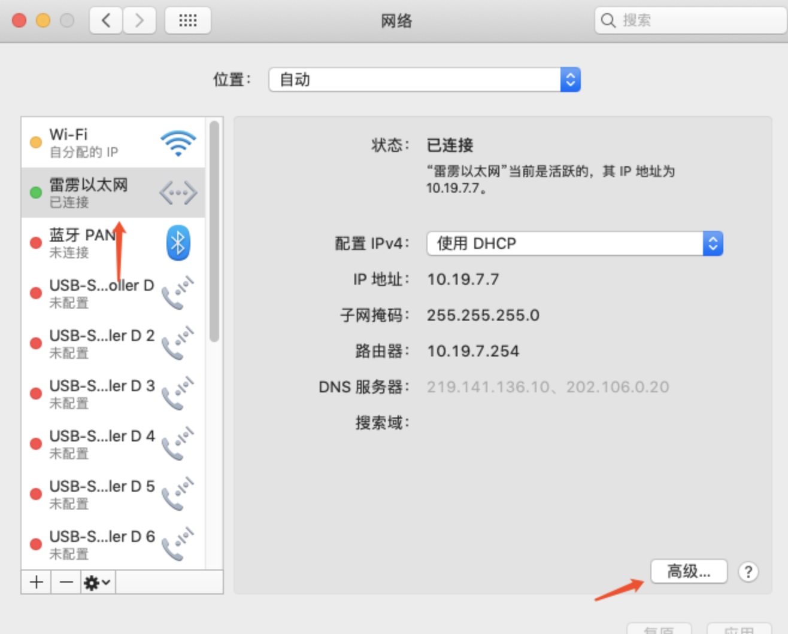

 

- A类网的IP址址最高位二进制不大于011开头，所以A类范围就是:1—127。

- B类网的IP址址最高位二进制不大于101开头，所以B类范围就是:128—191。

- C类网的IP址址最高位二进制不大于110开头，所以C类范围就是:192—223。

- D类网的IP址址最高位二进制不大于1110开头，所以D类范围就是:224—239。

- E类网的IP址址最高位二进制不大于1111开头，所以E类范围就是:240—255。

 

[私网地址](https://baike.baidu.com/item/%E7%A7%81%E7%BD%91%E5%9C%B0%E5%9D%80/8254497)

- A类地址:10.0.0.0~10.255.255.255
- B类地址:172.16.0.0 ~172.31.255.255
- C类地址:192.168.0.0~192.168.255.255

所以 `10.19.7.7`属于A类IP私有IP地址

 

IP地址和子网掩码进行**与运算**，结果就是真实的网络地址

(与运算: 全1为1，否则为0)

 

---

 

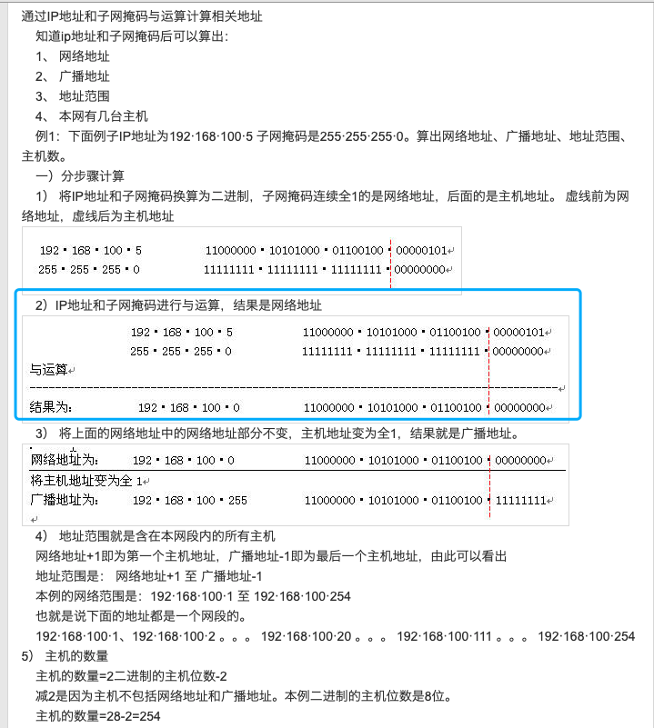

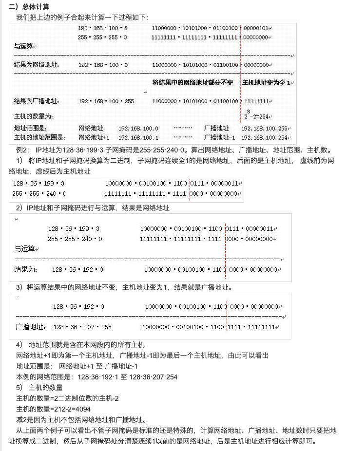

[IP地址和子网掩码的相关运算](https://www.kanzhun.com/jiaocheng/438515.html)

[IP地址、子网掩码、网络号、主机号、网络地址、主机地址 的计算方法](https://blog.csdn.net/u012600104/article/details/52461793)

---

 

参考:

[子网划分及子网掩码计算方法](https://www.cnblogs.com/kangxinxin/p/9917961.html)

[软考——软件设计师：第九章：计算机网络与信息安全考点总结](https://blog.csdn.net/weixin_43823808/article/details/108336089)

[ip地址及子网掩码换算，子网划分教程](https://jingyan.baidu.com/article/ae97a646d936ddbbfd461d02.html)

 

实用工具:

[网络和IP地址计算器](https://www.sojson.com/convert/subnetmask.html)

