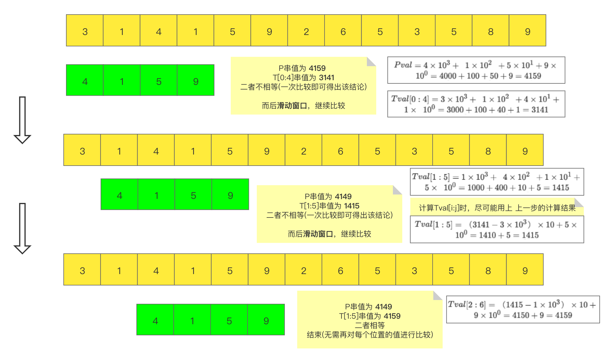
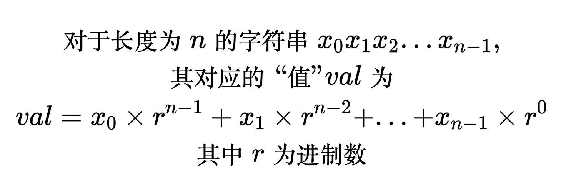
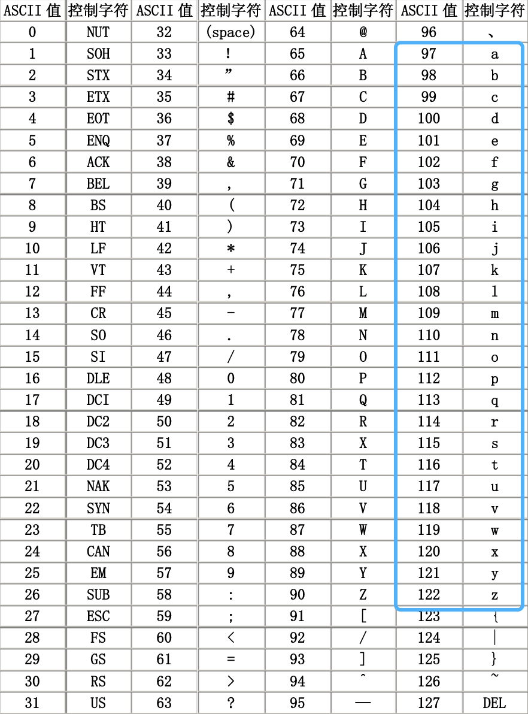
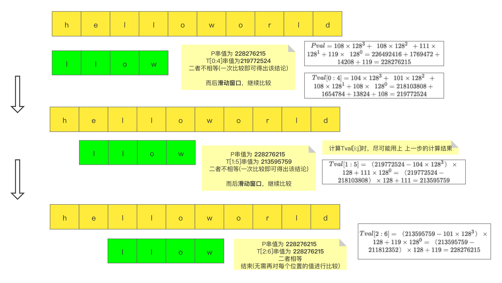
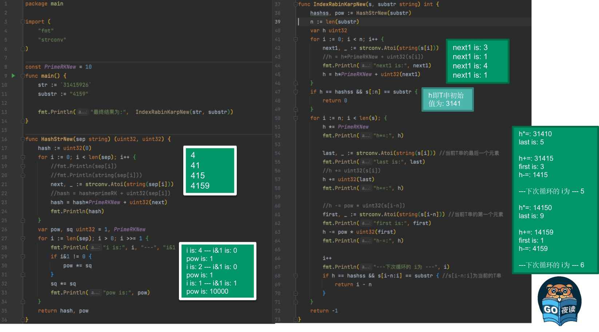

<br>

[leetcode-28 实现strStr()](https://dashen.tech/2015/03/01/leetcode-28-%E5%AE%9E%E7%8E%B0strStr/)


更熟悉的字符串匹配算法可能是[KMP算法](https://dashen.tech/2018/05/13/%E5%AD%97%E7%AC%A6%E4%B8%B2%E5%8C%B9%E9%85%8D%E7%9A%84KMP%E7%AE%97%E6%B3%95/), 但在Golang中,使用的是[Rabin–Karp算法](https://zh.wikipedia.org/wiki/%E6%8B%89%E5%AE%BE-%E5%8D%A1%E6%99%AE%E7%AE%97%E6%B3%95)


---


<br>

一般中文译作 **拉宾-卡普算法**,由[迈克尔·拉宾](https://dashen.tech/2020/05/07/%E5%A4%A9%E7%A5%9E%E8%8D%9F%E8%90%83/#Michael-Rabin)与[理查德·卡普](https://dashen.tech/2020/05/07/%E5%A4%A9%E7%A5%9E%E8%8D%9F%E8%90%83/#Richard-Karp)于1987年提出

> 要在一段文本中找出单个模式串的一个匹配，此算法具有线性时间的平均复杂度，其运行时间与待匹配文本和模式串的长度成线性关系。虽然平均情况下，此算法表现优异，但最坏情况下，其复杂度为文本长与模式串长的乘积


尽可能多的利用上一步的结果，这是优化时间复杂度的一大核心

<br>


### 对于数字类型的字符串，可有如下匹配方法：

<br>




<br>

### 将该方法扩展到非数字类型的字符串：

<br>





<font size=1> 
以上这张图片的LaTex：

```tex
$$\begin{gather}
  
对于长度为n的字符串 x_{0} x_{1} x_{2} ... x_{n-1},\\其对应的“值”val为\\

val = x_{0} \times r^{n-1} + x_{1}\times r^{n-2} + ... +  x_{n-1}\times r^{0}
 
 \\其中r为进制数\end{gather}$
 ```
</font>








<font size=1 color="grey">

ASCII：英语字符与二进制位之间的关系
(其他语言？？)

[Unicode](https://zh.wikipedia.org/wiki/Unicode)：将世界上所有的符号都纳入其中，
每个符号都对应一个独一无二的编码，最多可以容纳1114112个字符(2021年9月公布的14.0.0，已经收录超过14万个字符)
(有个问题是浪费空间。。)  也译作统一码/万国码/国际码

UTF-8: 使用最广的一种 Unicode 的实现方式
(最大特点是 变长的编码方式)

[字符编码笔记：ASCII，Unicode 和 UTF-8](https://www.ruanyifeng.com/blog/2007/10/ascii_unicode_and_utf-8.html)

[中日韩汉字Unicode编码表](http://www.chi2ko.com/tool/CJK.htm)

</font>

<br>


### 源码注释：

<br>




将源码中的*16777619*进制改为10进制，从字符串31415926中搜索4159：


**4159**

```go
package main

import (
	"fmt"
	"strconv"
)

func main() {

	var primeRK uint32 = 10
	sep := "4159"
	hash := uint32(0)
	for i := 0; i < len(sep); i++ {

		//fmt.Println(sep[i])
		//fmt.Println(string(sep[i]))
		next, _ := strconv.Atoi(string(sep[i]))
		//hash = hash*primeRK + uint32(sep[i])
		hash = hash*primeRK + uint32(next)
		fmt.Println(hash)
	}
	
}
```

输出为：

```go
4
41
415
4159
```


<br>


*完整的以10为primeRK，从31415926中搜索4159的代码：*

```go
package main

import (
	"fmt"
	"strconv"
)

const PrimeRKNew = 10

func main() {
	str := `31415926`
	substr := "4159"

	fmt.Println("最终结果为:",  IndexRabinKarpNew(str, substr))
}

func HashStrNew(sep string) (uint32, uint32) {
	hash := uint32(0)

	for i := 0; i < len(sep); i++ {
		//fmt.Println(sep[i])
		//fmt.Println(string(sep[i]))
		next, _ := strconv.Atoi(string(sep[i]))
		//hash = hash*primeRK + uint32(sep[i])
		hash = hash*PrimeRKNew + uint32(next)
		fmt.Println(hash)
	}

	var pow, sq uint32 = 1, PrimeRKNew
	for i := len(sep); i > 0; i >>= 1 {
		fmt.Println("i is:", i, "---", "i&1 is:", i&1)
		if i&1 != 0 {
			pow *= sq
		}
		sq *= sq
		fmt.Println("pow is:", pow)
	}
	return hash, pow
}

func IndexRabinKarpNew(s, substr string) int {
	// Rabin-Karp search
	hashss, pow := HashStrNew(substr)
	fmt.Println("hashss, pow:", hashss, pow)

	fmt.Println("~~~分割线~~~")

	n := len(substr)
	var h uint32
	for i := 0; i < n; i++ {
		next1, _ := strconv.Atoi(string(s[i]))
		//h = h*PrimeRKNew + uint32(s[i])
		fmt.Println("next1 is:", next1)
		h = h*PrimeRKNew + uint32(next1)
	}

	fmt.Println("h即T串初始值为:", h)

	if h == hashss && s[:n] == substr {
		return 0
	}
	for i := n; i < len(s); {
		h *= PrimeRKNew
		fmt.Println("h*=:", h)

		last, _ := strconv.Atoi(string(s[i])) //当前T串的最后一个元素
		fmt.Println("last is:", last)
		//h += uint32(s[i])
		h += uint32(last)
		fmt.Println("h+=:", h)

		//h -= pow * uint32(s[i-n])
		first, _ := strconv.Atoi(string(s[i-n])) //当前T串的第一个元素
		fmt.Println("first is:", first)
		h -= pow * uint32(first)
		fmt.Println("h-=:", h)

		i++
		fmt.Println("---下次循环的 i为 ---", i)
		if h == hashss && s[i-n:i] == substr { //s[i-n:i]为当前的T串
			return i - n
		}
	}
	return -1
}
```

输出为：

```go
4
41
415
4159
i is: 4 --- i&1 is: 0
pow is: 1
i is: 2 --- i&1 is: 0
pow is: 1
i is: 1 --- i&1 is: 1
pow is: 10000
hashss, pow: 4159 10000
~~~分割线~~~
next1 is: 3
next1 is: 1
next1 is: 4
next1 is: 1
h即T串初始值为: 3141
h*=: 31410
last is: 5
h+=: 31415
first is: 3
h-=: 1415
---下次循环的 i为 --- 5
h*=: 14150
last is: 9
h+=: 14159
first is: 1
h-=: 4159
---下次循环的 i为 --- 6
最终结果为: 2

```


[strings.Contains()源码阅读暨internal/bytealg初探](https://dashen.tech/2021/08/09/strings-Contains-%E6%BA%90%E7%A0%81%E9%98%85%E8%AF%BB%E6%9A%A8internal-bytealg%E5%88%9D%E6%8E%A2/)


<br>


---


<br>

书籍推荐 

[柔性字符串匹配](https://book.douban.com/subject/2038862/)

<br>

牛刀小试:


[力扣28. 实现strStr()](https://dashen.tech/2015/03/01/leetcode-28-%E5%AE%9E%E7%8E%B0strStr/)


[力扣187. 重复的DNA序列](https://leetcode-cn.com/problems/repeated-dna-sequences/)

[力扣686. 重复叠加字符串匹配](https://leetcode-cn.com/problems/repeated-string-match/?utm_source=LCUS&utm_medium=ip_redirect&utm_campaign=transfer2china)


---


<br>

另：

除去KMP和RK算法，字符串匹配还有 [Boyer-Moore算法](https://zhuanlan.zhihu.com/p/168700696)(简称*BM算法*)系列算法，其核心思想是：


> 在字符串匹配过程中，模式串发现不匹配时，跳过尽可能多的字符以进行下一步的匹配，从而提高匹配效率

BM算法的简化版[Horspool算法](http://www.ifcoding.com/archives/247.html)

以及性能更好的[Sunday算法](https://zhuanlan.zhihu.com/p/170513335)


Python用的也不是KMP，而是boyer-moore和horspool, [源码点此](https://svn.python.org/projects/python/branches/pep-0384/Objects/stringlib/fastsearch.h)


[KMP 算法的实际应用有哪些？](https://segmentfault.com/q/1010000023841178/a-1020000023851399)

[图解字符串匹配之Horspool算法和Boyer-Moore算法](http://www.ifcoding.com/archives/247.html)


---

<br>

参考：


[RABIN-KARP在GOLANG中的实现](https://sjis.me/2019/09/26/2019-09-26-rabin-karp/)

[编码：KR字符串匹配，一个简单到领导都看得懂的算法](https://mp.weixin.qq.com/s/7Z1U19qykCjNBP64NraVmw)

[Rabin-Karp（旋转哈希）算法](https://blog.csdn.net/weixin_43960117/article/details/109656341)


[字符串处理 Rabin-Karp (Rolling Hash)及相关LeetCode题目](https://www.jianshu.com/p/efca349a218d)


[Rabin-Karp 算法（字符串快速查找）](https://www.cnblogs.com/golove/p/3234673.html)

[字符串查找算法（二）](https://studygolang.com/articles/1191)

[[Golang] 源码探究:strings](https://studygolang.com/articles/20164)

[go/src/internal/bytealg/bytealg.go](https://github.com/golang/go/blob/master/src/internal/bytealg/bytealg.go)

[Go语言源码中的Rabin-Karp算法](https://studygolang.com/articles/3553)

[Golang 源码阅读笔记/bytes](https://www.yuque.com/zeng1999/zagw0q/teknzz?language=zh-cn)

[github-IndexByteString](https://github.com/search?l=Go&q=IndexByteString&type=Code)

[简单易懂的Rabin Karp算法详解！](https://leetcode-cn.com/problems/implement-strstr/solution/yi-dong-de-rabin-karpsuan-fa-hao-xiang-mei-ren-xie/)


[字符串匹配算法-Rabin Karp算法](https://coolcao.com/2020/08/20/rabin-karp/)

[[算法]轻松掌握rabin-karp](https://www.bilibili.com/s/video/BV1xJ411b7rH)


[Rabin–Karp算法](https://juejin.cn/post/6844903638490415111)


[聊一聊字节跳动的面试](https://zhuanlan.zhihu.com/p/82871762)


[Golang源码剖析——字符串查找算法](https://blog.cyeam.com/golang/2014/08/08/go_index)


<br>

