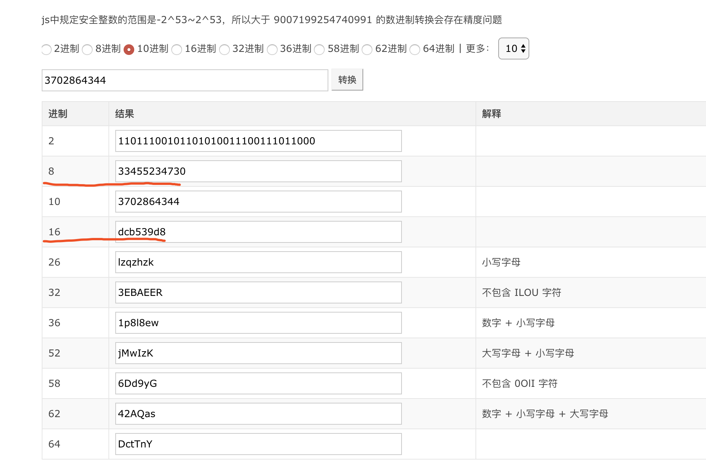

>阅读本文前,细致浏览[此文](https://blog.csdn.net/han156/article/details/77817031)以及粗略速览[ipv4](https://baike.baidu.com/item/IPv4/422599?fr=aladdin)和[无类域间路由](https://baike.baidu.com/item/%E6%97%A0%E7%B1%BB%E5%9F%9F%E9%97%B4%E8%B7%AF%E7%94%B1/240168?fr=aladdin)效果更佳

- 本文涉及算法很简单,更多更有价值之处是此间过程和来龙去脉.

<br>
<br>

### 前言

IPV4由4个Byte组成,每个Byte有8个Bit,每个Bit有0/1两种情况,也即32位0/1字符串(IPV6由128位组成);但为了显示直观方便记忆,会将4个Byte分开,将每个Byte的值转成10进制,中间用"."拼接,也就成了平时常见的IPV4地址(这样也不太容易记忆,于是后来就用字符（域名，例如：`www.dashen.tech`）来表示IP地址,每次请求时,通过DNS服务器,将字符（域名）解析成IP地址)


科普一下:把一个比特位Bit想象成一个坑,这个坑里只能放0或者1;一个字节Byte有8个比特位,则一个字节可以表征多少种不同情况?&nbsp&nbsp很显然,根据乘法原理,是2x2x2x2x2x2x2x2即2的8次方即256种情况,中学学过二进制与十进制的转换,二进制00000000和11111111之间的256个不同值,对应十进制0到255.


于是,对于任意一串32位的二进制数,都可以转换为ipv4的形式,
如对"01101001 01010001 01111101 00101010",
可以分别计算每段对应的十进制数字,中间用"."分隔,
即105.81.125.42

对于IDC部门,划分到的IP地址是一个区间,如从上面的"01101001 01010001 01111101 00101010"(记为a),到"01101001 01010001 01111111 00101000"(记为b),
转换为ipv4即是"105.81.125.42"到105.81.127.40",


### Step1:理论基础
那问题来了,如何判断某个ipv4地址,如"105.81.126.188",在不在这个区间范围内?

制定这套规则,做出这套转换的人类,当然能判断得出,但对于计算机,变成ipv4这个鬼样子格式,已经无法"一眼识别".


解决办法也很直观,即将ipv4格式转化为原本的二进制,如对"105.81.126.188",其对应的二进制值为"01101001 01010001 01111110 10111100"(记为c);此时即可以判断,c是否在[a,b]区间范围内.

但人类还是不习惯二进制比较大小,于是会将a,b,c全部转为10进制再做比较,

对于a对应的十进制数为1766948138,b为1766948648,
c为1766948540,现在,人类能够读懂,c在[a,b]之间.

进制转换可借助此网站快速实现,[戳此直达](https://tool.lu/hexconvert/) (注意去掉中间可能存在的空格)


具体到代码层面,可借助位运算符实现快速进制转换,

```go

package main

import (
	"strings"
	"strconv"
	"fmt"
)

func main() {

	rs := CidrToInt("105.81.126.188")

	fmt.Println(rs)

}

func CidrToInt(ip string) uint64 {
	ipSegement := strings.Split(ip, ".")

	segment1, _ := strconv.ParseUint(ipSegement[0], 10, 64)
	segment2, _ := strconv.ParseUint(ipSegement[1], 10, 64)
	segment3, _ := strconv.ParseUint(ipSegement[2], 10, 64)
	segment4, _ := strconv.ParseUint(ipSegement[3], 10, 64)

	intip := uint64(0)
	intip = intip + (segment1 << 24)
	intip = intip + (segment2 << 16)
	intip = intip + (segment3 << 8)
	intip = intip + segment4

	return intip
}


```

>结果为: 1766948540


[该网站功能](http://www.cha127.com/long2ip/)背后其实就是这么个方法~

<br>

关于位运算:

多说几句,实际位操作符,就是将数字左/右移动n位,然后在原位置补0;位操作符操作得到的是原数字对应的二进制数
如xxxxxx<<2即左移2位,将最左边两位去掉,剩余部分向左移动两位,最右边空余两位用0补齐 


---

### Step2:应用实践
现在我们可以通过ipv4地址对应的十进制数,直接在浏览器地址栏进行访问,以访问百度为例,


DNS解析服务器会将域名baidu.com解析到IPV4地址220.181.57.216,通过该地址访问实际更为直接.

现在我们将其转换为10进制数,将结果放在地址栏,看是否"更为直接"


将3702864344复制到地址栏,如期望跳到了百度.

借助如上所提进制转换网站,



我们同样可通过其对应的补码之后的8进制和16进制数进行访问,

试试在地址栏键入`0033455234730`和`0xdcb539d8`


---
实际上,leetcode第751题,疑似就是这么个问题,但不知为何这道题被"消失"了,或许是太简单了


---

如有兴趣,我们再写一个方法,将对应的十进制数转换为ipv4格式~
详见下篇


