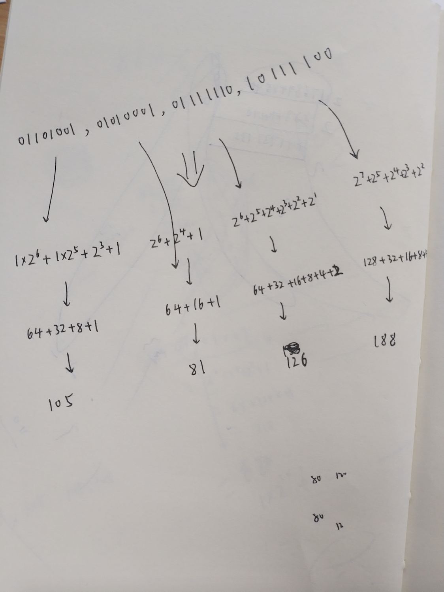

<br>

有十进制数c=`1766948540`,如何得出其对应的ipv4地址?

可将该十进制数c转为二进制数,如小于32位,前面用0补全;再划分为4等块,对每一块二进制数转化为10进制,中间用`.`分隔,得到的字符串即为十进制数c对应的ipv4

手算结果如下:
(得出一个31位的二进制数,在最左边补齐一个0)


<br>



---

用代码实现:


```go
func f2() {
	i := 1766948540
	s2 := strconv.FormatInt(int64(i), 2)

	l := len(s2)

	if l < 32 {
		s2 = fmt.Sprintf("%032s", s2) //01101001 01010001 01111110 10111100
	}

	a1 := string(s2[0:8])   //01101001
	a2 := string(s2[8:16])  //01010001
	a3 := string(s2[16:24]) //01111110
	a4 := string(s2[24:32]) //10111100

	//二进制转十进制
	d1, _ := strconv.ParseInt(a1, 2, 64)
	d2, _ := strconv.ParseInt(a2, 2, 64)
	d3, _ := strconv.ParseInt(a3, 2, 64)
	d4, _ := strconv.ParseInt(a4, 2, 64)

	ipv4 := fmt.Sprintf("%d", d1) + "." + fmt.Sprintf("%d", d2) + "." + fmt.Sprintf("%d", d3) + "." + fmt.Sprintf("%d", d4)
	fmt.Println(ipv4)

}

```


<br>

---

当然还有其他实现方法可参考,如下:


```go
func IntToCidr(intip uint64) string {
	segIp1 := intip & 0xFF000000
	segIp1 = segIp1 >> 24
	segIp2 := intip & 0x00FF0000
	segIp2 = segIp2 >> 16
	segIp3 := intip & 0x0000FF00
	segIp3 = segIp3 >> 8
	segIp4 := intip & 0x000000FF

	ip1 := strconv.FormatUint(segIp1, 10)
	ip2 := strconv.FormatUint(segIp2, 10)
	ip3 := strconv.FormatUint(segIp3, 10)
	ip4 := strconv.FormatUint(segIp4, 10)

	return ip1 + "." + ip2 + "." + ip3 + "." + ip4

}

```

`如xxxxxx<<2即左移2位,将最左边两位去掉,剩余部分向左移动两位,最右边空余两位用0补齐 `

或

```go
func IntToIpv4(){

	i:= 1766948540

	fmt.Println(byte(i >> 24))
	fmt.Println(byte(i >> 16))
	fmt.Println(byte(i >> 8))
	fmt.Println(byte(i))
	
}

```

结果:
```
105
81
126
188
```