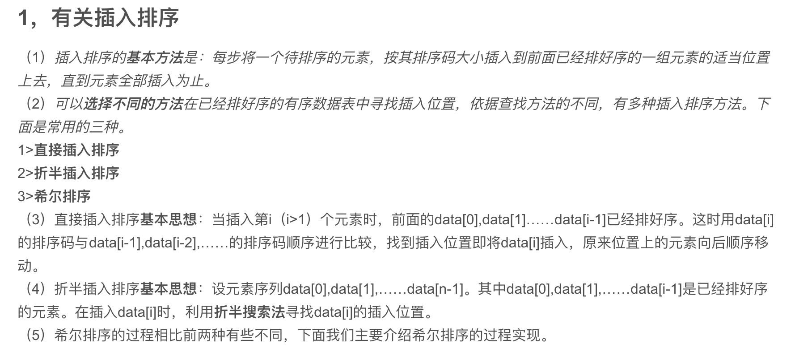
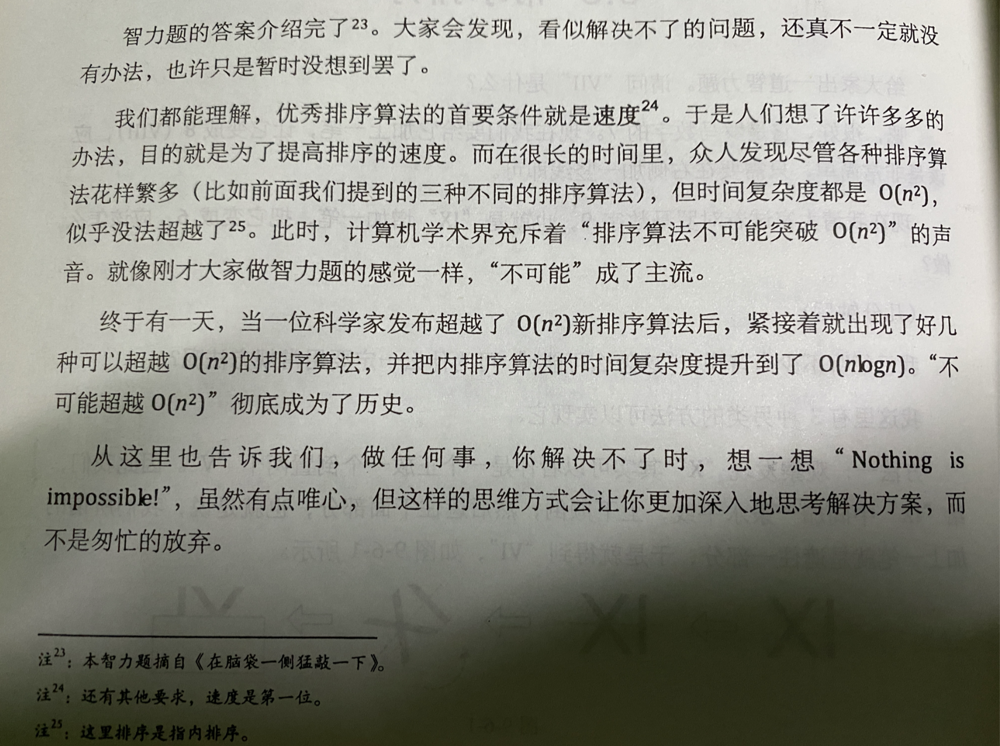
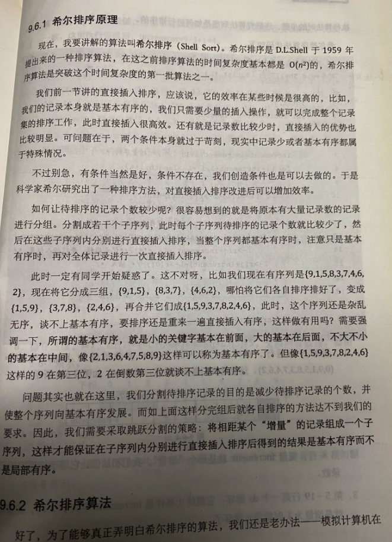
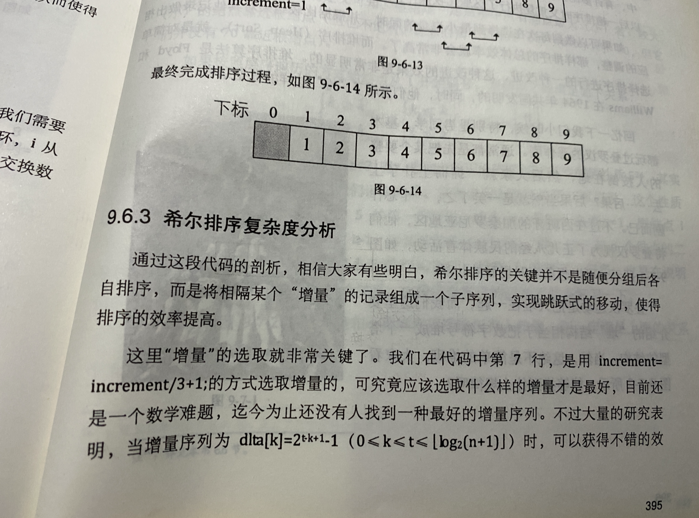
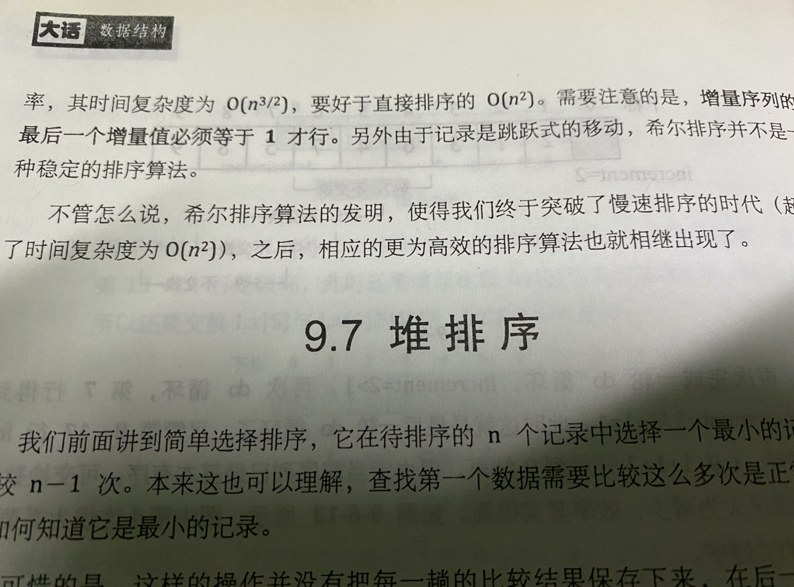
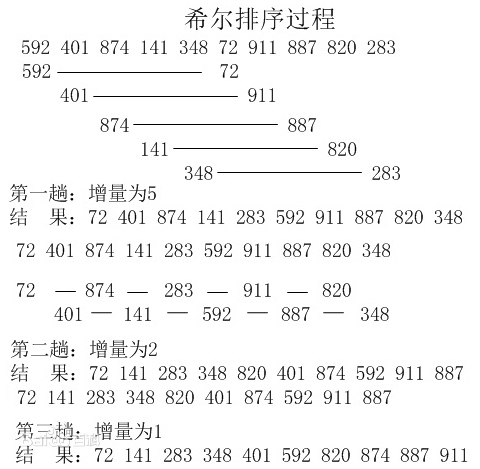

<br>


### 希尔排序(Shell Sort)

<br>


在研究希尔排序前,要先理清插入排序




<br>

- 希尔排序(Shell Sort)是插入排序的一种,又称“缩小增量排序”（Diminishing Increment Sort).
- 希尔排序是直接插入排序算法的一种更高效的改进版本.
- 希尔排序是<font color="green">**非稳定排序算法**</font>.
- 希尔排序是把记录按下标的一定增量分组,对每组使用直接插入排序算法排序;随着增量逐渐减少,每组包含的关键词越来越多,当增量减至1时,整个文件恰被分成一组,算法便终止。

- 相较直接插入排序，希尔排序减少了比较和交换的次数，在中小规模的排序中，性能表现较好。但随着数据量增大，希尔排序与其他更好的排序算法（快排、堆排、并归等）仍有较大差距。

<br>



<br>




<br>


<br>

参考下面两张图片,可知实际上 上图有误,希尔排序的平均时间复杂度是n的1.5次方





<font size=1 color="#8B1C62">

希尔排序的平均时间复杂度，应该是 待排序元素数量n的1.5次方…网上以讹传讹，整了个迷一般的1.3次方，让我很长一段时间如坠云雾。

直接插入排序，其平均时间复杂度应该是1/4*n的平方，虽然同样是n²级别，但因为前面聊胜于无的1/4，其性能稍好于冒泡排序和简单选择排序。

而升级版的直接插入排序，即希尔排序，是第一个使排序算法平均时间复杂度突破n²这一关隘的算法，即便在问世一年后，便被快速排序抢了风头。

如果说快速排序pivot即枢轴值的选取，三值取中或九值取中，其后涉及复杂的数学运算。那希尔排序这个增量increment(也被称为Gap值)的选取，竟然还是一门没有确切答案的玄学。

[希尔排序在不同增量序列下的效率差异](https://mp.weixin.qq.com/s/rTsRlZGVTUV_5wwPz42Lrw), 和素数又有 似隐似现若即若离的关联


</font>





<font size=1 color="#104E8B">

相比于冒泡排序和(直接)插入排序,希尔排序 可以很大程度优化算法的时间复杂度. 

在快速排序出现前,Shell Sort算是最先进的排序~

 希尔排序是 D.L.Shell 于 1959 年提出,

 快速排序则是 Tony Hoare 在1960年提出.

 两者都是不稳定排序

 </font>

<br>


### 具体算法

- 一般情况下,初次取序列的一半为增量,以后每次减半,直到增量为1.

<br>




```go
package main

import (
	"fmt"
)

func main() {
	list := []int{3, 7, 2, 3, 8, 0, 1, 9, 6, 5}
	shellSort(list, len(list)/2)
	fmt.Println(list)
}

/**
希尔排序：把切片分成n个batch，对每个batch进行插入排序；然后减小batch，再对每个batch进行插入排序；直到bathc等于1
*/
func shellSort(arr []int, batchSize int) {
	if batchSize < 1 {
		return
	}
	// k : 每个batch中的元素所在batch的index， 介于[0, batchSize)
	for k := 0; k < batchSize; k++ {
		// 用到了插入排序
		for j := 1; batchSize*j+k < len(arr); j++ { // j: 用来获取每个batch所在的第k个元素，拥有多少个batch
			for n := j; n > 0; n-- {
				pre := batchSize*(n-1) + k
				next := batchSize*n + k
				if arr[next] < arr[pre] {
					arr[next], arr[pre] = arr[pre], arr[next]
				}
			}

		}
	}
	shellSort(arr, batchSize/2) //以2为步长
}

```

<br>

另一种写法:

```go
func ShellSort(a []int) {
    n := len(a)
    h := 1
    for h < n/3 { //寻找合适的间隔h
        h = 3*h + 1
    }
    for h >= 1 {
        //将数组变为间隔h个元素有序
        for i := h; i < n; i++ {
            //间隔h插入排序
            for j := i; j >= h && a[j] < a[j-h]; j -= h {
                swap(a, j, j-h)
            }
        }
        h /= 3
    }
}
 
func swap(slice []int, i int, j int) {
    slice[i], slice[j] = slice[j], slice[i]
}
```

<br>


---

<br>


参考:

[希尔排序（golang实现）](https://blog.csdn.net/qq_36520153/article/details/82886403)

[希尔排序(golang实现)-2](https://www.jianshu.com/p/cf50795d7603)

[golang实现希尔排序](https://studygolang.com/articles/13855)


