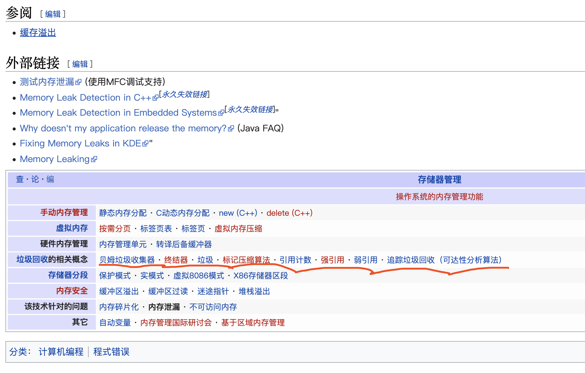
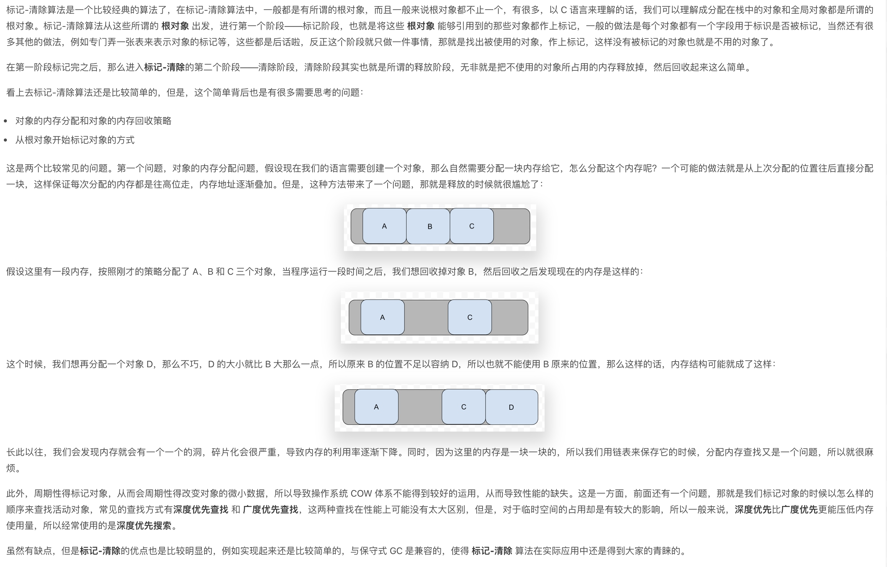
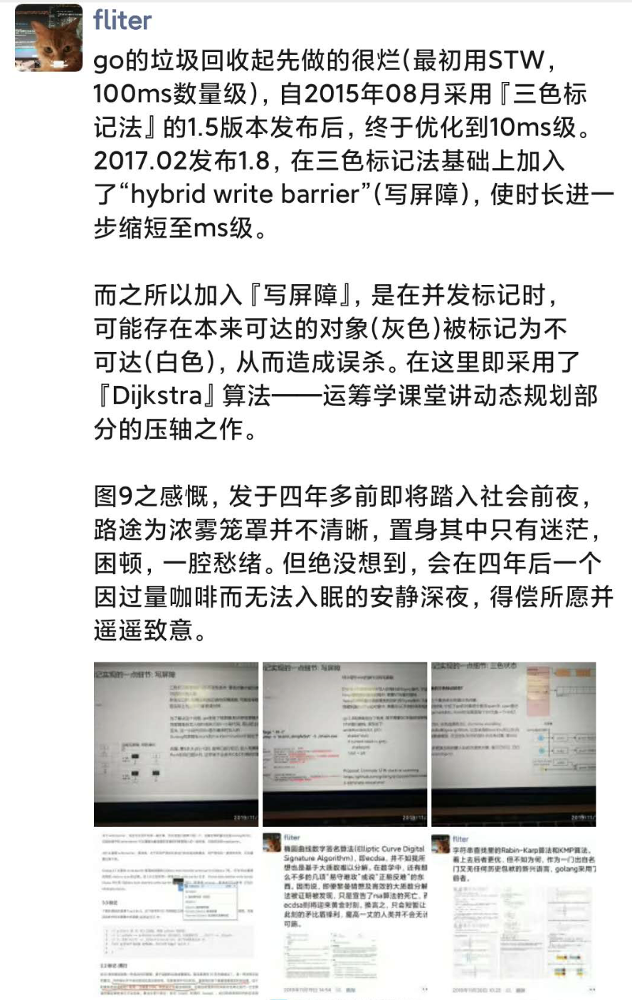

 

## 关于垃圾回收

<b>

垃圾回收(Garbage Collection，简称GC)是编程语言中提供的内存管理功能。

在传统的系统级编程语言（主要指C/C++）中，程序员定义了一个变量，就是在内存中开辟了一段相应的空间来存值。由于内存是有限的，所以当程序不再需要使用某个变量的时候，就需要销毁该对象并释放其所占用的内存资源，好重新利用这段空间。

在C/C++中，释放无用变量内存空间的事情需要由程序员自己来处理(malloc分配内存,free释放内存)。就是说当程序员认为变量没用了，就手动地释放其占用的内存。但是这样显然非常繁琐，如果有所遗漏，就可能造成资源浪费甚至"内存泄露"。当软件系统比较复杂，变量多的时候程序员往往就忘记释放内存或者在不该释放的时候释放内存了。这对于程序开发人员是一个比较头痛的问题。

为了解决这个问题，后来开发出来的几乎所有新语言（java，python，php等等）都引入了语言层面的自动内存管理 – 也就是语言的使用者只用关注内存的申请而不必关心内存的释放，内存释放由虚拟机（virtual machine）或运行时（runtime）来自动进行管理。而这种对不再使用的内存资源进行自动回收的功能就被称为垃圾回收。
</b>

 

###  内存泄漏(memory leak)

`由于疏忽或错误造成程序未能释放已经不再使用的内存。`不再用到的内存，没有及时释放，就叫做内存泄漏（memory leak）

内存泄漏并非指内存在物理上的消失，而是应用程序分配某段内存后，由于设计错误，导致在释放该段内存之前就失去了对该段内存的控制，从而造成了内存的浪费;

一次内存泄露危害可以忽略,但内存泄露堆积后果很严重,无论多少内存,迟早会被占光。

内存溢出(out of memory)

简称OOM,指应用系统中存在无法回收的内存或使用的内存过多, 最终使得程序运行要用到的内存大于能提供的最大内存。此时程序就运行不了, 系统会提示内存溢出,有时候会自动关闭软件, 重启电脑或者软件后释放掉一部分内存又可以正常运行该软件;

(从微观层面, 是指程序在申请内存时, 没有足够的内存空间供其使用, 出现out of memory；比如申请了一个int32,但给它存了int64才能存下的数，那就是内存溢出。)

内存泄露是造成内存溢出的其中一个原因，但是内存泄露不一定会造成内存溢出。简单来说，内存溢出就是占用内存太大，超过了系统可以承受的范围；而内存泄露则是由于对程序运行分配的对象回收不及时甚至于脆没有被回收，久而久之，则在系统分配的堆空间里面产生了很多无用的引用

 

---

 

## 常见方法

 

[各种编程语言的实现都采用了哪些垃圾回收算法？这些算法都有哪些优点和缺点？](https://www.zhihu.com/question/20018826)

 

### 引用计数法(reference counting)

 

基本思路是为每个对象加一个计数器，记录指向这个对象的引用数量。每次有一个新的引用指向这个对象，计数器加一；反之每次有一个指向这个对象引用被置空或者指向其他对象，计数器减一。当计数器变为 0 的时候，自动删除这个对象。

 

`引用计数`的优点是:

 1）相对简单，不需要太多运行时（run-time）的支持，可以在原生不支持 GC 的语言里实现。(如C/C++?)
 
 2）对象会在成为垃圾的瞬间被释放，不会给正常程序的执行带来额外中断。

 
 

 

`引用计数`的死穴是**循环引用**:

对象 A 包含一个引用指向对象 B ，同时对象 B 包含一个引用指向对象 A，计数器就抓瞎了。另外，引用计数对正常程序的执行性能有影响（每次引用赋值都要改计数器），特别是在多线程环境下（改计数器要加锁同步）。

 

PHP 5.3之前的GC,Python部分GC机制, 采用了该方法

[Python中GC的垃圾回收算法分析](https://www.boxuegu.com/news/2370.html)

 

---

### 标记清除法(mark-sweep)

 

[垃圾回收（GC） 的基本算法](https://liqiang.io/post/base-algorithm-in-gc)

 

基本思路是先按需分配，等到没有空闲内存的时候从寄存器和程序栈上的引用出发，遍历`以对象为节点、以引用为边构成的图，把所有可以访问到的对象打上标记，然后清扫一遍内存空间，把所有没标记的对象释放`。

`标记-清扫`没有无法处理循环引用的问题，不触发 GC 时也不影响正常程序的执行性能。

`标记-清扫`的问题是当内存耗尽触发 GC 时，需要中断正常程序一段时间来清扫内存，在内存大对象多的时候这个中断可能很长。

采用或者部分采用标记-清扫的例子,或采用该方法变种的例子非常多。实际应用中基于该算法的垃圾回收机制使用最广, Golang的三色标记法,便是基于此

 

---

### 复制收集法(copying)

 

基本思路是把整个内存空间一分为二，不妨记为 A 和 B。所有对象的内存在 A 中分配，当 A 塞满的时候，同样从寄存器和程序栈上的引用出发，遍历以对象为节点、以引用为边构成的图，把所有可以访问到的对象复制到 B 去，然后对调 A 和 B 的角色。

相对于标记-清扫，`节点复制`的主要缺点是总有一半空间空闲着无法利用，另一个比较隐晦的缺点是它使用内存的方式与现有的内存换页、Cache 换入换出机制有潜在的冲突。

但有个很大的优点： 所有的对象在内存中永远都是紧密排列的，所以分配内存的任务变得极为简单，只要移动一个指针即可。对于内存分配频繁的环境来说，性能优势相当大。另外，由于不需要清扫整个内存空间，所以如果内存中存活对象很少而垃圾对象很多的话（有些语言有这个倾向），`触发 GC 造成的中断会小于标记-清扫法`。

 

`引用计数法`和`标记清除法`两种方法都是在对象本身上操作的，也就是说清除和释放都是操作对象本身所在的位置，但是，GC 复制算法 就稍微复杂一些了 --- 最原始的做法是将内存一分为二，每次只使用其他一半，当要 GC 的时候就将使用着的一半中的活动对象复制到另外一半中，然后清理掉这一半中的所有对象，直接使用另外一半即可，重复这个操作。

 

好处非常明显:

<b>

首先是速度快，没有额外的标记-清理操作，就是直接的复制，高吞吐；

分配对象直接分配，不需要考虑碎片化问题；

还可以保持与 OS 的缓存兼容。

</b>

 

弊端也很突出: 

<b>

即空间的利用率不高; 

且不兼容保守式的 GC 算法; 

对于递归调用还会有栈溢出的风险。

</b>

所以为了更好的完善这个算法，还有有很多改进思路被提出，例如不是将空间划分为两部分，而是划分为多个部分，从而提升空间的利用率, 就是其中的一个思路。

 

---

 

## Go中GC的实现及测验

 

[Go垃圾回收 1：历史和原理](https://lessisbetter.site/2019/10/20/go-gc-1-history-and-priciple/)

[GO GC 垃圾回收机制](https://segmentfault.com/a/1190000018161588)

[Proposal: Eliminate STW stack re-scanning](https://go.googlesource.com/proposal/+/master/design/17503-eliminate-rescan.md)

垃圾回收,主要是语言的虚拟机,或者`运行时`即runtime去做

---

 

### 1.3以前版本 STW（Stop The World）

 

`100ms数量级`

Golang的垃圾回收算法都非常简陋，其性能也广为诟病:go runtime在一定条件下（内存超过阈值或定期如2min），暂停所有任务的执行，进行mark&sweep操作，操作完成后再启动所有任务的执行。

在内存使用较多的场景下，go程序在进行垃圾回收时会发生非常明显的卡顿现象（`Stop The World`）。在对响应速度要求较高的后台服务进程中，这种延迟简直无法忍受！这个时期国内外很多在生产环境实践go语言的团队, 都或多或少踩过gc的坑。当时解决这个问题比较常用的方法, 是尽快控制自动分配内存的内存数量以减少gc负荷，同时采用手动管理内存的方法处理需要大量及高频分配内存的场景。

---

 

### 1.3 Mark STW, Sweep 并行

 

1.3版本中，go runtime分离了mark和sweep操作，和以前一样，也是先暂停所有任务执行, 并启动mark. mark完成后马上就重新启动被暂停的任务(之前是等sweep完之后再执行普通协程任务)，让sweep任务和普通协程任务一样并行地和其他任务一起执行。如果运行在多核处理器上，go会试图将gc任务放到单独的核心上运行而尽量不影响业务代码的执行。

go team自己的说法是减少了50%-70%的暂停时间。

<b>在这个版本后,Go语言在GC的sweep阶段,和程序员写的程序可以同时执行了(mark阶段程序员的程序还是处在停滞等待的)

1.3之前,在进行垃圾回收时的sweep阶段时,程序员写的go func是处于等待状态的</b>

---

 

### 1.5 三色标记法

 

`10ms数量级`

go 1.5 实现的垃圾回收器是“非分代的、非移动的、并发的、三色的标记清除垃圾收集器”。

`三色标记法` 的mark操作是可以渐进执行的, 而不需每次都扫描整个内存空间，可以减少`stop the world`的时间。 

由此可以看到，一路走来直到1.5版本，go的垃圾回收性能也是一直在提升，但是相对成熟的垃圾回收系统（如java jvm和javascript v8），go需要优化的路径还很长。

 

三色标记算法是对"标记清除法"标记阶段的改进，原理如下：

- 起初所有对象都是白色。

- 从根出发扫描所有可达对象，标记为灰色，放入待处理队列。

- 从队列取出灰色对象，将其引用对象标记为灰色放入队列，自身标记为黑色。

- 重复 上一步，直到灰色对象队列为空。此时白色对象即为垃圾，进行回收。

三色标记的一个明显好处是能够让用户程序和 mark 并发的进行，具体可以参考论文：《On-the-fly garbage collection: an exercise in cooperation.》。这个版本Golang 的 GC 实现也是基于这篇论文.

<b>在这个版本后,Go语言在GC的makr & sweep阶段,和程序员写的程序可以同时执行了. 即GC运行时,程序员的程序可以不必等待了.</b>

> 从垃圾回收器的视角来看，三色抽象规定了三种不同类型的对象，并用不同的颜色相称：
 
白色对象（可能死亡）：未被回收器访问到的对象。在回收开始阶段，所有对象均为白色，当回收结束后，白色对象均不可达。
 
灰色对象（波面）：已被回收器访问到的对象，但回收器需要对其中的一个或多个指针进行扫描，因为他们可能还指向白色对象。
 
黑色对象（确定存活）：已被回收器访问到的对象，其中所有字段都已被扫描，黑色对象中任何一个指针都不可能直接指向白色对象。

[GC 的认识](https://github.com/qcrao/Go-Questions/blob/master/GC/GC.md)

---

 

### 1.8 混合写屏障（hybrid write barrier）

 

`1ms数量级`

这个版本的 GC 代码相比之前改动较大，采用一种混合的 write barrier 方式 （Yuasa-style deletion write barrier [Yuasa ‘90] 和 Dijkstra-style insertion write barrier [Dijkstra ‘78]）来避免 堆栈重新扫描。

> Write Barrier是为了记录mark阶段新产生的对象。
 
Golang 1.7 之前的 write barrier 使用的经典的 Dijkstra-style insertion write barrier [Dijkstra ‘78]， STW 的主要耗时就在 stack re-scan 的过程。自 1.8 之后采用一种混合的 write barrier 方式 （Yuasa-style deletion write barrier [Yuasa ‘90] 和 Dijkstra-style insertion write barrier [Dijkstra ‘78]）来避免 re-scan。具体的可以参考 17503-eliminate-rescan。

混合屏障的优势在于它允许堆栈扫描永久地使堆栈变黑（没有STW并且没有写入堆栈的障碍），这完全消除了堆栈重新扫描的需要，从而消除了对堆栈屏障的需求。重新扫描列表, 特别是堆栈障碍在整个运行时引入了显着的复杂性，并且干扰了来自外部工具（如GDB和基于内核的分析器）的堆栈遍历。

此外，与Dijkstra风格的写屏障一样，混合屏障不需要读屏障，因此指针读取是常规的内存读取; 它确保了进步，因为物体单调地从白色到灰色再到黑色。

混合屏障的缺点很小: 它可能会导致更多的浮动垃圾，因为它会在标记阶段的任何时刻保留从根（堆栈除外）可到达的所有内容。

[golang 1.8 gc的演进](https://studygolang.com/articles/25205)

---

 

更多参考:

[Java虚拟机垃圾回收算法](https://cloud.tencent.com/developer/article/1583855)

[深入理解java垃圾回收机制](https://www.cnblogs.com/sunniest/p/4575144.html)

[JavaScript内存管理](https://developer.mozilla.org/zh-CN/docs/Web/JavaScript/Memory_Management)

