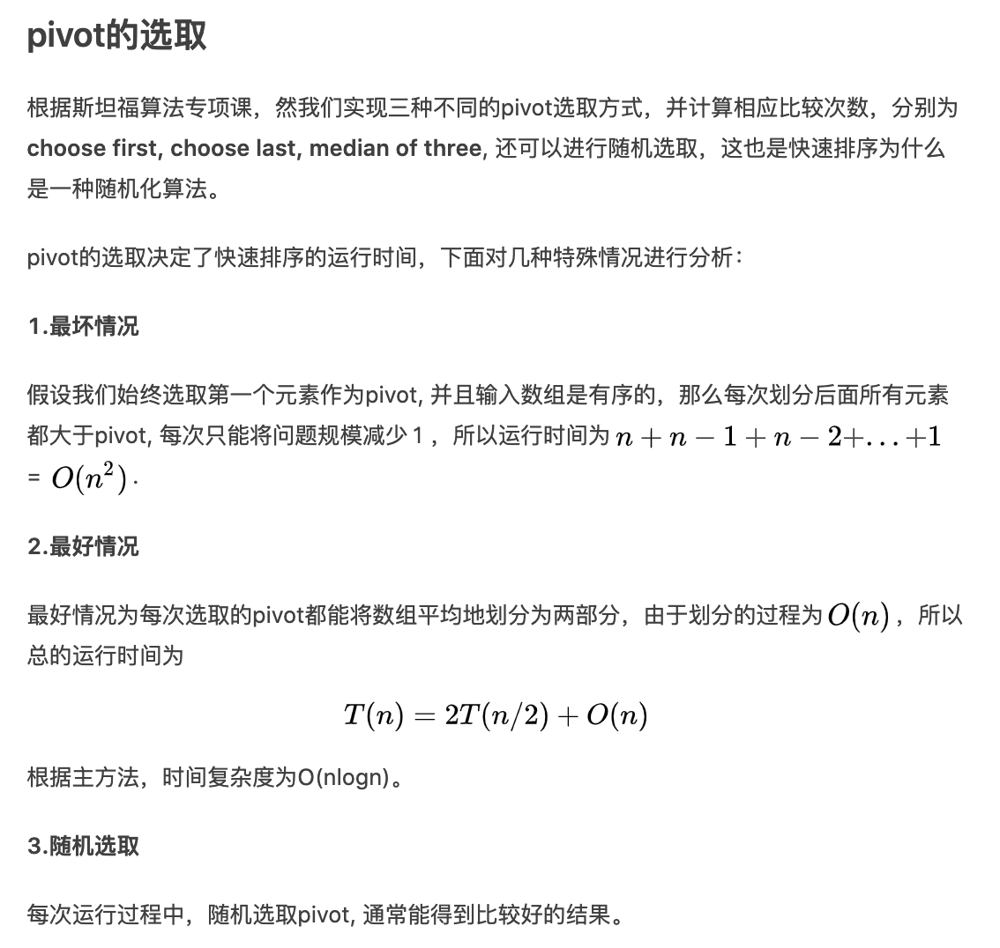

<br>


[排序算法：快速排序【图解+代码】](https://www.bilibili.com/video/BV1bz411e7vY)

[动画详解排序算法之快速排序 Quick Sort](https://www.bilibili.com/video/BV1b441117Rn)


[快速排序和二分查找法总结](https://www.jianshu.com/p/a81b5cc782ef)


[使用 Go 实现快速排序](https://colobu.com/2018/06/26/implement-quick-sort-in-golang/)


和CSP理论的提出者系自一人,即大名鼎鼎的托尼·霍尔（Tony Hoare）爵士

[天神荟萃](https://dashen.tech/2020/05/07/%E5%A4%A9%E7%A5%9E%E8%8D%9F%E8%90%83/)


<br>


---


> sort.Sort的实现: 当待排序元素≤12时，使用希尔排序；当阈值为0时，使用堆排序。否则使用快速排序。在确定其分区点时，有一个三值取中的逻辑（元素数量不大于40时进行一次，大于40时进行三次）。根据注释的Tukey's Ninther，了解到这是取中值的一个算法…


**"最优雅和高效的算法之一"**, 使用golang,短止20行

算法思想是 **分而治之**和**递归调用**

通过选取一个pivot，将一个数组划分为两个子数组。
- 1.从数组中选择一个元素作为pivot
- 2.重新排列数组，**小于**pivot的在pivot的**左边**，大于pivot的在其右边。
- 3.递归地对划分后的左右两部分重复上述步骤。


<br>

[排序算法汇总](https://dashen.tech/2019/03/26/%E6%8E%92%E5%BA%8F%E7%AE%97%E6%B3%95%E6%B1%87%E6%80%BB/)

确实如果不考虑 枢轴点(pivot)的选取,而定死以最后一个(或第一个)元素作为pivot,那快速排序的代码实现,确实并不复杂. 而在工业实现中,这个枢轴点的选取,一般会采用三值取中(当元素数较少)甚至九值取中(当元素数较多)...

"取中"涉及到复杂的数学原理,面试时对方的渣渣水平,不足予论.只要写出定死枢轴值是最后一个元素的就行


<br>



<br>

---


```go
package main

import (
	"fmt"
	"math/rand"
	"sort"
	"time"
)

func partition(a []int, lo, hi int) int {
	pivot := a[hi] // 关键一步,可以一眼看出选定的枢轴点是第一个元素还是最后一个元素,hi显然选取了最后一个元素

	i := lo - 1
	for j := lo; j < hi; j++ {
		if a[j] < pivot {
			i++
			a[j], a[i] = a[i], a[j]
		}
	}
	a[i+1], a[hi] = a[hi], a[i+1]
	return i + 1
}
func quickSort(a []int, lo, hi int) {
	if lo >= hi {
		return
	}
	p := partition(a, lo, hi)
	quickSort(a, lo, p-1)
	quickSort(a, p+1, hi)
}

func main() {
	rand.Seed(time.Now().UnixNano())

	testData1 := make([]int, 0, 100000000)

	times := 100000000

	for i := 0; i < times; i++ {
		val := rand.Intn(20000000)
		testData1 = append(testData1, val)
	}

	start := time.Now()
	quickSort(testData1, 0, len(testData1)-1)
	fmt.Println("single goroutine: ", time.Now().Sub(start))
	if !sort.IntsAreSorted(testData1) {
		fmt.Println("wrong quick_sort implementation")
	}
}
```


<br>


添加部分注释如下:

```go
package main

import (
	"fmt"
	"time"
)

func partition(a []int, lo, hi int) int {
	pivot := a[hi]
	fmt.Println("未处理前的数组为:", a)
	fmt.Println("pivot:", pivot)
	fmt.Println("当前数组长度为:", hi+1)
	fmt.Println("lo:", lo)
	fmt.Println("hi:", hi)
	fmt.Println("进行循环:\n\n")
	i := lo - 1
	for j := lo; j < hi; j++ {

		fmt.Println("****循环开始****")
		fmt.Println("j is:", j)
		if a[j] < pivot {
			i++
			fmt.Println("i is:", i)
			a[j], a[i] = a[i], a[j]

			fmt.Println("now a is:", a)
		}

		fmt.Println("-----循环结束----")
	}
	a[i+1], a[hi] = a[hi], a[i+1]

	fmt.Println("last a is:", a)

	time.Sleep(1e9)
	return i + 1
}
func quickSort(a []int, lo, hi int) {
	if lo >= hi {
		return
	}

	p := partition(a, lo, hi)

	fmt.Println("\n\n获取到当前p为:", p)
	fmt.Println("开始递归:\n\n\n")

	quickSort(a, lo, p-1)

	fmt.Println("进行后半部分的排序")
	quickSort(a, p+1, hi)
}

func main() {
	var list []int
	list = []int{3, 7, 2, 3, 8, 0, 1, 9, 6, 5}

	quickSort(list, 0, len(list)-1)

	fmt.Println(list)

}
```

<br>

返回值为:

```sql
j is: 0
i is: 0
now a is: [3 7 2 3 8 0 1 9 6 5]
-----循环结束----
****循环开始****
j is: 1
-----循环结束----
****循环开始****
j is: 2
i is: 1
now a is: [3 2 7 3 8 0 1 9 6 5]
-----循环结束----
****循环开始****
j is: 3
i is: 2
now a is: [3 2 3 7 8 0 1 9 6 5]
-----循环结束----
****循环开始****
j is: 4
-----循环结束----
****循环开始****
j is: 5
i is: 3
now a is: [3 2 3 0 8 7 1 9 6 5]
-----循环结束----
****循环开始****
j is: 6
i is: 4
now a is: [3 2 3 0 1 7 8 9 6 5]
-----循环结束----
****循环开始****
j is: 7
-----循环结束----
****循环开始****
j is: 8
-----循环结束----
last a is: [3 2 3 0 1 5 8 9 6 7]


获取到当前p为: 5
开始递归:


未处理前的数组为: [3 2 3 0 1 5 8 9 6 7]
pivot: 1
当前数组长度为: 5
lo: 0
hi: 4
进行循环:


****循环开始****
j is: 0
-----循环结束----
****循环开始****
j is: 1
-----循环结束----
****循环开始****
j is: 2
-----循环结束----
****循环开始****
j is: 3
i is: 0
now a is: [0 2 3 3 1 5 8 9 6 7]
-----循环结束----
last a is: [0 1 3 3 2 5 8 9 6 7]


获取到当前p为: 1
开始递归:


进行后半部分的排序
未处理前的数组为: [0 1 3 3 2 5 8 9 6 7]
pivot: 2
当前数组长度为: 5
lo: 2
hi: 4
进行循环:


****循环开始****
j is: 2
-----循环结束----
****循环开始****
j is: 3
-----循环结束----
last a is: [0 1 2 3 3 5 8 9 6 7]


获取到当前p为: 2
开始递归:


进行后半部分的排序
未处理前的数组为: [0 1 2 3 3 5 8 9 6 7]
pivot: 3
当前数组长度为: 5
lo: 3
hi: 4
进行循环:


****循环开始****
j is: 3
-----循环结束----
last a is: [0 1 2 3 3 5 8 9 6 7]


获取到当前p为: 3
开始递归:


进行后半部分的排序
进行后半部分的排序
未处理前的数组为: [0 1 2 3 3 5 8 9 6 7]
pivot: 7
当前数组长度为: 10
lo: 6
hi: 9
进行循环:


****循环开始****
j is: 6
-----循环结束----
****循环开始****
j is: 7
-----循环结束----
****循环开始****
j is: 8
i is: 6
now a is: [0 1 2 3 3 5 6 9 8 7]
-----循环结束----
last a is: [0 1 2 3 3 5 6 7 8 9]


获取到当前p为: 7
开始递归:


进行后半部分的排序
未处理前的数组为: [0 1 2 3 3 5 6 7 8 9]
pivot: 9
当前数组长度为: 10
lo: 8
hi: 9
进行循环:


****循环开始****
j is: 8
i is: 8
now a is: [0 1 2 3 3 5 6 7 8 9]
-----循环结束----
last a is: [0 1 2 3 3 5 6 7 8 9]


获取到当前p为: 9
开始递归:


进行后半部分的排序
[0 1 2 3 3 5 6 7 8 9]


```

<br>

牛刀小用:

[leetcode-75. 颜色分类](https://leetcode-cn.com/problems/sort-colors/)