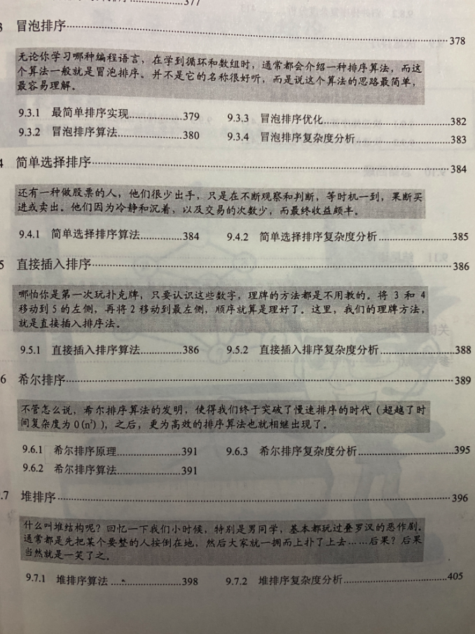
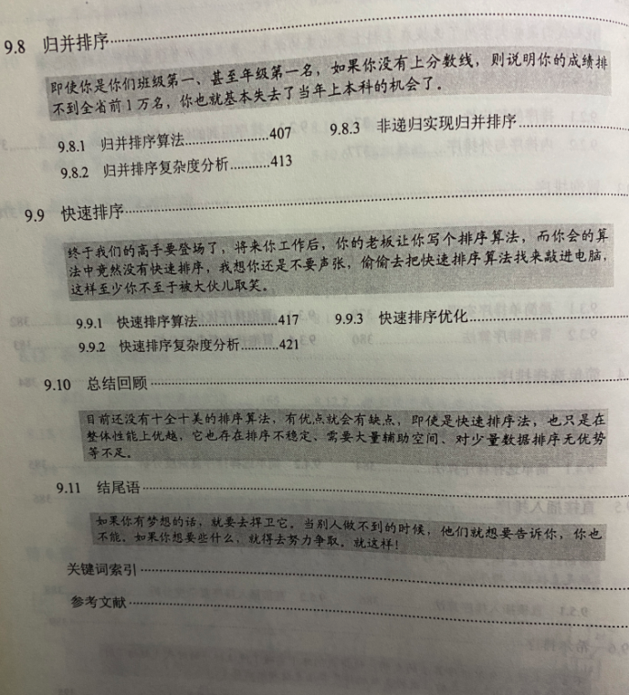
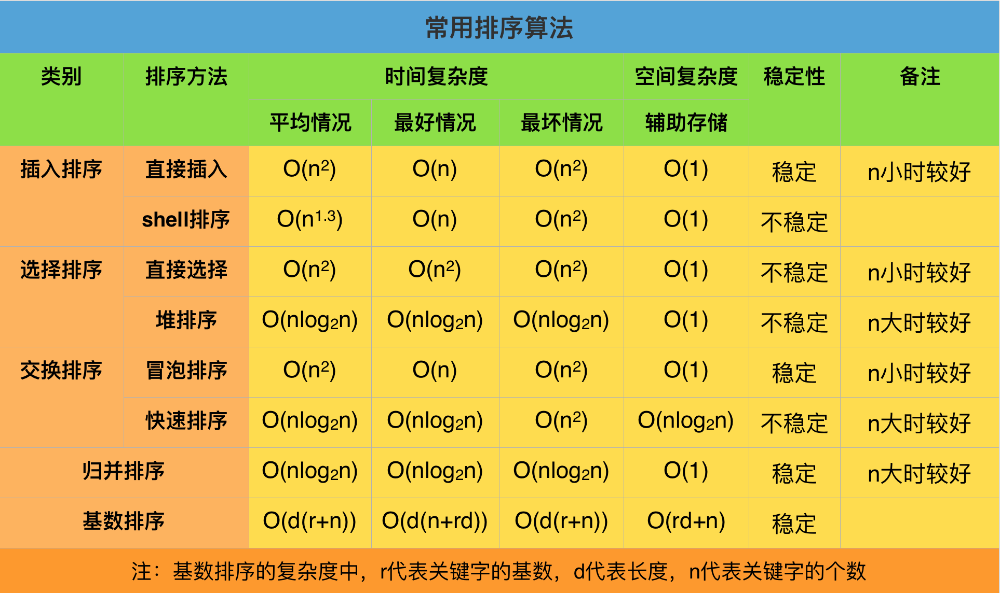
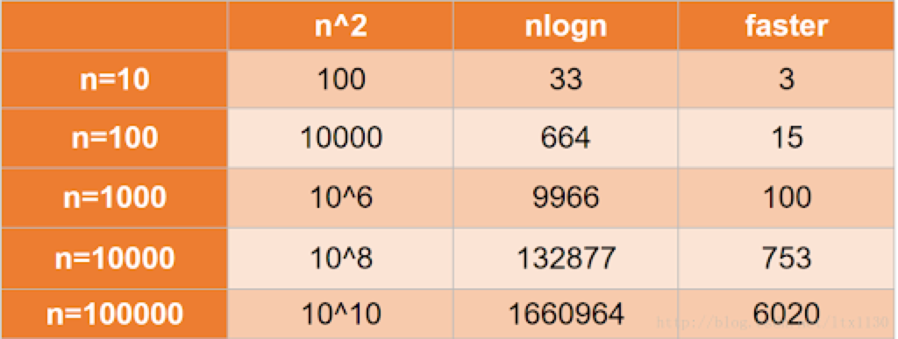
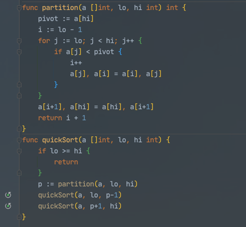
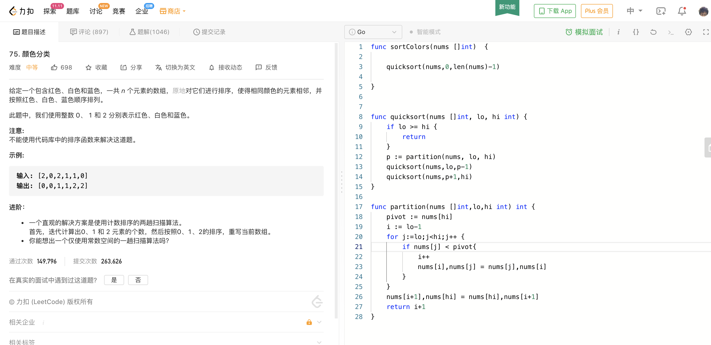

<br>


[十大经典排序算法](https://www.bookstack.cn/read/JS-Sorting-Algorithm/README.md)


<br>







---

<br>


### **生成一串无序的随机数:**


<br>


长度为15,范围在0-1000之间

```go

package main

import (
	"fmt"
	"math/rand"
	"time"
)

func main() {

	var length = 15
	var list []int

	// 以时间戳为种子生成随机数，保证每次生成的数据不重复
	r := rand.New(rand.NewSource(time.Now().UnixNano()))
	for i := 0; i < length; i++ {
		list = append(list, r.Intn(1000))
	}
	fmt.Println(list)

}

```

<br>

---


### **各大算法 的 时间复杂度及稳定性:**

<br>





<font size=1>


注: 希尔排序的平均时间复杂度应该为n的1.5次方,上图有误

</font>

<br>


冒泡排序的时间复杂度为O(n的平方),即如果要比较的元素n=5,就需要25次比较; 当n=10000时,将急剧飙升到1亿次比较.

计算机科学家对排序,这一基本算法的研究和优化,从未停止.


<br>




<br>

对于时间复杂度为O(n的平方)和O(n乘以log以2为底n的对数)的排序算法(此处以冒泡排序和快速排序为例),其需要比较的次数和差距如上图,即:

当10个数排序时,冒泡需比快排多比较3倍;<br>
当100个数排序时,冒泡需比快排多比较15倍;<br>
当1000个数排序时,冒泡需比快排多比较100倍;<br>
当10000个数排序时,冒泡需比快排多比较750倍;<br>
当100000个数排序时,冒泡需比快排多比较6000倍;<br>


---

<br>


#### (直接)插入排序

[插入排序](https://dashen.tech/2018/10/25/%E6%8F%92%E5%85%A5%E6%8E%92%E5%BA%8F/)

<br>

#### Shell排序

[希尔排序](https://dashen.tech/2018/12/22/%E5%B8%8C%E5%B0%94%E6%8E%92%E5%BA%8F/)

<br>

---

<br>


#### 直接选择排序

[直接选择排序](https://dashen.tech/2018/10/25/%E5%A0%86%E6%8E%92%E5%BA%8F/)


<br>

#### 堆排序

[堆排序](https://dashen.tech/2018/10/25/%E5%A0%86%E6%8E%92%E5%BA%8F/)

<br>

---

<br>


#### 冒泡排序

[冒泡排序](https://dashen.tech/2017/09/17/%E5%86%92%E6%B3%A1%E6%8E%92%E5%BA%8F/)

<br>


#### 快速排序

[快速排序](https://dashen.tech/2015/03/22/%E5%BF%AB%E9%80%9F%E6%8E%92%E5%BA%8F/)


20行代码(8行递归,12行排序&取枢轴点)







<br>

---

#### 归并排序

[归并排序]()


<br>


---

<br>


扩展阅读:


[sort包源码分析](https://dashen.tech/2020/10/25/sort%E5%8C%85%E6%BA%90%E7%A0%81%E5%88%86%E6%9E%90/)


[找工作知识储备(3)A---从头说12种排序算法：原理、图解、动画视频演示、代码以及笔试面试题目中的应用](https://www.jianshu.com/p/aa0d50bdd775)


