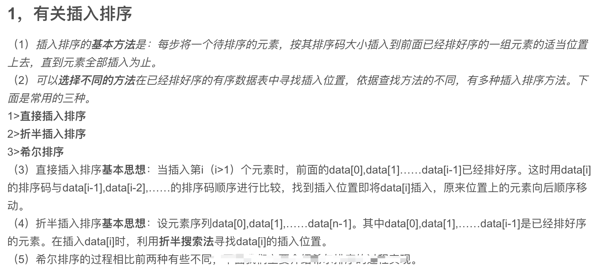
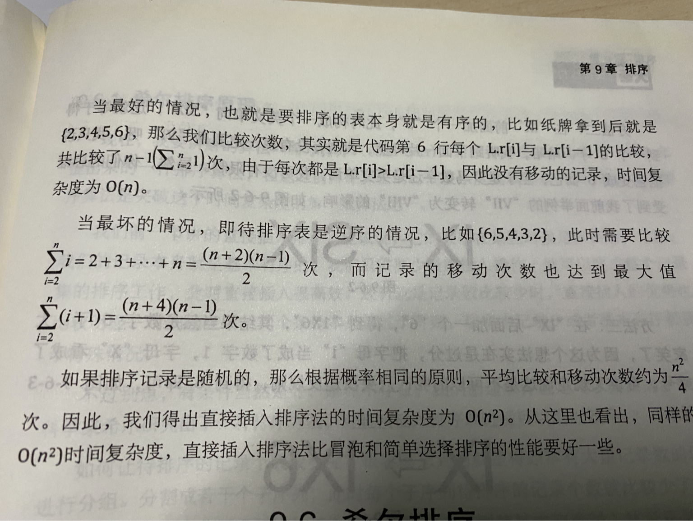

### 概述:

<br>


插入排序，一般也被称为**直接插入排序**。对于少量元素的排序，是一个有效的算法 。


插入排序是一种最简单的排序方法，其基本思想是将一个记录插入到已经排好序的有序表中，从而一个新的、记录数增1的有序表。在其实现过程使用双层循环，外层循环对除了第一个元素之外的所有元素，内层循环对当前元素前面有序表进行待插入位置查找，并进行移动

<br>




<br>


### 基本思想及代码实现:

<br>


插入排序的工作方式像许多人排序一手扑克牌。开始时，我们的左手为空并且桌子上的牌面向下。然后，我们每次从桌子上拿走一张牌并将它插入左手中正确的位置。为了找到一张牌的正确位置，我们从右到左将它与已在手中的每张牌进行比较。拿在左手上的牌总是排序好的，原来这些牌是桌子上牌堆中顶部的牌。


插入排序是指在待排序的元素中，假设前面n-1(其中n>=2)个数已经是排好顺序的，现将第n个数插到前面已经排好的序列中，然后找到合适自己的位置，使得插入第n个数的这个序列也是排好顺序的。按照此法对所有元素进行插入，直到整个序列排为有序的过程，称为插入排序

<br>




<br>


```go
package main

import (
	"fmt"
	"math/rand"
	"time"
)

func main() {

	var length = 15
	var list []int

	// 以时间戳为种子生成随机数，保证每次生成的数据不重复
	r := rand.New(rand.NewSource(time.Now().UnixNano()))
	for i := 0; i < length; i++ {
		list = append(list, r.Intn(1000))
	}
	fmt.Println(list)

	insertionSort(list)

	fmt.Println(list)

}

func insertionSort(arr []int) {
	if len(arr) <= 1 {
		return
	}
	for i := 1; i < len(arr); i++ {
		for j := i; j > 0; j-- {
			if arr[j] < arr[j-1] {
				arr[j], arr[j-1] = arr[j-1], arr[j]
			}
		}
	}
}

```

