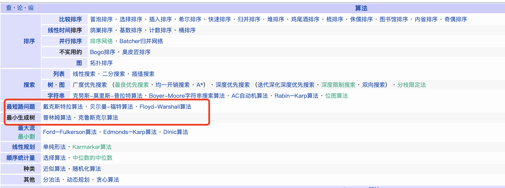

[最小生成树](https://zh.wikipedia.org/wiki/%E6%9C%80%E5%B0%8F%E7%94%9F%E6%88%90%E6%A0%91)(*Minimum Spanning Tree,MST*) 是图论中的内容, 是指一副 连通加权无向图 中一棵 权值最小 的生成树。最小生成树其实是最小权重生成树的简称

主要有两大算法,较容易理解的[克鲁斯卡尔算法(Kruskal)]()和[普里姆算法(Prim)]()

可参考[最小生成树(Kruskal(克鲁斯卡尔)和Prim(普里姆))算法动画演示](https://www.bilibili.com/video/av47042691/)

 

### Kruskal算法

 

[Kruskal算法](https://dashen.tech/2020/11/15/Kruskal%E7%AE%97%E6%B3%95/)

[Kruskal算法java版](https://www.cnblogs.com/yesun/p/3200052.html)

 

---

 

### Prim算法

 

[Prim算法](https://dashen.tech/2020/11/15/Prim%E7%AE%97%E6%B3%95/)