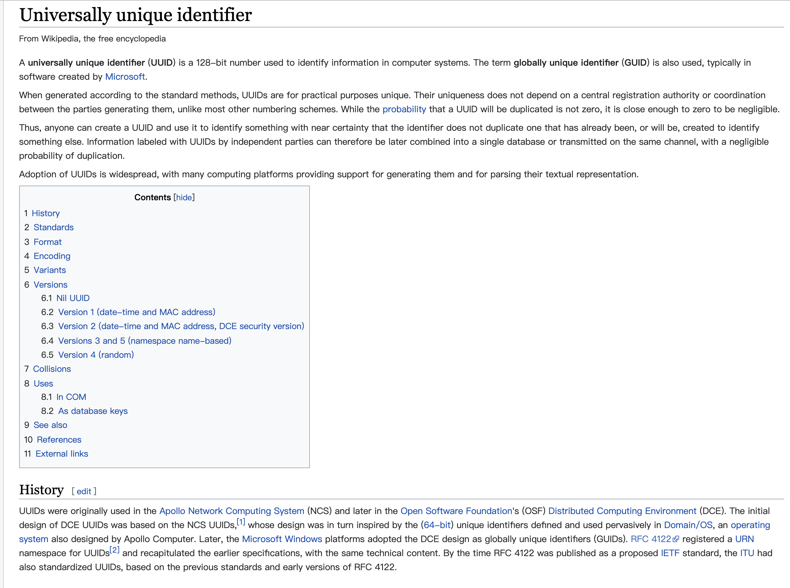
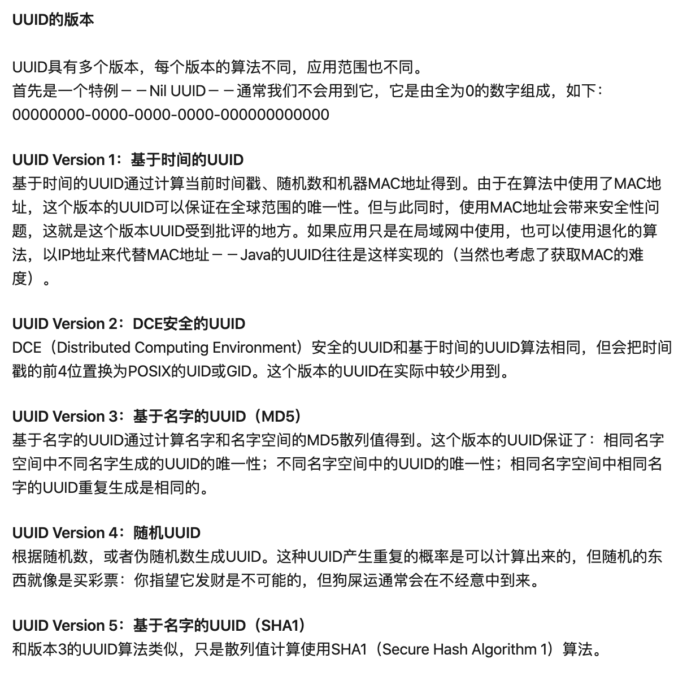
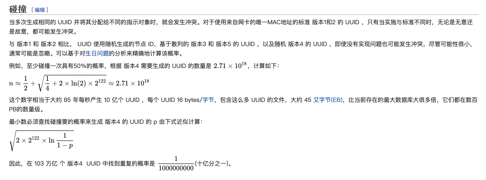

 

 

### UUID/GUID

[通用唯一识别码（英语：Universally Unique Identifier，缩写：UUID）](https://zh.wikipedia.org/wiki/%E9%80%9A%E7%94%A8%E5%94%AF%E4%B8%80%E8%AF%86%E5%88%AB%E7%A0%81)

UUID是由开放软件基金会（OSF）定义的一种标准,而GUID是微软对UUID这个标准的实现,目前被广泛采用。UUID还有其它各种实现，不止GUID一种。

生成的uuid是由一组 **32位数** 的16进制数字所构成，故uuid理论上的总数为16的32次方, 即2的128次方，约等于3.4 x 10的38次方。也就是说若每纳秒(ns)产生1兆个UUID，要花100亿年才会将所有uuid用完。

UUID的标准型式包含32个16进制数字，以连字号分为五段，形式为8-4-4-4-12的32个字符。示例：

550e8400-e29b-41d4-a716-446655440000

### UUID的版本

uuid现在共有5个版本,版本1不够安全,版本4有可能发生重复,但概率极低.现在大多使用uuid4

参见: 

[UUID 不同版本的区别及选择](https://www.jianshu.com/p/76e3a75605ed)

### 生成规则

参考:

[图解各路分布式ID生成算法](https://i6448038.github.io/2019/09/28/snowflake/)

比较知名的有Twitter的Snowflake算法

---

 

UUID4发生碰撞的概率:

[更多参见私有笔记](https://note.youdao.com/web/#/file/1543ED0604AD42088E783F9EE149FDC6/note/WEB4e88a215267b556419acc7cbfafc2107/?search=uuid&count=5)

---

参考:

[面试总被问分布式ID？ 美团（Leaf）了解一下](https://juejin.im/post/5e61b4f26fb9a07cb83e2eee)

[美团技术分享：深度解密美团的分布式ID生成算法](https://zhuanlan.zhihu.com/p/83753710)

[面试总被问分布式ID怎么办？ 滴滴（Tinyid）甩给他](https://cloud.tencent.com/developer/article/1598569)