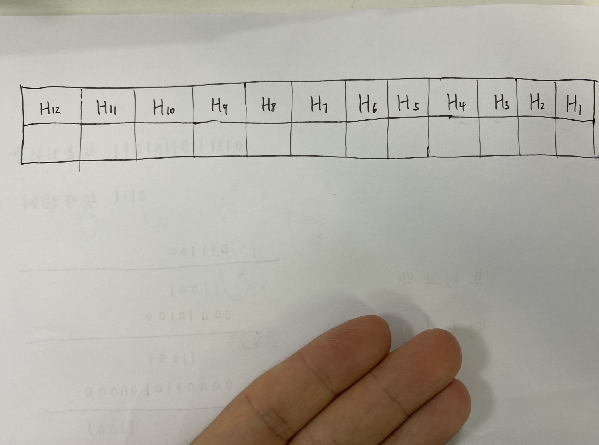
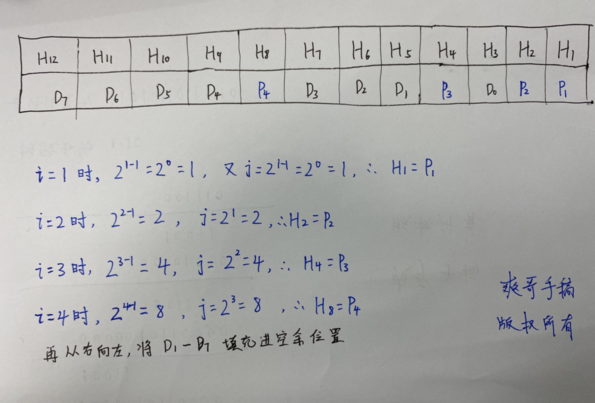
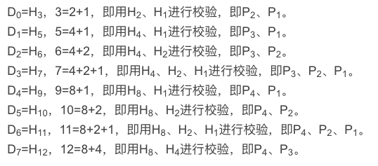
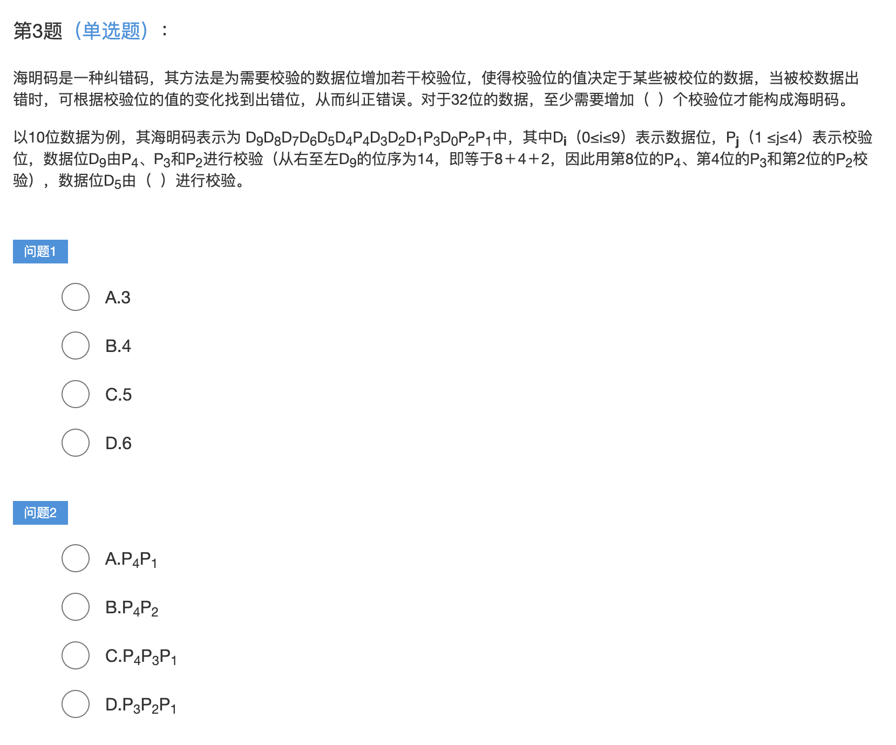
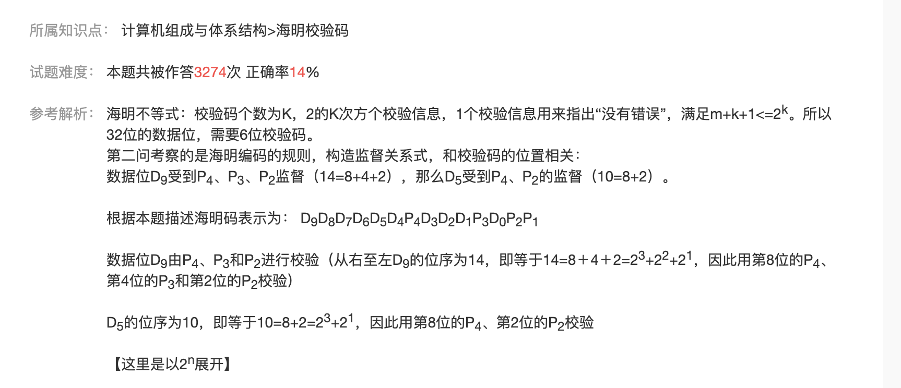

二进制数据在 传送、存取等环节，可能会发生 *误码*(1变成0或0变成1). 如何发现并纠正 *误码*? 解决此类问题的思路是在原始数据(数码位)基础上增加几位校验位。常使用的检验码有三种. 分别是 **奇偶校验码、海明校验码和[循环冗余校验码(CRC)](https://dashen.tech/2021/02/17/CRC%E7%AE%97%E6%B3%95%E5%8E%9F%E7%90%86/)**

其中 *[奇偶校验码](https://baike.baidu.com/item/%E5%A5%87%E5%81%B6%E6%A0%A1%E9%AA%8C%E7%A0%81/4403451)* 只能查是否有错误而无法纠错，且要求只能有一位出现错误。

为了能找到发生错误的位置，而有了 *[海明校验码](https://baike.baidu.com/item/%E6%B1%89%E6%98%8E%E7%A0%81/3226749)*

 

实际上本质来说, 海明码是升级款的奇偶校验码,其采用了一种非常巧妙的方式,把这串数字(即要传输的内容)分了组,通过分组校验来确定哪一位出现了错误

类似KMP算法,描述起来很麻烦,实际上使用起来却很简单

"海明"也被译为"汉明"

 

---

 

## 实例

 

**数据位为8的数据$D_7D_6D_5D_4D_3D_2D_1D_0=01101001$,求海明码**

 

### 1.计算**校验位**的个数

 

设数据位为n位，校验位P为k位，则n和k必须满足以下关系：

$$2^k - 1 ≥ n + k$$

 

此例中有 $2^k - 1 ≥ 8 + k$，可得*k*最小应为4，即 16 - 1 ≥ 8 + 4。

(奇偶校验称为 Parity Check,Parity Bit即奇偶校验位,故用P表示校验位)

 

### 2.计算**校验位**的位置

 

#### 2.1 海明码的总位数

 

设校验位为P,数据位为D,海明码为H,则海明码H的位数为**数据的位数**和**校验码的位数**相加,

在此即为 8+4 = 12 位

 

#### 2.2 校验码的位置

 

校验位P 在海明码的第$2^{i-1}$位，即$H_j = P_i，j=2^{i-1}$，i从1开始计数。

无论是海明码、校验位还是数据位，均从右向左排列，即从低位向高位排列。

可先填入校验码的位置，再将数据位依次从低位到高位填入

 

如此例,i即为 *1,2,3,4*, 故有:

 

---

 

### 3.确定每个数据位 都由哪些校验码进行校验

 

根据 $2^{i-1}$ 的公式,可知$P_4、P_3、P_2、P_1$的下标分别为8、4、2、1

确定$D_0-D_7$每个数据位都是由哪些校验码(P)进行校验的

**数据位D的下标,等于其校验位的下标之和**

 

 

---

 

### 4.计算校验码的值

 

校验码的值 为有参与校验的数据依次从低到高**异或**的值。

(异或:相同为0,相异为1)

 

因为 $D_7D_6D_5D_4D_3D_2D_1D_0=01101001$

$P_1$参与了$D_0、D_1、D_3、D_4、D_6$等数据位的校验。 
$P_2$参与了$D_0、D_2、D_3、D_5、D_6$等数据位的校验。 
$P_3$参与了$D_1、D_2、D_3、D_7$等数据位的校验。 
$P_4$参与了$D_4、D_5、D_6、D_7$等数据位的校验。 
所以：（$D_7D_6D_5D_4D_3D_2D_1D_0=01101001$） 
$$P_1 = D_0⊕D_1⊕D_3⊕D_4⊕D_6 = 1⊕0⊕1⊕0⊕1 = 1$$ 
$$P_2 = D_0⊕D_2⊕D_3⊕D_5⊕D_6 = 1⊕0⊕1⊕1⊕1 = 0$$ 
$$P_3 = D_1⊕D_2⊕D_3⊕D_7 = 0⊕0⊕1⊕0 = 1$$ 
$$P_4 = D_4⊕D_5⊕D_6⊕D_7 = 0⊕1⊕1⊕0 = 0$$ 

---

 

### 5.错误校验

 

确定错误校验$G_4G_3G_2G_1$，校验码有几位，错误校验就有几位。 
如果采用*偶校验*则结果全为0时没有错误，如果采用*奇校验*则结果全为1时没有错误 
$$G_1 = P_1D_0⊕D_1⊕D_3⊕D_4⊕D_6 = 1⊕1⊕0⊕1⊕0⊕1 = 0$$ 
$$G_2 = P_2D_0、D_2、D_3、D_5、D_6 = 0⊕1⊕0⊕1⊕1⊕1 = 0$$ 
$$G_3 = P_3D_1、D_2、D_3、D_7 = 1⊕0⊕0⊕1⊕0 = 0$$ 
$$G_4 = P_4D_4、D_5、D_6、D_7 = 0⊕0⊕1⊕1⊕0 = 0$$ 

则$G_4G_3G_2G_1 = 00004$，表示没有异常。假如结果为0100则转为十进制为8，表示第八位存在异常。

 

---

海明码是一种纠错码，其方法是为需要校验的数据位增加若干校验位，使得校验位的值决定于某些被校位的数据，当被校数据出错时，可根据校验位的值的变化找到出错位，从而纠正错误。对于32位的数据，至少需要增加（  ）个校验位才能构成海明码。

以10位数据为例，其海明码表示为 D（0≤i≤9）表示数据位，P
（1 ≤j≤4）表示校验位，数据位D由（  ）进行校验。

---

 

参考:

[软考笔记--海明码](https://blog.csdn.net/lang523493505/article/details/101036488)

[简单理解海明校验码](https://baijiahao.baidu.com/s?id=1598006039749022275)

[hamming code通俗易懂的解释](https://blog.csdn.net/Yonggie/article/details/83186280)

[软考-计算机系统知识之海明码](https://blog.csdn.net/ma15732625261/article/details/52829423)

[白话——海明校验码及编码过程](https://blog.csdn.net/CAUC_yangxiao/article/details/86477863)

[理解海明校验法](https://www.cnblogs.com/hdxg/p/13874456.html)

[【软考】校验码之详细总结](https://blog.csdn.net/yujing1314/article/details/83617016)

[软考-海明码-单位错-冗余位数](https://zhuanlan.zhihu.com/p/84679719)

