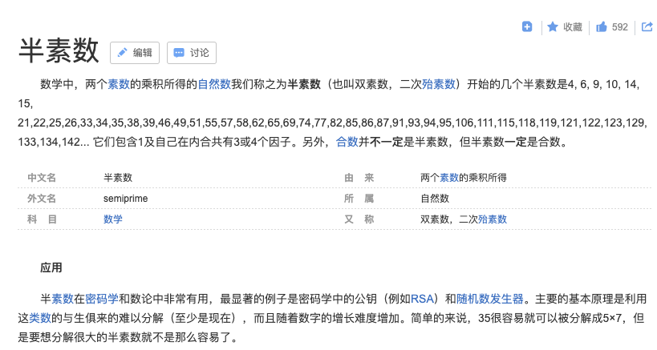

<br>

<font color="brown" size="4">别说话,看图</font>


<br>

### step 1


第一关不费吹灰,顺利淌过~

---

### step 2
<br>
然而,如同数学数列或解析几何压轴题,第一问只是开胃甜点;真正的正餐,都留在最后


思路历程:

- 我原来想 算出6541367999以内所有的质数,然后遍历相乘,记下乘积落在6541367000-6541367999之间的因数,即为所求...时间复杂度为O(n的平方)

- 但实际操作,发现获取1000万以内的所有质数,电脑cpu就已经300%多了,不要说获取到10亿数量级;和RSA加密算法的理论基石 ---- 分解大(质)数没有有效方法一样,如何高效率获取更大的质数,实际也是一个难题,这也是关系到算法安全性的核心问题.(受前一阵黎曼猜想的影响,此处不需要叙述太多)


<br>


<br>


用最传统获取质数的方式,获取50万以内所有质数,用时100秒;获取50到100万以内所有质数,则用时280秒...

其实对于golang,还有一种精巧的获取质数的方法,即利用go语言独特的协程优势;创始三巨头之一曾经演示. [更多可戳此查看](http://www.sohu.com/a/168103037_657921)

---

- 强攻亦可,但感觉这不是最普遍路数;反过头来再看一遍问题


先来看这样一个问题:

>对于两个质数a,b，有c=ab，能否找到两个与a,b都不相等的质数x,y，使得c=xy？

初步判断是不能，但该怎样简洁地证明？假设存在这样的质数x,y，要推出a,b不可能为质数


[戳此查看更多](https://blog.csdn.net/lijil168/article/details/68185549)

<font color="blue">即设c为6541367000到6541367999之间的任一整数,a,b为两个质数,且有c=ab,则不存在与a,b都不同的质数x,y,使得c=xy</font>


如果c为如上区间内偶数,则a,b至少一个为偶数,而偶数不为质数;即若满足a,b均为质数,且c=ab,则c不可能为偶数.

综上,对6541367000到6541367999之间的所有奇数进行遍历,对每一个数,用第一问中方法进行处理,代码如下:


```go
func main() {

	i := 6541367001
	for i < 6541367999 {
		f3(i)
		i = i + 2
	}
}

// IfPrime 是否是质数
func IfPrime(value int) (bool) {

	end := int(math.Sqrt(float64(value)))
	for i := 2; i <= end; i++ {
		if value%i == 0 {
			return false
		}
	}
	return true
}

func f3(bigint int) {
	//取这个数的算数平方根,向上取整,结果记为a;
	//用这个大质数去除2,3,4...一直到a(其实此处可以优化,只除2到a之间的质数即可,不需全部都除)
	//当恰好被整除时,此时的除数和商即为结果
	max := math.Sqrt(float64(bigint))
	a, _ := math.Modf(max)

	m := make(map[int]int)

	for i := 2; i <= int(a); i ++ {
		if bigint%i == 0 {

			if IfPrime(i) && IfPrime(bigint/i){
				m[i] = bigint / i
			}

			//if len(m) >= 3 {
			//	break
			//}
		}
	}

	if len(m) > 0  {
		fmt.Println("对于大整数", bigint)
		fmt.Println("分可分解为如下两个质数的乘积:", m)
		fmt.Println("\n")
	}

}

```


结果如下:


```text
对于大整数 6541367003
分可分解为如下两个质数的乘积: map[23:284407261]


对于大整数 6541367005
分可分解为如下两个质数的乘积: map[5:1308273401]


对于大整数 6541367011
分可分解为如下两个质数的乘积: map[37:176793703]


对于大整数 6541367017
分可分解为如下两个质数的乘积: map[41:159545537]


对于大整数 6541367023
分可分解为如下两个质数的乘积: map[5419:1207117]


对于大整数 6541367037
分可分解为如下两个质数的乘积: map[3:2180455679]


对于大整数 6541367039
分可分解为如下两个质数的乘积: map[14177:461407]


对于大整数 6541367043
分可分解为如下两个质数的乘积: map[3:2180455681]


对于大整数 6541367053
分可分解为如下两个质数的乘积: map[13:503182081]


对于大整数 6541367059
分可分解为如下两个质数的乘积: map[20359:321301]


对于大整数 6541367061
分可分解为如下两个质数的乘积: map[3:2180455687]


对于大整数 6541367071
分可分解为如下两个质数的乘积: map[31:211011841]


对于大整数 6541367077
分可分解为如下两个质数的乘积: map[7:934481011]


对于大整数 6541367113
分可分解为如下两个质数的乘积: map[53:123422021]


对于大整数 6541367117
分可分解为如下两个质数的乘积: map[17:384786301]


对于大整数 6541367127
分可分解为如下两个质数的乘积: map[3:2180455709]


对于大整数 6541367135
分可分解为如下两个质数的乘积: map[5:1308273427]


对于大整数 6541367137
分可分解为如下两个质数的乘积: map[73:89607769]


对于大整数 6541367141
分可分解为如下两个质数的乘积: map[23:284407267]


对于大整数 6541367153
分可分解为如下两个质数的乘积: map[11839:552527]


对于大整数 6541367159
分可分解为如下两个质数的乘积: map[37:176793707]


对于大整数 6541367167
分可分解为如下两个质数的乘积: map[4231:1546057]


对于大整数 6541367169
分可分解为如下两个质数的乘积: map[3:2180455723]


对于大整数 6541367171
分可分解为如下两个质数的乘积: map[2089:3131339]


对于大整数 6541367173
分可分解为如下两个质数的乘积: map[11:594669743]


对于大整数 6541367177
分可分解为如下两个质数的乘积: map[19:344282483]


对于大整数 6541367179
分可分解为如下两个质数的乘积: map[24439:267661]


对于大整数 6541367189
分可分解为如下两个质数的乘积: map[7:934481027]


对于大整数 6541367201
分可分解为如下两个质数的乘积: map[2857:2289593]


对于大整数 6541367207
分可分解为如下两个质数的乘积: map[40819:160253]


对于大整数 6541367239
分可分解为如下两个质数的乘积: map[11:594669749]


对于大整数 6541367241
分可分解为如下两个质数的乘积: map[3:2180455747]


对于大整数 6541367257
分可分解为如下两个质数的乘积: map[31:211011847]


对于大整数 6541367267
分可分解为如下两个质数的乘积: map[409:15993563]


对于大整数 6541367277
分可分解为如下两个质数的乘积: map[3:2180455759]


对于大整数 6541367289
分可分解为如下两个质数的乘积: map[3:2180455763]


对于大整数 6541367293
分可分解为如下两个质数的乘积: map[32707:199999]


对于大整数 6541367297
分可分解为如下两个质数的乘积: map[263:24872119]


对于大整数 6541367309
分可分解为如下两个质数的乘积: map[331:19762439]


对于大整数 6541367311
分可分解为如下两个质数的乘积: map[883:7408117]


对于大整数 6541367317
分可分解为如下两个质数的乘积: map[55901:117017]


对于大整数 6541367323
分可分解为如下两个质数的乘积: map[241:27142603]


对于大整数 6541367341
分可分解为如下两个质数的乘积: map[5107:1280863]


对于大整数 6541367353
分可分解为如下两个质数的乘积: map[52901:123653]


对于大整数 6541367359
分可分解为如下两个质数的乘积: map[137:47747207]


对于大整数 6541367369
分可分解为如下两个质数的乘积: map[97:67436777]


对于大整数 6541367379
分可分解为如下两个质数的乘积: map[3:2180455793]


对于大整数 6541367413
分可分解为如下两个质数的乘积: map[7:934481059]


对于大整数 6541367419
分可分解为如下两个质数的乘积: map[269:24317351]


对于大整数 6541367421
分可分解为如下两个质数的乘积: map[3:2180455807]


对于大整数 6541367429
分可分解为如下两个质数的乘积: map[73:89607773]


对于大整数 6541367431
分可分解为如下两个质数的乘积: map[53:123422027]


对于大整数 6541367433
分可分解为如下两个质数的乘积: map[3:2180455811]


对于大整数 6541367439
分可分解为如下两个质数的乘积: map[3:2180455813]


对于大整数 6541367447
分可分解为如下两个质数的乘积: map[6203:1054549]


对于大整数 6541367451
分可分解为如下两个质数的乘积: map[3:2180455817]


对于大整数 6541367459
分可分解为如下两个质数的乘积: map[11:594669769]


对于大整数 6541367461
分可分解为如下两个质数的乘积: map[947:6907463]


对于大整数 6541367471
分可分解为如下两个质数的乘积: map[5839:1120289]


对于大整数 6541367473
分可分解为如下两个质数的乘积: map[1013:6457421]


对于大整数 6541367477
分可分解为如下两个质数的乘积: map[157:41664761]


对于大整数 6541367479
分可分解为如下两个质数的乘积: map[89:73498511]


对于大整数 6541367483
分可分解为如下两个质数的乘积: map[7:934481069]


对于大整数 6541367485
分可分解为如下两个质数的乘积: map[5:1308273497]


对于大整数 6541367489
分可分解为如下两个质数的乘积: map[67049:97561]


对于大整数 6541367491
分可分解为如下两个质数的乘积: map[17:384786323]


对于大整数 6541367497
分可分解为如下两个质数的乘积: map[7:934481071]


对于大整数 6541367501
分可分解为如下两个质数的乘积: map[19081:342821]


对于大整数 6541367503
分可分解为如下两个质数的乘积: map[11:594669773]


对于大整数 6541367521
分可分解为如下两个质数的乘积: map[13:503182117]


对于大整数 6541367523
分可分解为如下两个质数的乘积: map[3:2180455841]


对于大整数 6541367531
分可分解为如下两个质数的乘积: map[83:78811657]


对于大整数 6541367541
分可分解为如下两个质数的乘积: map[3:2180455847]


对于大整数 6541367545
分可分解为如下两个质数的乘积: map[5:1308273509]


对于大整数 6541367551
分可分解为如下两个质数的乘积: map[47:139178033]


对于大整数 6541367557
分可分解为如下两个质数的乘积: map[19:344282503]


对于大整数 6541367563
分可分解为如下两个质数的乘积: map[97:67436779]


对于大整数 6541367577
分可分解为如下两个质数的乘积: map[3:2180455859]


对于大整数 6541367597
分可分解为如下两个质数的乘积: map[431:15177187]


对于大整数 6541367599
分可分解为如下两个质数的乘积: map[13:503182123]


对于大整数 6541367603
分可分解为如下两个质数的乘积: map[37:176793719]


对于大整数 6541367605
分可分解为如下两个质数的乘积: map[5:1308273521]


对于大整数 6541367609
分可分解为如下两个质数的乘积: map[7:934481087]


对于大整数 6541367611
分可分解为如下两个质数的乘积: map[11497:568963]


对于大整数 6541367617
分可分解为如下两个质数的乘积: map[113:57888209]


对于大整数 6541367619
分可分解为如下两个质数的乘积: map[3:2180455873]


对于大整数 6541367627
分可分解为如下两个质数的乘积: map[17:384786331]


对于大整数 6541367649
分可分解为如下两个质数的乘积: map[3:2180455883]


对于大整数 6541367663
分可分解为如下两个质数的乘积: map[58049:112687]


对于大整数 6541367669
分可分解为如下两个质数的乘积: map[71:92131939]


对于大整数 6541367681
分可分解为如下两个质数的乘积: map[443:14766067]


对于大整数 6541367689
分可分解为如下两个质数的乘积: map[1693:3863773]


对于大整数 6541367707
分可分解为如下两个质数的乘积: map[7:934481101]


对于大整数 6541367719
分可分解为如下两个质数的乘积: map[9421:694339]


对于大整数 6541367727
分可分解为如下两个质数的乘积: map[3:2180455909]


对于大整数 6541367731
分可分解为如下两个质数的乘积: map[9887:661613]


对于大整数 6541367743
分可分解为如下两个质数的乘积: map[971:6736733]


对于大整数 6541367747
分可分解为如下两个质数的乘积: map[19:344282513]


对于大整数 6541367761
分可分解为如下两个质数的乘积: map[10709:610829]


对于大整数 6541367765
分可分解为如下两个质数的乘积: map[5:1308273553]


对于大整数 6541367771
分可分解为如下两个质数的乘积: map[79801:81971]


对于大整数 6541367773
分可分解为如下两个质数的乘积: map[211:31001743]


对于大整数 6541367793
分可分解为如下两个质数的乘积: map[3:2180455931]


对于大整数 6541367795
分可分解为如下两个质数的乘积: map[5:1308273559]


对于大整数 6541367829
分可分解为如下两个质数的乘积: map[3:2180455943]


对于大整数 6541367843
分可分解为如下两个质数的乘积: map[113:57888211]


对于大整数 6541367845
分可分解为如下两个质数的乘积: map[5:1308273569]


对于大整数 6541367851
分可分解为如下两个质数的乘积: map[1567:4174453]


对于大整数 6541367857
分可分解为如下两个质数的乘积: map[19309:338773]


对于大整数 6541367871
分可分解为如下两个质数的乘积: map[3:2180455957]


对于大整数 6541367873
分可分解为如下两个质数的乘积: map[541:12091253]


对于大整数 6541367879
分可分解为如下两个质数的乘积: map[61:107235539]


对于大整数 6541367883
分可分解为如下两个质数的乘积: map[3:2180455961]


对于大整数 6541367887
分可分解为如下两个质数的乘积: map[8681:753527]


对于大整数 6541367901
分可分解为如下两个质数的乘积: map[3:2180455967]


对于大整数 6541367909
分可分解为如下两个质数的乘积: map[49109:133201]


对于大整数 6541367915
分可分解为如下两个质数的乘积: map[5:1308273583]


对于大整数 6541367921
分可分解为如下两个质数的乘积: map[11:594669811]


对于大整数 6541367923
分可分解为如下两个质数的乘积: map[23:284407301]


对于大整数 6541367927
分可分解为如下两个质数的乘积: map[47:139178041]


对于大整数 6541367929
分可分解为如下两个质数的乘积: map[487:13431967]


对于大整数 6541367933
分可分解为如下两个质数的乘积: map[17:384786349]


对于大整数 6541367951
分可分解为如下两个质数的乘积: map[97:67436783]


对于大整数 6541367959
分可分解为如下两个质数的乘积: map[7:934481137]


对于大整数 6541367963
分可分解为如下两个质数的乘积: map[13:503182151]


对于大整数 6541367971
分可分解为如下两个质数的乘积: map[331:19762441]


对于大整数 6541367989
分可分解为如下两个质数的乘积: map[13:503182153]


对于大整数 6541367995
分可分解为如下两个质数的乘积: map[5:1308273599]


```


到此大功告成,攻破魔塔最顶层;


等等,先看看网上,


这是不是和多年前,遍布大城小邑街头巷尾的"重金求子"广告有异曲同工之处?...

依据哥多年来经验,倒也不绝对是诈骗帖,而更像是招聘帖...

[就像这样](http://www.sohu.com/a/11881959_107887)


---

### 后记

其实这里还有一个"半素数"的概念,如上这些大整数,都是半素数



本人长期对大质数分解,非对称加密等有浓厚兴趣,欢迎探讨新思路&方法;

可加微信: cuimoman

非套路,有图有真相:


