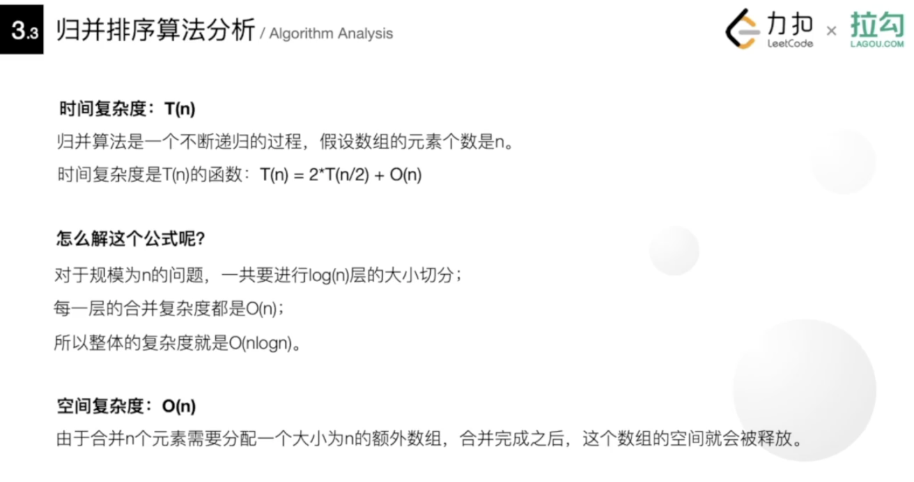
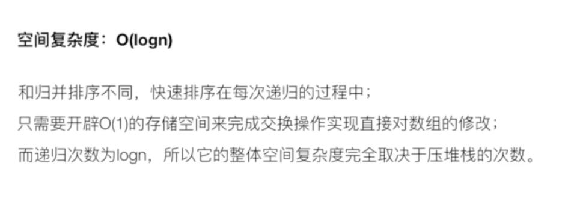
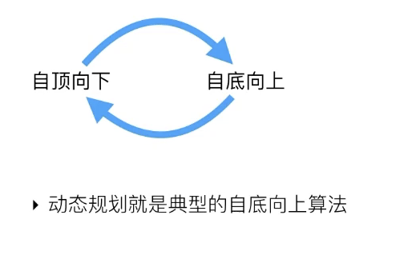
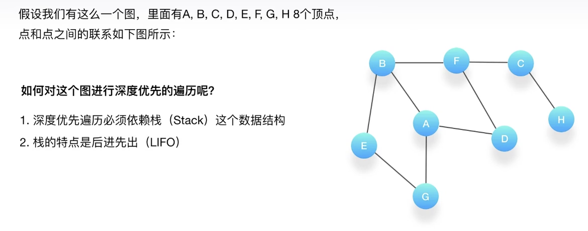
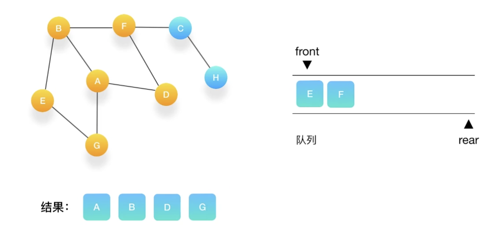
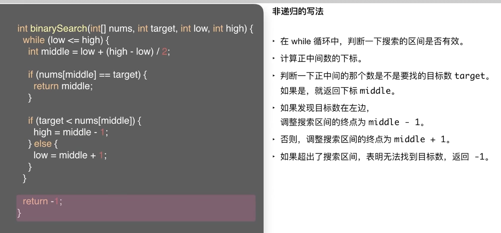

 

##  3.面试中常用的算法 - 排序

 

 

####  冒泡排序/Bubble Sort

[冒泡排序](http://www.dashen.tech/2017/09/17/%E5%86%92%E6%B3%A1%E6%8E%92%E5%BA%8F/)

是一种稳定的排序算法
 

 

---

#### 插入排序/Insertion Sort

**与冒泡排序的区别:**

在冒泡排序中,经过每一轮的排序处理后,数组后端的数是排好序的;

在插入排序中,经过每一轮的排序处理后,数组前端的数都是排好序的

**算法思想:**

不断地将尚未排好序的数插入到已经排好序的部分.

时间复杂度和冒牌排序一样,也是O(n的平方), 也是一种稳定的排序算法

[leetcode-147 对链表进行插入排序](http://www.dashen.tech/2015/03/01/leetcode-147-%E5%AF%B9%E9%93%BE%E8%A1%A8%E8%BF%9B%E8%A1%8C%E6%8F%92%E5%85%A5%E6%8E%92%E5%BA%8F/)

 

---

#### 归并排序/Merge Sort

 

`归并排序`的核心思想是分治,把一个复杂问题拆分成若干个子问题来求解.

1. 把数组从中间划分成两个子数组;

2. 一直递归地把子数组划分成更小的子数组,直到子数组里面只有一个元素;

3. 依次按照递归的返回顺序,不断地合并排好序的子数组,知道最后把整个数组的顺序排好

也是稳定的排序算法;

对两个有序的数组进行合并的操作,面试中常问....

 

---

#### 快速排序/Quick Sort

 

也采用了**分治**的思想

类似全班排高矮,找一个中中不溜的(即基准值),让所有人和ta比较.然后依次分组,再再每个组里再找一个中不溜的,继续下去...

`快速排序`是直接在原数组里进行各种操作,当子数组被分割出来时,原数组里的排序也改变了;  然后在子数组里继续找基准值,继续划分一直比下去,直到子数组元素个数为1(递归)

最差情况下,和冒泡排序一样

[leetcode-215 数组中的第K个最大元素](http://www.dashen.tech/2015/03/01/leetcode-215-%E6%95%B0%E7%BB%84%E4%B8%AD%E7%9A%84%E7%AC%ACK%E4%B8%AA%E6%9C%80%E5%A4%A7%E5%85%83%E7%B4%A0/)

 

---

#### 拓扑排序/Topological Sort

 

拓扑是研究图论中,顶点和顶点连线之间的关系

一个有向无环图,可以有一个或多个拓扑排序的序列

一般会用广度/深度优先算法来构建

时间复杂度为O(n)

 

---

## 4. 面试中常用的算法--递归,回溯

分析和处理问题的能力

 

#### 递归/Recursion

二叉树的很多性质,在定义上就满足递归.

**可以使一个看似复杂的问题变得简洁和易于理解**

经典案例: 汉诺塔(又称河内塔)

 

**算法思想:**

[leetcode-91 解码方法](http://www.dashen.tech/2015/03/01/leetcode-91-%E8%A7%A3%E7%A0%81%E6%96%B9%E6%B3%95/)

`递归`思想是自顶向下;

`动态规划`思想是自底向上

[leetcode-247 中心对称数II](http://www.dashen.tech/2015/03/01/leetcode-247-%E4%B8%AD%E5%BF%83%E5%AF%B9%E7%A7%B0%E6%95%B0II/)

**两种方法,来解决递归算法的时间复杂度分析:**

1. 迭代法:

 

2. 公式法:

计算递归函数复杂度最方便的工具, 只需牢记3种可能出现的情况,以及处理它们的公式即可.

 

 

 

---

 

#### 回溯/Backtracking

 

`回溯算法`是一种试探算法, 可以避免我们走弯路

[leetcode-39 组合总和](http://www.dashen.tech/2015/03/01/leetcode-21-%E5%90%88%E5%B9%B6%E4%B8%A4%E4%B8%AA%E6%9C%89%E5%BA%8F%E9%93%BE%E8%A1%A8/)

[leetcode-52 N皇后II](http://www.dashen.tech/2015/03/01/leetcode-52-N%E7%9A%87%E5%90%8EII/)

 

回溯,实际上是用递归实现的.因此在分析回溯的时间复杂度时,其实就是在对递归函数进行分析.

 

递归和回溯,可以说是算法面试中,最重要的算法考察点之一,很多其他算法都有它们的影子,例如:

- 二叉树的定义和遍历,

- 归并排序,快速排序,

- 动态规划(实际是对递归的优化)

- 二分搜索(也可以利用递归去实现)

 

---

##  5.深度优先与广度优先算法

 

在整个算法知识点中占比非常大;

**应用最多的地方是对图进行遍历(树也是图的一种)**

 

#### 深度优先搜索算法/DFS

 

> 深度优先搜索是一种在开发爬虫早期使用较多的方法。它的目的是要达到被搜索结构的叶结点(即那些不包含任何超链的HTML文件) 。在一个HTML文件中，当一个超链被选择后，被链接的HTML文件将执行深度优先搜索，即在搜索其余的超链结果之前必须先完整地搜索单独的一条链。深度优先搜索沿着HTML文件上的超链走到不能再深入为止，然后返回到某一个HTML文件，再继续选择该HTML文件中的其他超链。当不再有其他超链可选择时，说明搜索已经结束。

[深度优先搜索](https://baike.baidu.com/item/%E6%B7%B1%E5%BA%A6%E4%BC%98%E5%85%88%E6%90%9C%E7%B4%A2/5224976?fromtitle=DFS&fromid=5055&fr=aladdin)属于图算法的一种，英文缩写为DFS即Depth First Search.其过程简要来说是对每一个可能的分支路径深入到不能再深入为止，而且每个节点只能访问一次.

和走迷宫一样,尽量往深处走.

**一般用来解决连通性的问题**

深度优先遍历必须依赖栈(Stack)这个数据结构

 

选择一个起始点,不停地压入和弹出..

 

例题:

递归实现:

非递归实现:

 

复杂度分析:

 

##### 如何利用DFS寻找最短路径?

 

---

 

#### 广度优先搜索算法/BFS

 

> 宽度优先搜索算法（又称广度优先搜索）是最简便的图的搜索算法之一，这一算法也是很多重要的图的算法的原型。Dijkstra单源最短路径算法和Prim最小生成树算法都采用了和宽度优先搜索类似的思想。其别名又叫BFS，属于一种盲目搜寻法，目的是系统地展开并检查图中的所有节点，以找寻结果。换句话说，它并不考虑结果的可能位置，彻底地搜索整张图，直到找到结果为止。

[BFS，其英文全称是Breadth First Search](https://baike.baidu.com/item/%E5%AE%BD%E5%BA%A6%E4%BC%98%E5%85%88%E6%90%9C%E7%B4%A2/5224802?fromtitle=BFS&fromid=542084&fr=aladdin)

**一般用来解决最短路径的问题**

广度优先遍历需要借用的数据结构是队列(Queue)

选择一个起始顶点:

队列为空,说明所有的点都被标记过了,结束搜索

复杂度分析:

**扩展:从A走到B最多允许打通3堵墙,求最短路径的步数:**

面试时,都可以从最暴力的办法开始想,然后一步步优化.

 

---

##  6.动态规划/Dynamic Programming

 

**大事化小,小事化了**

 

[leetcode-300 最长上升子序列]()

**子序列和子数组不同,不需要元素是连续的**

[leetcode-198 打家劫舍]()

[leetcode-62 不同路径]()

### 常见问题:

 

1. 线性规划/Linear Programming(最为简单)

求dp[i]的办法,主要有两种:

"0-1思想"

[leetcode-198 打家劫舍]()

[leetcode-62 不同路径]()

当前值依赖于前面所有计算好的值

---

 

2. 区间规划/Interval Programming

 

[leetcode-516 最长回文子序列]()

---

 

3. 约束规划/Constraint Programming

 

 

**NP完全问题:**

NP即非决定性多项式/Non-deterministic Polynomial

无法在多项式的时间内解答...(即时间复杂度为指数级,阶乘级等,这对计算机来说是接收不了的)

`时间复杂度` 并不是程序解决问题需要花费的具体时间,而是程序运行时间随着问题规模扩大,增长得有多快...如果是O(1),即无论规模多大,时间都是固定的;如果是O(n),即随着规模线性增加

"0-1背包问题"的时间复杂度,是一个非多项式级别的...

 

---

##  7.二分搜索算法与贪婪算法

 

 

###  二分搜索/Binary Search

 

也称为"折半搜索","对数搜索",前提必须是排好序的

**优点和缺点:**

 

*递归写法与非递归写法:*

递归写法:

 

时间复杂度分析:

 

非递归写法:

 

二分搜索的核心:

1. 确定搜索的范围和区间
2. 取中间的数判断是否满足条件
3. 如果不满足条件,判定应该往哪个半边继续进行搜索

 

<编程珠玑>中写道:只有10%的程序员能正确写出二分搜索的代码.

面试题好多都是经典二分搜索的变形:

1. 找确定的边界

[34. 在排序数组中查找元素的第一个和最后一个位置]()

递归的写法:

 

 

2. 找模糊的边界

 

所谓`模糊的边界`,即边界的值不等于目标的值,而是大于或小于目标的值.

 

当不满足条件,而middle的数等于target时怎么办?

 

[leetcode-33 搜索旋转排序数组]()

 

3. 不定长边界

 

**代码实现:**

 

---

 

###  贪婪/Greedy

 

贪婪是一种在每一步都采取在当前状态下最好或最优的选择,从而希望导致结果是最好或最优的算法

 

贪婪算法的反例:0-1背包问题

 

[leetcode-253 会议室II]()

---

**面试中 贪婪算法 考察不多.**

**二分搜索算法是重中之重,看似简单,但想写对并不容易**

