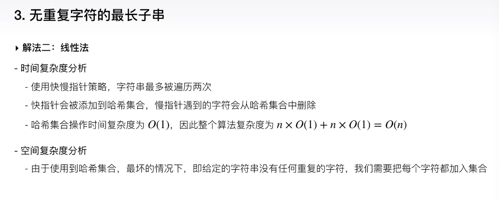

 

## 8.剖析大厂算法面试真题-高频题精讲(一)

 

---

 

#### 3.无重复字符的最长子串

[leetcode-3 最大字符子串](http://www.dashen.tech/2015/03/01/leetcode-3-%E6%9C%80%E5%A4%A7%E5%AD%97%E7%AC%A6%E5%AD%90%E4%B8%B2/)

**Longest Common SubString, 又称为"LCS"问题**

 

1. 暴力法:

 

**子序列**和**子串**: 子序列不需要连续

暴力法的时间复杂度:

---

 

2. 线性法:

 

**复杂度分析:**

 

---

3. 优化的线性法:

---

 

#### 4.寻找两个有序数组的中位数

[leetcode-4 寻找两个有序数组的中位数](http://www.dashen.tech/2015/03/01/leetcode-4-%E5%AF%BB%E6%89%BE%E4%B8%A4%E4%B8%AA%E6%9C%89%E5%BA%8F%E6%95%B0%E7%BB%84%E7%9A%84%E4%B8%AD%E4%BD%8D%E6%95%B0/)

 

1. 暴力法:

 

---

2. 切分法:

 

*时间复杂度:*

**扩展一:**

如果给定的两个数组都是没有经过排序处理的,应该如何找出中位数呢?

先合并排序,再找出中位数.

有无更好的方法呢?

 

**扩展二:**

对于分布式的大数据处理,应考虑两方面的限制:

- 每台服务器进行算法计算的复杂度限制,包括时间和空间复杂度
 - 空间复杂度: 假设存储的都是32位整型,即4个字节,那么10亿个数需占用40亿字节,大约40GB
 - 而快速排序的空间复杂度为log(n),那大约30次堆栈压入

- 服务器与服务器之间进行通信时的网络带宽限制

 

经典的快速选择算法

 

[leetcode-23 合并K个排序链表](http://www.dashen.tech/2015/03/01/leetcode-23-%E5%90%88%E5%B9%B6K%E4%B8%AA%E6%8E%92%E5%BA%8F%E9%93%BE%E8%A1%A8/)

---

## 8.剖析大厂算法面试真题-高频题精讲(二)

 

- 合并区间+无重叠区间

- 火星字典

- 基本计算器

 

---

 

#### 56.合并区间

 

[leetcode-56 合并区间](http://www.dashen.tech/2015/03/01/leetcode-56-%E5%90%88%E5%B9%B6%E5%8C%BA%E9%97%B4/)

 

#### 435.无重叠区间

 

[leetcode-435 无重叠区间](http://www.dashen.tech/2015/03/01/leetcode-435-%E6%97%A0%E9%87%8D%E5%8F%A0%E5%8C%BA%E9%97%B4/)

 

力扣上还有很多关于`区间`的问题

 

---

 

#### 269.火星字典

 

[leetcode-269 火星字典](http://www.dashen.tech/2015/03/01/leetcode-269-%E7%81%AB%E6%98%9F%E5%AD%97%E5%85%B8/)

 

---

 

#### 772.基本计算器III

 

[leetcode-772 基本计算器III](http://www.dashen.tech/2015/03/01/leetcode-772-%E5%9F%BA%E6%9C%AC%E8%AE%A1%E7%AE%97%E5%99%A8III/)

 

---

## 10.剖析大厂算法面试真题-难题精讲(一)

 

 

- 正则表达式匹配

- 柱状图中的最大矩形

- 实现strStr()

---

 

#### 10.正则表达式匹配

 

[leetcode-10 正则表达式匹配](http://www.dashen.tech/2015/03/01/leetcode-10-%E6%AD%A3%E5%88%99%E8%A1%A8%E8%BE%BE%E5%BC%8F%E5%8C%B9%E9%85%8D/)

[leetcode-44 通配符匹配]()

 

#### 84.柱状图中最大的矩形

 

[leetcode-84 柱状图中最大的矩形]()

 

#### 28.实现strStr()
 

[leetcode-28 实现strStr()]()

 

---

## 11.剖析大厂算法面试真题-难题精讲(二)

 

 

- 回文对

- 至多包含K个不同字符的最长子串

- 接雨水II

---

 

#### 336.回文对

 

[leetcode-336 回文对](http://www.dashen.tech/2015/03/01/leetcode-336-%E5%9B%9E%E6%96%87%E5%AF%B9/)

 

#### 340.至多包含K个不同字符的最长子串

 

[leetcode-340 至多包含K个不同字符的最长子串](http://www.dashen.tech/2015/03/01/leetcode-340-%E8%87%B3%E5%A4%9A%E5%8C%85%E5%90%ABK%E4%B8%AA%E4%B8%8D%E5%90%8C%E5%AD%97%E7%AC%A6%E7%9A%84%E6%9C%80%E9%95%BF%E5%AD%90%E4%B8%B2/)

 

#### 407.接雨水II

 

[leetcode-407 接雨水II](http://www.dashen.tech/2015/03/01/leetcode-407-%E6%8E%A5%E9%9B%A8%E6%B0%B4II/)

[leetcode-417 太平洋大西洋水流问题]()

 

---

## 12.冲刺

 

 

- 刷题
- 简历
- 面试经验

---

 

#### 刷题/Leetcode

 

这点上Golang差好多,能直接用的只有slice,map这聊聊几个...

最关键的不是量的问题,而是质的问题

 

*白板面试注意事项:*

 

**刷过的题目忘了怎么办?**

 

#### 简历/Resume

 

 

#### 面试经验/Interview

 

