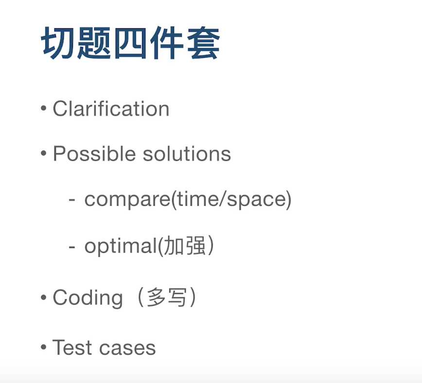

 

参考:

[算法面试40讲相关讲义](https://www.jianshu.com/p/56297a0be1a6)

### 01丨合格程序员的第一步：算法与数据结构

 

 

区块链的数据结构: 链表+默克尔树

 

---

 

### 02丨如何事半功倍地学习算法与数据结构

 

一万小时定律

- **优先队列**也就是**堆**

- **LRU Cache**也是一种数据结构

 

---

 

### 03丨如何计算算法的复杂度

 

**递归**,不得不提斐波那契数列,其递归写法的时间复杂度是?

**O(2的n次方)**

代码简洁,但执行次数过多,不是最优的.

主定律公司..

 

以下常见的时间复杂度记住即可:

- 二分查找: O(logn)

- 二叉树的遍历(前/中/后): O(n)

- ?

- 快速排序/归并排序: O(nlogn)

---

 

### 04丨如何通过LeetCode来进行算法题目练习

 

---

 

### 05丨理论讲解：数组&链表

 

数组: 在内存中连续;查询为O(1),插入/删除操作为O(n),因为要挪动后面的内容

链表: 查询O(n), 插入/删除O(1)

 

---

 

### 06丨面试题：反转一个单链表&判断链表是否有环

 

链表的题目就是有时比较无聊,思考难度不大,但代码实现有些复杂..需要多练,且部分代码要记下来

 

---

 

### 07丨理论讲解：堆栈&队列

 

中文博大精深...

Stack可以叫"栈",也可以叫"堆栈",

但不能叫"堆",堆特指'Heap'这种数据结构

既可以用数组实现,也可以用链表实现...但面试时一般都不会去问实现

[阮一峰-Stack的三种含义](https://www.ruanyifeng.com/blog/2013/11/stack.html)

[Big-O Cheat Sheet](https://www.bigocheatsheet.com/)

 

---

 

### 08丨面试题：判断括号字符串是否有效

 

[leetcode-20 有效的括号](http://www.dashen.tech/2015/03/01/leetcode-20-%E6%9C%89%E6%95%88%E7%9A%84%E6%8B%AC%E5%8F%B7/)

 

---

 

### 09丨面试题：用队列实现栈&用栈实现队列

 

[leetcode-232 用栈实现队列](http://www.dashen.tech/2015/03/01/leetcode-232-%E7%94%A8%E6%A0%88%E5%AE%9E%E7%8E%B0%E9%98%9F%E5%88%97/)

[leetcode-225 用队列实现栈](http://www.dashen.tech/2015/03/01/leetcode-225-%E7%94%A8%E9%98%9F%E5%88%97%E5%AE%9E%E7%8E%B0%E6%A0%88/)

 

---

 

### 10丨理论讲解：优先队列

 

 

---

 

### 11丨面试题：返回数据流中的第K大元素

 

---

 

### 12丨面试题：返回滑动窗口中的最大值

 

---

 

### 13丨理论讲解：哈希表

 

---

 

### 14丨面试题：有效的字母异位词

 

---

 

### 15丨面试题：两数之和

 

---

 

### 16丨面试题：三数之和

 

---

 

### 17丨理论讲解：树&二叉树&二叉搜索树

 

---

 

### 18丨面试题：验证二叉搜索树

 

---

 

### 19丨面试题：二叉树&二叉搜索树的最近公共祖先

 

---

 

### 20丨理论讲解：二叉树遍历

 

