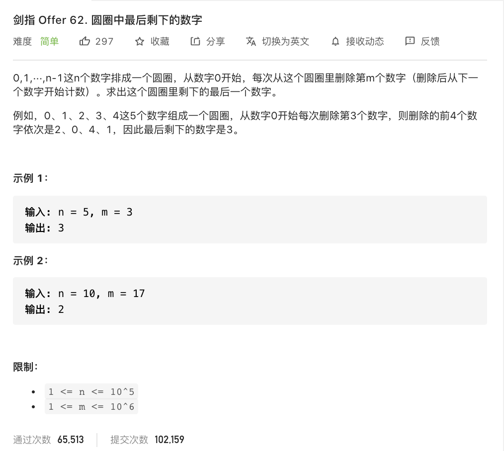
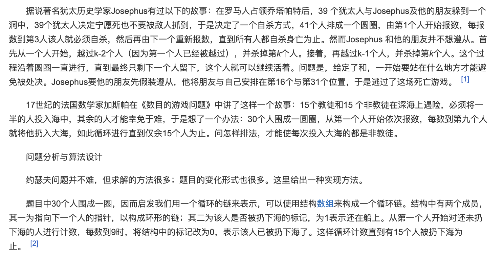
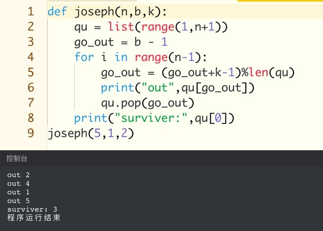

<br>


[剑指 Offer 62. 圆圈中最后剩下的数字](https://leetcode-cn.com/problems/yuan-quan-zhong-zui-hou-sheng-xia-de-shu-zi-lcof/)


难度:  <font color="green">**简单**</font>





<br>


---


<br>




[约瑟夫问题/约瑟夫斯置换](https://baike.baidu.com/item/%E7%BA%A6%E7%91%9F%E5%A4%AB%E9%97%AE%E9%A2%98/3857719)


真正的[俄罗斯轮盘赌](https://baike.baidu.com/item/%E4%BF%84%E7%BD%97%E6%96%AF%E8%BD%AE%E7%9B%98%E8%B5%8C/71476)


<br>


---


<br>


### 递归写法:


<br>

```go
func lastRemaining(n int, m int) int {

    if n == 1 {
        return 0
    } else {
        return (lastRemaining(n-1,m) +m) %n
    }

}

```


---


<br>


### 非递归写法:


<br>


```go
func lastRemaining(n int, m int) int {
	var (
		find  int       //find=1找到下一个猴子让它出去
		count int       //count计数是否数到m
		num   int       //当num到达N-1时，只剩一只猴子
		flag  = []int{} //flag[i],该猴子已经出去了
		rs    int       // 最终结果
	)

	for i := 0; i < n; i++ {
		flag = append(flag, 0)
	}
	i := 0 //找下一只要出去的猴子从i开始找
	for num != n-1 {
		find = 0
		count = 0
		for ; find == 0; i++ {
			t := i % n
			if flag[t] == 0 {
				count += 1
			}
			if count == m {
				num++
				find = 1
				flag[t] = 1
			}
		}
	}
	for i = 0; i < n; i++ {
		if flag[i] == 0 {
			rs = i
		}
	}

	return rs
}
```


这种写法反而耗费的时间更长


<br>

---

<br>

地产商都来抢饭啦..





<br>
