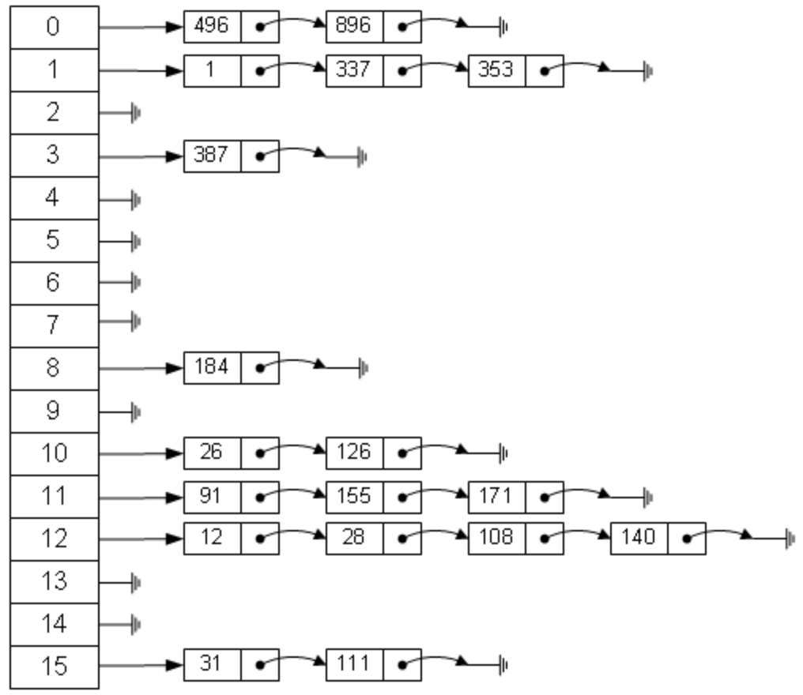

 

###  开放定址法(开放地址法) 

 

一旦发生了冲突，就去寻找下一个空的散列地址，只要散列表足够大，空的散列地址总能找到，并将记录存入 

---

 

###  再哈希法(双哈希法) 

 

有多个不同的Hash函数，当发生冲突时，使用第二个，第三个，….，等哈希函数
计算地址，直到无冲突。虽然不易发生聚集，但是增加了计算时间。

---

 

###   链表法 (链地址法, 拉链法)  

 

每个哈希表节点都有一个next指针，多个哈希表节点可以用next指针构成一个单向链表，被分配到同一个索引上的多个节点可以用这个单向 
链表连接起来..最后就像一个拉链

---

 

###  建立公共溢出区 

 

将哈希表分为基本表和溢出表两部分，凡是和基本表发生冲突的元素，一律填入溢出表

---

