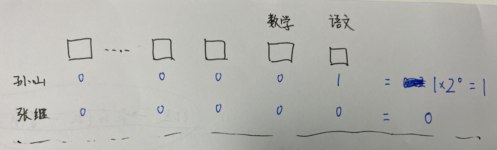
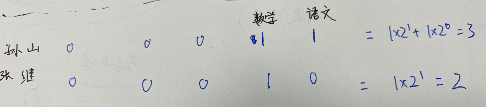
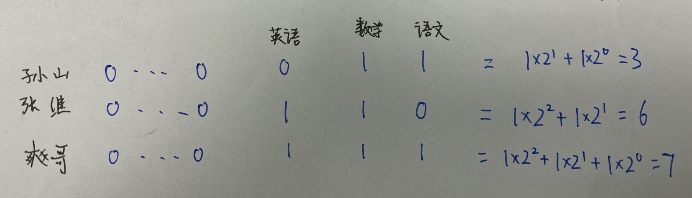

可能经常有如下这种需求: 需要一张表,来记录学员课程的通过与否. 课程数量不确定,往往很多,且会有变动,随时可能新增一门课.

这种情况下,在设计表结构时,一门课对应一个字段,就有些不合适, 因为不知道课程的具体数量,也无法应对后期课程的增加.


考虑只用一个状态标志位,利用位运算,来标识多门课的通过或否.

这与Linux的文件权限思路一致

[Linux文件和目录的权限](https://www.cnblogs.com/ccw869476711/p/9213398.html)


<br>

---


<br>

### 设计及实现

<br>

- 左移（<<）:

- 右移（>>）:

- |（或运算）：只要当一方为 true 时，结果就是 true，否则为 false。 (有1就为1,全0才为0)

- &（与运算）：只有当两方都为 true 时，结果才是 true，否则为 false。(全1才为1,有0就为0)

<br>

对于正数和负数，左移一位就相当于乘以2的1次方，左移n位就相当于乘以2的n次方

`如xxxxxx<<2即左移2位,右边空出的位用0填补，高位左移溢出则舍弃该高位 `


<br>

**步骤一:**

<br>


> 如语文成绩率先出来,我们约定,以这个字段(记为`attr`)的`第一位`,来代表该学生语文有没有通过测评(0否1是)

<br>

<font color="#CD853F">attr为当前该属性字段的值(从数据库里取出来的值). index为约定的第几位来标识当前业务,index从0开始计数</font>


```go

package main

import "fmt"

func main() {

	// 记录阶段
    //如果语文成绩测评通过,调一个写接口,初始attr值为0,约定的表示位置为第1位,又因为从0开始计数,故而index=0

	setRs := set(0, 0) //将attr字段的最新值,记录进数据库的attr字段


	// 查询阶段
	//当需要获知该学生的语文是否通过时. 查数据库,获取上面记录进的值(此时setRs即attr=1); 进而get方法,可知道是否通过(如果rs结果为1,则通过)
	rs := get(setRs, 0)
	_ = rs
}

func set(attr, index int) int {
	tmp := 1 << index
    // 1左移0位,即原地没动,还是1
	fmt.Printf("1 << index %d 值为%d:\n", index, tmp)
    // 1 | 0,或运算,有1就为1,故而setRs=1
	setRs := tmp | attr
	fmt.Println(setRs)
	
	return setRs
}

func get(attr, index int) int {
	tmp := attr >> index
    // 1右移0位,即原地不动,还是1
	fmt.Printf("attr %d >> index %d 值为 %d:\n", attr, index, tmp)
	// 0001 & 0001,与运算,全1才为1,故而为0001,即为十进制数1
	getRs := tmp & 1
	fmt.Println(getRs)

	return getRs
}


```

<br>


输出为:

```rs
1 << index 0 值为1:
1
attr 1 >> index 0 值为 1:
1
```


<br>




<br>


假设`孙山`语文及格, `张继`语文落榜(则不调用写接口,只有通过才调),则二人当前attr的值为1和0. 

这样就完成了语文科目的处理


<br>


---


<br>


**步骤二:**

<br>


> 几天后数学测评结果也出来了,继续用attr,约定以这个字段的`第二位`,来代表该学生数学有没有通过测评(0否1是)

<br>


同样用之前的代码, 


**记录阶段:**

```go
package main

import "fmt"

func main() {

	// 记录阶段
    //如果数学成绩测评通过,调写接口,约定的表示位置为第1位,又因为从0开始计数,故而index=1
	// 对于孙山,从数据库取出其attr值,为1; 张继的attr值为0

	// 加入二人都通过了数学测评,都需调用如下写接口

	setRsSun := set(1, 1) //将attr字段的最新值,记录进数据库的attr字段
	fmt.Println("-----------")
	setRsZhang := set(0, 1)

}

func set(attr, index int) int {
	tmp := 1 << index
    // 1左移1位,即由"0001"变为"0010",即为十进制数2
	fmt.Printf("1 << index %d 值为%d:\n", index, tmp)
    // 对于语文通过带孙山,0010 | 0001,或运算,有1就为1,故而setRs=0011,即十进制数3
	// 对于语文未通过带张继,0010 | 0000,或运算,有1就为1,全0才为0, 故而setRs=0010,即十进制数2
	setRs := tmp | attr
	fmt.Println(setRs)
	
	return setRs
}

```


<br>


```rs
1 << index 1 值为2:
3
-----------
1 << index 1 值为2:
2

```




<br>


**查询阶段:**

```go

package main

import "fmt"

func main() {


	// 查询阶段
	//当需要获知该学生的语文/数学是否通过时. 查数据库,获取其attr的值; 进而get方法,index字段为该科目约定的位置(语文为1,其index为0; 数学为2,其index为1),即可知道是否通过(如果rs结果为1,则通过)
	sunMath := get(setRsSun, 1) //setRsSun=3

	fmt.Println("-----------")
	zhangChinese := get(setRsZhang, 0)//setRsZhang=2


	fmt.Println("sunMath is:",sunMath)
	fmt.Println("zhangChinese is:",zhangChinese)
}


func get(attr, index int) int {
	tmp := attr >> index
   
	
	fmt.Printf("attr %d >> index %d 值为 %d:\n", attr, index, tmp)
	
	getRs := tmp & 1
	fmt.Println(getRs)

	return getRs
}


```


<br>


```rs
 // 对于孙山,十进制数3即二进制0011,右移1位,即0001,即十进制数1
attr 3 >> index 1 值为 1:
// 0001 & 0001,与运算,全1才为1,故而为1. 即孙山通过了数学
1
-----------
// 对于张继,十进制数2即二进制0010,右移0位,即原地不动,还是0010,十进制数2
attr 2 >> index 0 值为 2:
// 0010 & 0001,全1才为1,否则为0. 即张继没有通过语文
0

sunMath is: 1
zhangChinese is: 0

```

<br>

---


<br>


**步骤三:**

<br>


过了几天,英语结果也出来了.假如孙山没通过,张继通过,爽哥三门都通过,则有





写入和读取过程同上


---


<br>


**步骤四:**

<br>


假如现在第60个科目'信息技术'的测评出炉, 爽哥前面59门课程全部通过,则attr字段的值为$1\times2^{58}+1\times2^{57} ... + 1\times2^2 + 1\times2^1 + 1\times2^0$,

即 $288230376151711744 + 144115188075855872 ...+4+2+1 = 576460752303423487$


[2的n次方对照表](https://blog.csdn.net/for_cxc/article/details/85229922)

第60门课'信息技术'也高分通过, 则对于最新的attr值,即 `1 << index | attr`,

即`1 << 59 | 576460752303423487` = 1152921504606846975,将这个值计入数据库.

<br>


如需获取爽哥有无通过第60门课程,`1152921504606846975 >> 59 & 1` = 1,即通过


<br>


如果将数据库这个attr字段设置为有符号的*bigint*类型,则最多可标识 60几个不同业务的状态

<br>


---


<br>


更通用的代码:

```go

func main(){

	index := uint8("约定的位置" - 1)
	attr := "来自数据库"

}

func SetAttrBit(attr int, index uint8) int {
	return 1 << index | attr
}


func GetAttrBit(attr int, index uint8) int {
	return attr >> index & 1
}

```


<br>


参考:

[用位运算来标识状态](https://juejin.cn/post/6844903909333401607)


<br>

---


<br>

### 番外

<br>


["光学电报"](http://www.douglas-self.com/MUSEUM/COMMS/telegraf/telegraf.htm)