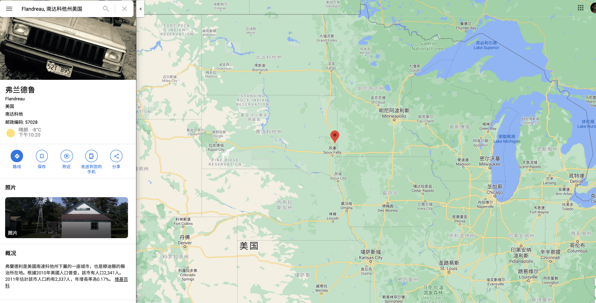

图文来自 [维基百科](https://en.wikipedia.org/wiki/Gene_Amdahl)

 

## Gene Amdahl

 

Gene Myron Amdahl (November 16, 1922 – November 10, 2015) was an American computer architect and high-tech entrepreneur, chiefly known for his work on mainframe computers at IBM and later his own companies, especially Amdahl Corporation. He formulated Amdahl's law, which states a fundamental limitation of parallel computing.

 

吉恩·迈伦·阿姆达尔 (1922.11.16--2015.11.10），美国计算机架构师和高科技企业家，主要以在IBM及后来其自己的公司（尤其是阿姆达尔公司）从事大型计算机工作而闻名。 他阐释了**阿姆达尔定律**，指出了并行计算的基本局限性。

 

## Childhood and education

 

Amdahl was born to immigrant parents of Norwegian and Swedish descent in Flandreau, South Dakota. After serving in the Navy during World War II he completed a degree in engineering physics at South Dakota State University in 1948.

He went on to study theoretical physics at the University of Wisconsin–Madison under Robert G. Sachs. However, in 1950, Amdahl and Charles H. "Charlie" Davidson, a fellow Ph.D. student in the Department of Physics, approached Harold A. Peterson with the idea of a digital computer. Amdahl and Davidson gained the support of Peterson and fellow electrical engineering professor Vincent C. Rideout, who encouraged them to build a computer of their unique design. Amdahl completed his doctorate at UW–Madison in 1952 with a thesis titled A Logical Design of an Intermediate Speed Digital Computer and creating his first computer, the Wisconsin Integrally Synchronized Computer, WISC. He then went straight from Wisconsin to a position at IBM in June 1952. Gene Amdahl is also related to former Minnesota Supreme Court Chief Justice Douglas K. Amdahl.

 

Amdahl出生于南达科他州弗兰德鲁(爽哥注：位于南达科他州和明尼苏达州之交的小城，2010年人口约2300人)，父母是挪威裔和瑞典裔的移民。第二次世界大战期间在海军服役，之后于1948年在南达科他州立大学获得工程物理学学位。

此后他继续在威斯康星大学麦迪逊分校，师从罗伯特·萨克斯（Robert G. Sachs）研究理论物理学。然而，在1950年，Amdahl和Charles Davidson，系里的一名博士同伴向哈罗德·彼得森（Harold A. Peterson）提出了数字计算机的想法。Amdahl和Davidson得到了Peterson和电气工程教授Vincent的支持，鼓励他们建造有自己独特设计的计算机。阿姆达尔 于1952年在威斯康星大学麦迪逊分校完成博士学位，题为“中速数字计算机的逻辑设计”，并创建了他的第一台计算机，即威斯康星州整体同步计算机WISC。随后，他于1952年6月从威斯康星州直接转到IBM任职。Gene Amdahl与前明尼苏达州最高法院首席法官Douglas K. Amdahl也有关系。

 

## The IBM and Amdahl years

 

At IBM, Amdahl worked on the IBM 704, the IBM 709, and then the Stretch project, the basis for the IBM 7030. He left IBM in December 1955, but returned in September 1960 (after working at Ramo-Wooldridge and at Aeronutronic). He quit out of frustration with the bureaucratic structure of the organization. In an interview[3] conducted in 1989 for the Charles Babbage Institute, he addressed this:

    "Well, what I felt was that with that kind of an organization I'm not going to be in control of what I want to do any time in the future. It's going to be a much more bureaucratic structure. I'll work in one area of it, and that's all I'll get experience in. And I decided that I didn't want to have that kind of life, basically. It wasn't just Dunwell. It was the way the structure was set up; I was going to be a peg-in-a-hole."

On his return, he became chief architect of IBM System/360 and was named an IBM Fellow in 1965, and head of the ACS Laboratory in Menlo Park, California. He left IBM again in September 1970, after his ideas for computer development were rejected, and set up Amdahl Corporation in Sunnyvale, California with aid from Fujitsu.

Competing with IBM in the mainframe market, the company manufactured "plug-compatible" mainframes, shipping its first machine in 1975 — the Amdahl 470V/6, a less expensive, more reliable and faster replacement for the System 370/168. By purchasing an Amdahl 470 and plug-compatible peripheral devices from third-party manufacturers, customers could now run S/360 and S/370 applications without buying actual IBM hardware. Amdahl's software team developed VM/PE (Virtual Machine/Performance Enhancement), software designed to optimize the performance of IBM's MVS operating system when running under IBM's VM operating system. By 1979, Amdahl Corporation had sold over a US$1 billion[citation needed] of V6 and V7 mainframes and had over 6,000 employees worldwide. The corporation went on to distribute an IBM-plug-compatible front-end processor (the 4705) as well as high-performance disk drives, both jointly developed with Fujitsu engineers.

At the 1967 Spring Joint Computer Conference, Amdahl, along with three other computer architects, most notably ILLIAC IV architect Daniel Slotnick, engaged in a discussion on future architectural trends. Amdahl argued, verbally and in three written pages,[10] for performance limitations in any special feature or mode introduced to new machines. This resulted in two, major and lesser, "laws" of computer performance regarding sequential vs. parallel processing. These arguments continue to this day.

 

在IBM，Amdahl从事IBM 704，IBM 709，及之后的Stretch项目，这是IBM 7030的基础。他于1955年12月离开IBM，但于1960年9月返回（期间[Ramo-Wooldridge](https://www.huxiu.com/article/175390.html)[爽哥注：全球最大征信公司的前身，成立于1953年]和Aeronutronic[福特汽车的一个部门]工作） 。他辞职的原因，是因对该组织官僚结构充满失望。在1989年查尔斯·巴贝奇研究所（Charles Babbage Institute）的一次采访中，他谈到了以下问题：

    好吧，我的感觉是，在这样一个机构，我无法控制我之后想要做的事情。这将是一个更加官僚的结构。我将在其中一个领域工作，这就是我将能得到的所有经验。我不想过这种生活。不只是因为Dunwell。这是组织架构的建立方式； 我将变成一枚螺丝钉。

回归后，他成为IBM *System/360* 的首席架构师，并于1965年被任命为[IBM](http://www.elecfans.com/d/719878.html) [院士](https://www.ibm.com/ibm/ideasfromibm/us/ibm_fellows/)，同时任 加利福尼亚州门洛帕克的ACS实验室的负责人。在对计算机发展的想法遭到拒绝后，他于1970年9月再次离开IBM，并在富士通的帮助下在加利福尼亚州森尼韦尔成立了Amdahl公司。

该公司在大型机市场上与IBM竞争，制造了“即插即用”的大型机，并于1975年交付了第一台机器`---` *Amdahl 470V/6*，它比*System 370/168*更便宜，更可靠并可更快复位。客户可通过从第三方制造商处购买*Amdahl 470*和兼容插头的外围设备，就可以运行*S/360*和*S/370*应用程序，而无需购买实体的IBM硬件。 Amdahl的软件团队开发了VM/PE（虚拟机/性能增强），该软件旨在在IBM VM操作系统下运行时优化IBM MVS操作系统的性能。到1979年，Amdahl Corporation已售出超过10亿美元的 V6和V7大型机，在全球拥有6,000多名员工。该公司继续分销与富士通工程师共同开发的IBM兼容插头的前端处理器（4705）以及高性能磁盘驱动器。

在1967年春季联合计算机会议上，Amdahl与其他三位计算机架构师，尤其是*ILLIAC IV*的架构师**Daniel Slotnick**一起，讨论了未来的架构趋势。 Amdahl口头和在[三页文稿](http://www-inst.eecs.berkeley.edu/~n252/paper/Amdahl.pdf)中指出了引入新机器的任何特殊功能或模式下的性能限制。 这导致了有关顺序处理与并行处理的两个主要的和次要的计算机性能定律。 这些争论一直持续到今天。

 

## 1979–2015: entrepreneur

 

Amdahl left his eponymous company in August 1979 to set up Trilogy Systems, together with his son Carl Amdahl and Clifford Madden. With over US$200 million in funds, Trilogy was aimed at designing an integrated chip for even cheaper mainframes, but the chip development failed within months of the company's $60 million public offering; thereafter, the company focused on developing its VLSI technology and, when that project failed, in 1985, Trilogy merged into Elxsi. Elxsi also did poorly and Amdahl left in 1989, having already founded his next venture, Andor International, in 1987. Andor hoped to compete in the mid-sized mainframe market, using improved manufacturing techniques developed by one of the company's employees, Robert F. Brown, to make smaller, more efficient machines. Production problems and strong competition led the company into bankruptcy by 1995.

Amdahl co-founded Commercial Data Servers in 1996, again in Sunnyvale, and again developing mainframe-like machines but this time with new super-cooled processor designs and aimed at physically smaller systems. One such machine, from 1997, was the ESP/490 (Enterprise Server Platform/490), an enhancement of IBM's P/390 of the System/390 family. Since then, CDS has changed its name and narrowed its focus. As Xbridge Systems, the company now builds software to scan mainframe datasets and database tables for sensitive information such as credit card numbers, social security and other government identification numbers, sensitive medical diagnosis information that can be linked to an individual, and other information such as that needed for electronic discovery.

In November 2004, Amdahl was appointed to the board of advisors of Massively Parallel Technologies. He died on November 10, 2015, in Palo Alto, California, from pneumonia, six days shy of his 93rd birthday. He also had Alzheimer's disease in the last years of his life.

 

Amdahl于1979年8月离开了他的同名公司，与他的儿子*Carl Amdahl*和*Clifford Madden*一起成立了*Trilogy Systems*。 Trilogy拥有超过2亿美元的资金，旨在为更便宜的大型机设计集成芯片，但该芯片开发在公司6000万美元的公开发售后的几个月内失败了；此后，该公司专注于开发其VLSI技术，当该项目失败时，1985年，Trilogy合并为Elxsi。 Elxsi的表现也很差，Amdahl于1989年离开公司，并于1987年成立了他的下一个合资企业Andor International。Andor希望通过使用公司员工*Robert F. Brown*开发改进的制造技术来竞争中型大型机市​​场，制造更小，更高效的机器。由于生产问题和激烈的竞争，该公司于1995年破产。

Amdahl于1996年与他人再次在Sunnyvale共同创立了*Commercial Data Servers*，并再次开发了类似大型机的机器，但这次却采用了新的特级处理器设计，并针对体积更小的系统。从1997年开始，一台这样的机器就是*ESP/490（企业服务器平台/490）*，它是对IBM System/390系列的P/390的增强。从那时起，CDS更改了名称并缩小了关注范围。作为Xbridge Systems公司，其现在可以构建软件来扫描大型机数据集和数据库表，以查找敏感信息，例如信用卡号，社会保险和其他政府标识号，可以链接到个人的敏感医疗诊断信息以及其他信息，例如电子发现所需的功能。

2004年11月，Amdahl被任命为*Massively Parallel Technologies*顾问委员会的成员。他于93岁生日六天后，即2015年11月10日在加利福尼亚州帕洛阿尔托市死于肺炎。他生命的最后几年也患有阿尔茨海默氏病。

 

## Awards

 

Amdahl was named an IBM Fellow in 1965, became a member of the National Academy of Engineering in 1967 and was recognized as the Centennial Alumnus of South Dakota State University in 1986. He has numerous awards and patents to his credit and has received Honorary Doctorates from his two alma maters and two other institutions as well.

Amdahl was elected Distinguished Fellow of the British Computer Society (DFBCS) in 1979 and in 1983, Amdahl was awarded the Harry H. Goode Memorial Award by the IEEE Computer Society "in recognition of his outstanding contributions to the design, applications and manufacture of large-scale high-performance computers."

In 1998, he was made a Fellow of the Computer History Museum "for his fundamental work in computer architecture and design, project management, and leadership."

In November 2007, Amdahl was recognized with the SIGDA Pioneering Achievement Award. A banquet dinner in his honor featured a short talk by Amdahl on his career, and a **panel debate** on the future of parallel processing. Panelists included John Gustafson (known for Gustafson's law). The talk and debate were both videotaped, and are available through the SIGDA Web page, and the ACM Digital Library.

 

“寻根之旅”--- 2008年，Gene Amdahl和他的妻子 Marian,  在挪威小城*Amdahl*的一套房子前留影

 

Amdahl于1965年被任命为IBM院士，1967年成为美国国家工程院院士，并于1986年被公认为南达科他州立大学百年校友。他获得了许多奖项和专利，并获得了两个母校和其他两个机构的荣誉博士学位。

阿姆达尔在1979年当选英国计算机协会（DFBCS）的特聘研究员，并于1983年，Amdahl被IEEE计算机协会授予“ Harry H. Goode纪念奖”，以表彰他对大型高性能计算机的设计，应用和制造做出的杰出贡献。

1998年，他因“在计算机体系结构和设计，项目管理和领导力方面的基础性工作”而被授予[计算机历史博物馆院士](https://en.wikipedia.org/wiki/Computer_History_Museum)。

2007年11月，Amdahl被授予SIGDA先驱成就奖。 在他的获奖晚宴上，Amdahl就他的职业做了简短的演讲，并就并行处理的未来进行了小组讨论。 小组成员包括约翰·古斯塔夫森（John Gustafson）（以古斯塔夫森法则著称）。 谈话和谈论均被录像，可通过SIGDA网页和ACM数字图书馆获得。

 

---

参考:

[Amdahl's law](https://en.wikipedia.org/wiki/Amdahl%27s_law)

[IBM Fellows](https://www.ibm.com/ibm/ideasfromibm/us/ibm_fellows/)

[Computer History Museum](https://en.wikipedia.org/wiki/Computer_History_Museum)

[性能调优（一）--- Amdahl定律及木桶原理](https://blog.csdn.net/zlts000/article/details/76349119)