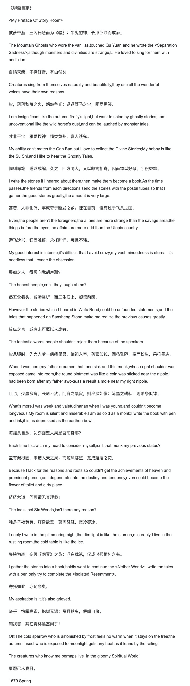

除去正文中提到的屈原，李贺，干宝，苏轼，几尊在中国文学史俱有一席之地的“上古大神”，这个一生未仕，自认“冷淡萧条”“落溷之花”的大户人家私塾先生，也曾致意八百年前几十里外的一位段姓老前辈。

段成式的出生地，今天有近80万人口，而知之者多不逾千。他离世一两百年后，苏州人范仲淹随母改嫁，到此处一户朱姓人家。过后近1000年，这位诗文政绩俱佳的文正公，被身不由己稀里糊涂安排成了当地名人，此地也自号“范公故里”——不仅俗套，显然也违背当事人意愿。

…

看过英文版『出师表』，『浮生六记』，『阿Q正传』，也尝试去欣赏英译的唐诗宋词。和苏曼殊之于拜伦作品，那种升华一般的琅琅雅致相比，中文作品被翻译为英语后，大多数直白，缺韵，张力和想象力不足，如龙失目 少了魂魄。

 

---

 

`《`聊斋自志`》`

`<`My Preface Of Story Room`>`

preface  [ˈprefəs]  

n. 前言；引语 
vt. 为…加序言；以…开始 
vi. 作序

 

披萝带荔，三闾氏感而为《骚》；牛鬼蛇神，长爪郎吟而成癖。

The Mountain Ghosts who wore the vanillas, touched Qu Yuan and he wrote the <Separation Sadness>;  although monsters and divinities are strange,Li He loved to sing for them with addiction.

vanilla  [vəˈnɪlə] 

n. 香子兰，香草
adj. 香草味的

divinity  [dɪˈvɪnəti]  

n. 神；神性；神学

addiction  [əˈdɪkʃn]  

n. 上瘾，沉溺；癖嗜

 

自鸣天籁，不择好音，有由然矣。

Creatures sing from themselves naturally and beautifully, they use all the wonderful voices,have their own reasons.

松，落落秋萤之火，魑魅争光；逐逐野马之尘，罔两见笑。

I am insignificant like the autumn firefly's light, but want to shine by ghostly stories;  I am uncoventional like the wild horse's dust,and can be laughed by monster tales.

unconventional  
英[ˌʌnkənˈvenʃənl]  
美[ˌʌnkənˈvenʃənl]  
adj.不因循守旧的; 不因袭的; 新奇的;  
[例句]Linus Pauling is an unconventional genius
莱纳斯·鲍林是个标新立异的天才人物。

 

才非干宝，雅爱搜神；情类黄州，喜人谈鬼。

My ability can't match the Gan Bao,but I love to collect the Divine Stories;My hobby is like the Su Shi,and I like to hear the Ghostly Tales.

闻则命笔，遂以成编。久之，四方同人，又以邮筒相寄，因而物以好聚，所积益夥。

I write the stories if I heared about them,then make them become a book. 

As the time passes,the friends from each directions,send the stories with the postal tubes,so that I gather the good stories greatly,the amount is very large.

甚者，人非化外，事或奇于断发之乡；睫在目前，怪有过于飞头之国。

Even,the people aren't the foreigners,the affairs are more strange than the savage area;  the things before the eyes,the affairs are more odd than the Utopia country.

眼前所发生的怪事，竟比飞头国的事更为离奇。飞头之国，古代传说中的怪异地方。唐段成式《酉阳杂俎·异境》：“岭南溪洞中，往往有飞头者，故有飞头獠子之号。”(爽哥注:  段成式,今山东邹平人氏,与蒲松龄出生地相距几十公里, 相差800多年)

savage  [ˈsævɪdʒ]  

n. 未开化的人；粗鲁的人；残暴成性的人 
adj. 野蛮的；残酷的；狂怒的；荒凉的 
vt. 乱咬；粗暴的对待 
n. (Savage)人名；(西)萨瓦赫；(英、德)萨维奇

 

遄飞逸兴，狂固难辞；永托旷怀，痴且不讳。

My good interest is intense,it's difficult that I avoid crazy; my vast mindedness is eternal, it's needless that I evade the obsession.

intense  [ɪnˈtens]  

adj. 强烈的；紧张的；非常的；热情的

eternal  [ɪˈtɜːnl]  

adj. 永恒的；不朽的

evade  [ɪˈveɪd]  详细X

vt. 逃避；规避；逃脱
vi. 逃避；规避；逃脱

evade: 逃避
evade obligations: 规避义务

obsession  [əbˈseʃn]  

n. 痴迷；困扰；[内科][心理] 强迫观念

 

展如之人，得毋向我胡卢耶？

The honest people, can't they laugh at me?

然五父衢头，或涉滥听；而三生石上，颇悟前因。

However the stories which I heared in Wufu Road, could be unfounded statements; and the tales that happened on Sansheng Stone,make me realize the previous causes greatly.

五父衢是一路名，位于山东曲阜县东南。
古道路名。《礼记·檀弓》：“孔子少孤，不知其墓，殡于五父之衢。”《左传》襄公十一年（公元前562年）：季武子将作三军，“诅诸五父之衢”。

孔子少孤，不知父亲葬在哪儿。母亲去世，无法合葬。于是把母亲的灵柩殡（停放）于五父衢头，也就是街上。果然有知道的人告诉孔子，他父亲的墓的位置。孔子才能使父母合葬。
蒲自序是说自己故事的来源是道听途说

unfounded  [ʌnˈfaʊndɪd]  

adj. 未建立的；没有理由的；没有事实根据的
网络释义 
Unfounded: 多虑 
Unfounded viewpoint: 无根据的看法 
unfounded rumor: 讹传

 

放纵之言，或有未可概以人废者。

The fantastic words,people shouldn't reject them because of the speakers.

fantastic,
除去"极好的",还有: 
n. 古怪的人 
adj. 奇异的；空想的；异想天开的；古怪的；极好的，极出色的；不可思议的；不切实际的

 

松悬弧时，先大人梦一病瘠瞿昙，偏袒入室，药膏如钱，圆粘乳际，寤而松生，果符墨志。

When I was born,my father dreamed that  one sick and thin monk,whose right shoulder was exposed came into room,the round ointment was like a coin, was sticked near the nipple, I had been born after my father awoke,as a result a mole near my right nipple.

瞿昙：梵语，原为佛教始祖姓氏，后泛指僧人。
悬弧：《礼记·内则》：“子生，男子设弧于门左，女子设帨于门右。”弧，木弓。后以“悬弧”表男子诞生。(比弄璋弄瓦高级一点..)

偏袒：和尚身穿袈裟，袒露右肩，故称

ointment  [ˈɔɪntmənt]  

n. 药膏；[药] 油膏
网络释义
OINTMENT: 药膏
Erythromycin Ointment: 红霉素软膏

mole  [məʊl]  

n. 鼹鼠；痣；防波堤；胎块；间谍

 

且也，少羸多病，长命不犹。门庭之凄寂，则冷淡如僧；笔墨之耕耘，则萧条似钵。

What's more,I was week and valetudinarian when I was young, and couldn't become longveous. My room is silent and miserable,I am as cold as a monk; I write the book with pen and ink,it is as depressed as the earthen bowl.

valetudinarian  [,vælɪtjuːdɪ'neərɪən]  

n. 过分担心自己健康的人；体弱多病的人 
adj. 过分担心健康的；虚弱的；有病的

earthen  [ˈɜːθn]  

adj. 土制的；陶制的；地球上的

earthen: 土制的 
earthen pot: 砂锅

 

每搔头自念，勿亦面壁人果是吾前身耶？

Each time I scratch my head to consider myself, isn't that monk my previous status?

盖有漏根因，未结人天之果；而随风荡堕，竟成藩溷之花。

Because I lack for the reasons and roots,so couldn't get the achievements of heaven and prominent person; as I degenerate into the destiny and tendency,even could become the flower of toilet and dirty place.

prominent  [ˈprɒmɪnənt]  

adj. 突出的，显著的；杰出的；卓越的

prominent: 突出的

prominent intellectuals: 高知识群体

Prominent Figures: 人物

degenerate  [dɪ'dʒen(ə)rət]  

v. 使退化；恶化；堕落 
adj. 退化的；堕落的；退化的；简并的 
n. 堕落的人

 

茫茫六道，何可谓无其理哉！

The indistinct Six Worlds, isn't there any reason?

indistinct  [ˌɪndɪˈstɪŋkt]  

adj. 模糊的，不清楚的；朦胧的；难以清楚辨认的

indistinct: 不清楚的 
indistinct strategy: 模糊战略 
marking indistinct: 标志不清

 

独是子夜荧荧，灯昏欲蕊；萧斋瑟瑟，案冷疑冰。

Lonely I write in the glimmering night,the dim light is like the stamen; miserably I live in the rustling room,the cold table is like the ice.

stamen(这个直译简直了...)

n. [植] 雄蕊

n. (Stamen)人名；(塞、保)斯塔门

stamen: 雄蕊

 

集腋为裘，妄续《幽冥》之录；浮白载笔，仅成《孤愤》之书。

I gather the stories into a book,boldly want to continue the `<Nether World>`; I write the tales with a pen,only try to complete the `<Isolated Resentment>`.

《幽冥》之录：南朝刘义庆著《幽冥录》，记神鬼怪异事。这里泛指志怪小说。

孤愤之书：战国韩非著有《孤愤》。《史记·老子韩非列传》索引云：“孤愤，愤孤直不容于时也。”此指代《聊斋志异》。

boldly  [ˈbəʊldli]  

adv. 大胆地；冒失地；显眼地

 

寄托如此，亦足悲矣。

My aspiration is it,it's also grieved.

aspiration  [ˌæspəˈreɪʃn]  

n. 渴望；抱负；送气；吸气；吸引术

 

嗟乎！惊霜寒雀，抱树无温；吊月秋虫，偎阑自热。
知我者，其在青林黑塞间乎！

Oh! The cold sparrow who is astonished by frost, feels no warm when it stays on the tree;the autumn insect who is exposed to moonlight,gets any heat as it leans by the railing.
The creatures who know me,perhaps live  in the gloomy Spiritual World!

青林黑塞：语本杜甫《梦李白二首》（其二）：“魂来枫林青，魂返关塞黑。”比喻冥冥中。

 

康熙己末春日。

1679 Spring

---

 

