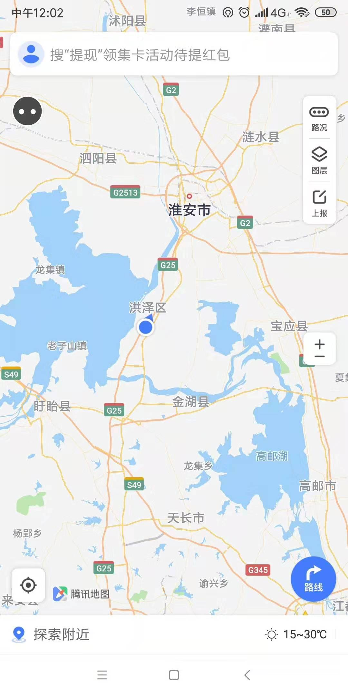
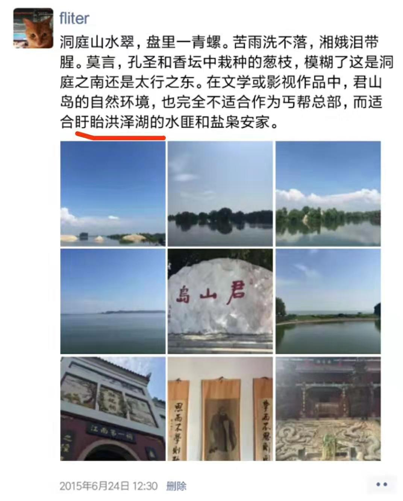
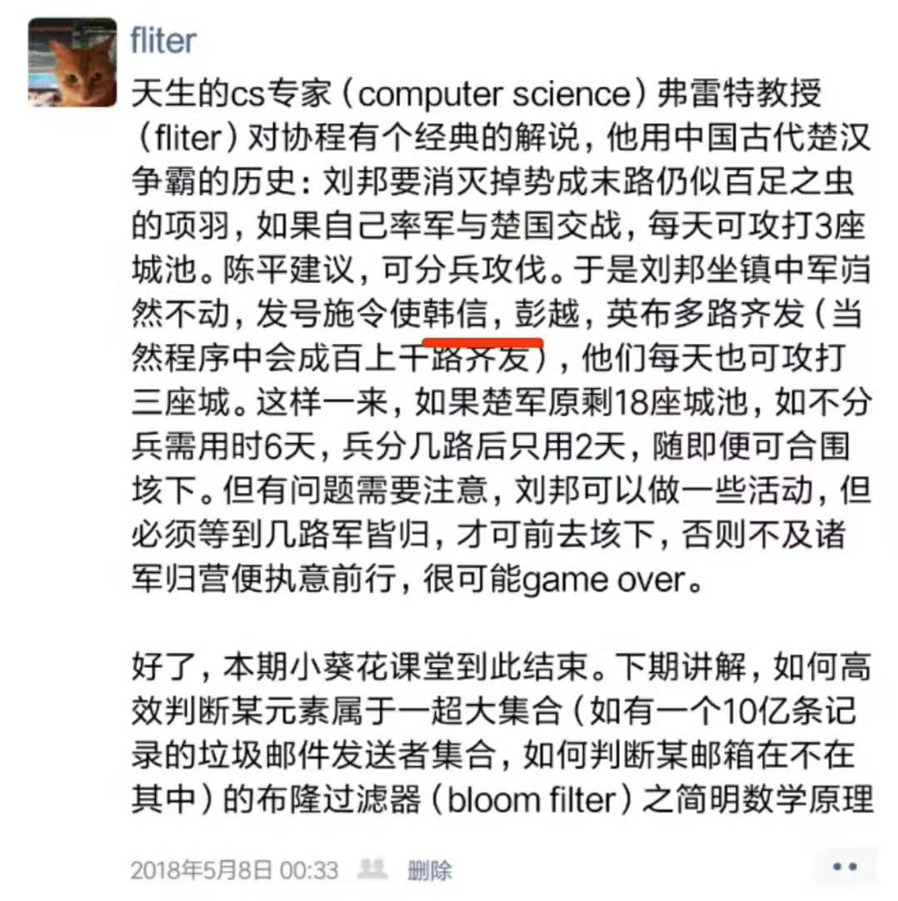
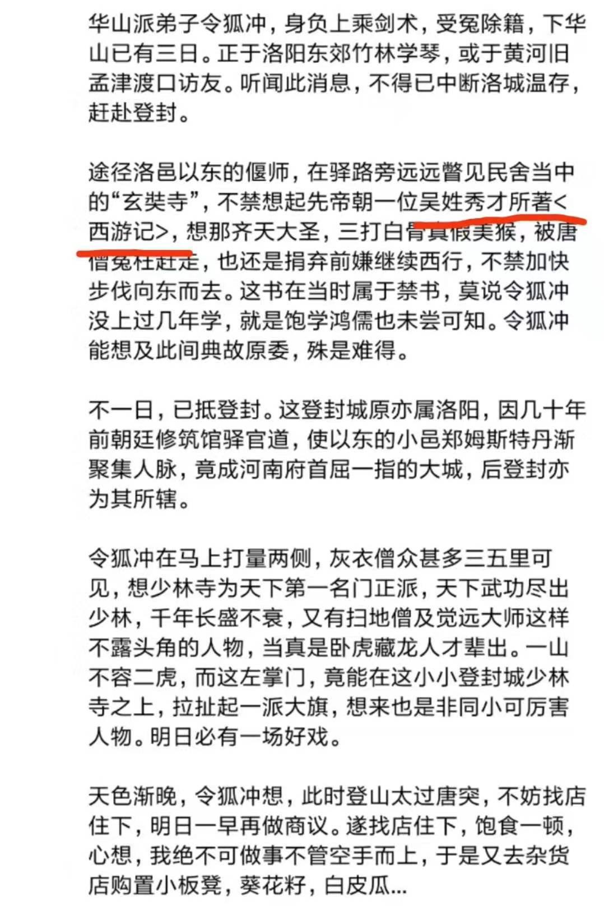
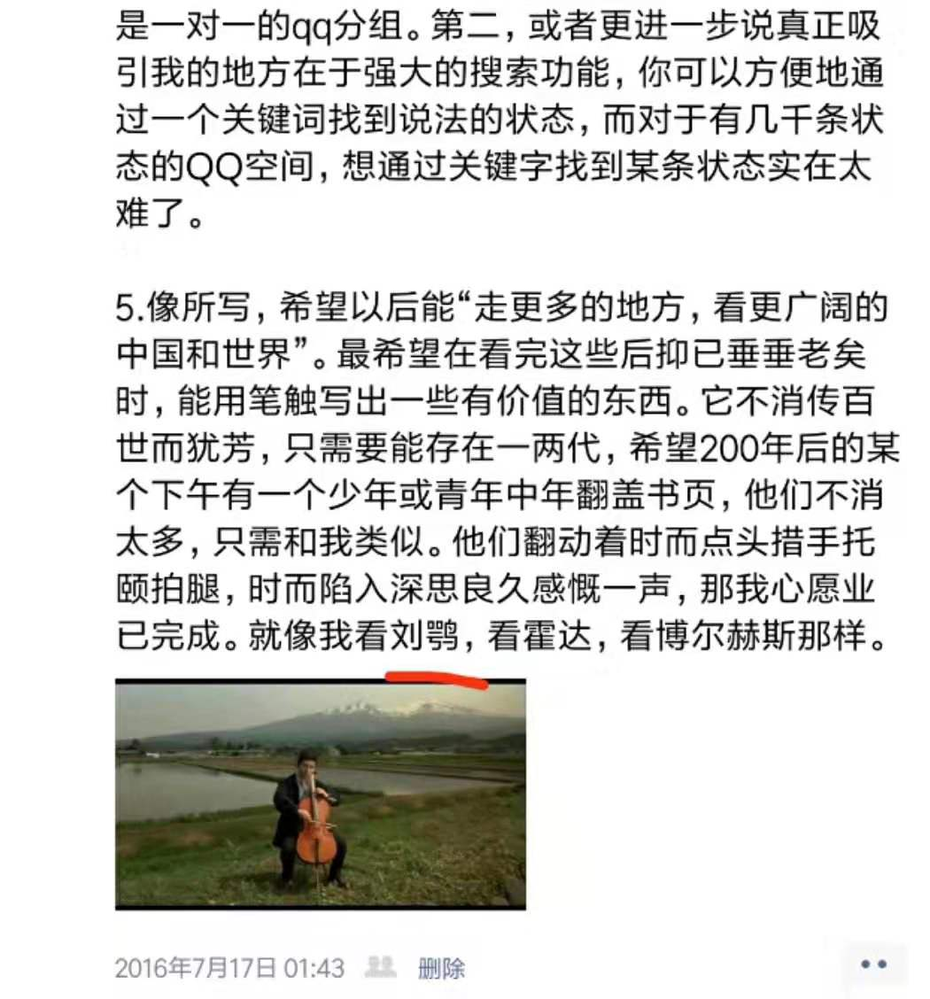
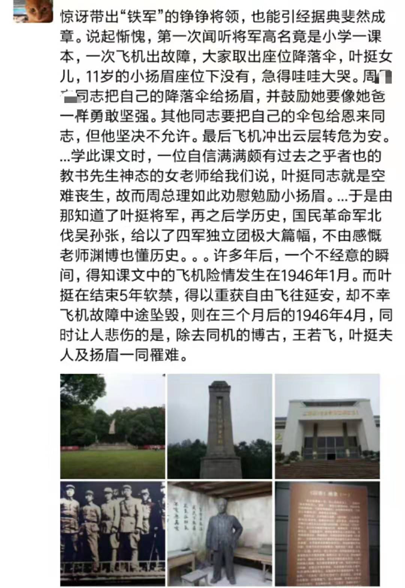
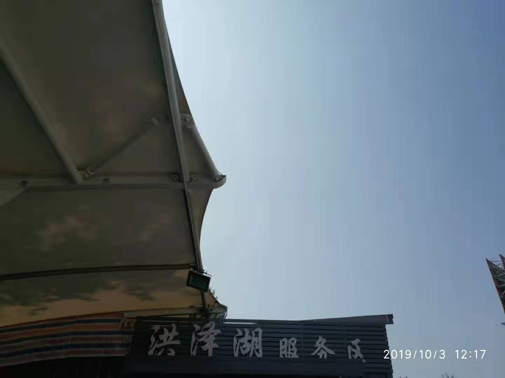

 

#己亥癸酉正午，余过淮扬#

『盱眙龙虾香天下，美丽清纯洪泽湖』的“洗耳”广告已多年未闻。

当年受胯下之辱的少年，几十年干戈杀伐，几历裂土封地又几经贬谪，以“淮阴侯”身份荣归故里，复修『漂母坟』，得偿幼时愿。

还有一位明朝的吴姓秀才，科举屡遭挫折，宦途困顿不堪，后索幸闭门著书，虽是写鬼神写幻境，却是付梓不多时，便为“禁书”。但依靠这部作品，他比所在王朝所有状元首辅的寿命加在一起还要绵长。中国儿童碰触中国文学，他这里是绕不过的一站。

当然，还有成人版的<老残游记>，希望多年后，我也能有刘鹗丰富经历，更有其犀利笔触。

『淮安城内少年郎，发奋读书为国强』。这是一百年前，一位周姓少年之秩事。然而，无论北上津门或是远渡重洋，却一生未能迈进大学引为平生憾事。但用另一种方式——像他那个“弃医从文”的远房亲戚，实现了自己所夸海口。他没有子嗣不留遗体，骨灰撒散赤县神州。周公吐哺天下归心，今天，他好像还在我们身边。

以南的扬州尝曾专程前去，但高邮不曾有缘。庵赵庄荸荠庵的明海小法师，怕已是耄耋老僧。从那天后，你又见过小英子吗？

宝应，这里不曾有何煊赫人物，亦无知名景区。但于我，有一位相逢可一笑的当年故友。『昔别尔未婚，儿女忽成行』，用在这里，怕是再恰当不过。

