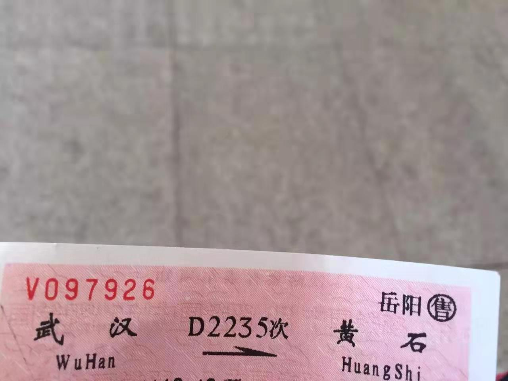
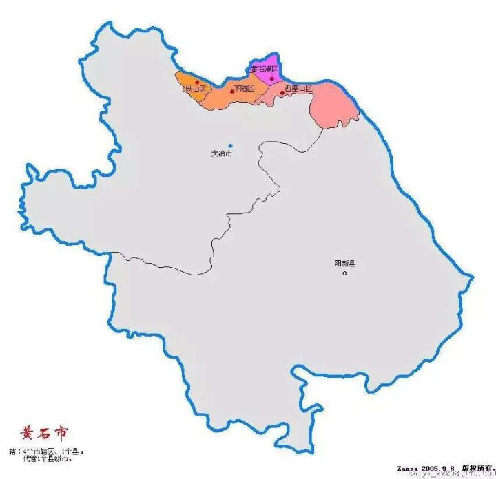
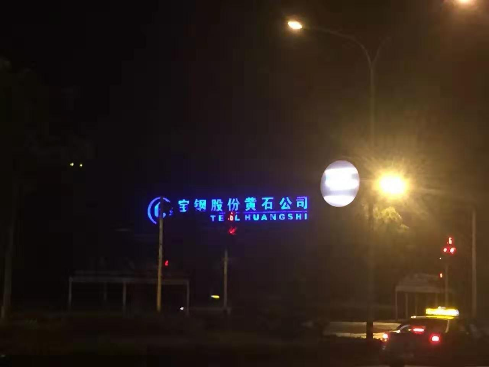
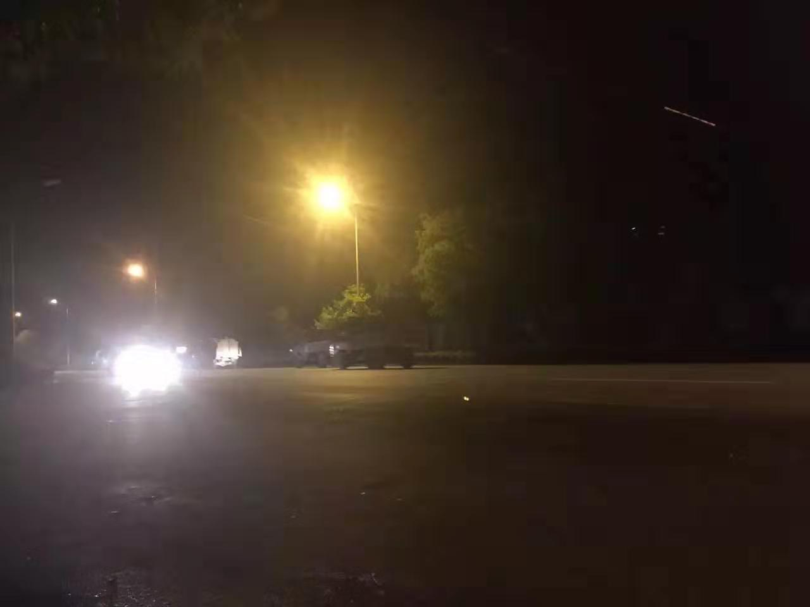
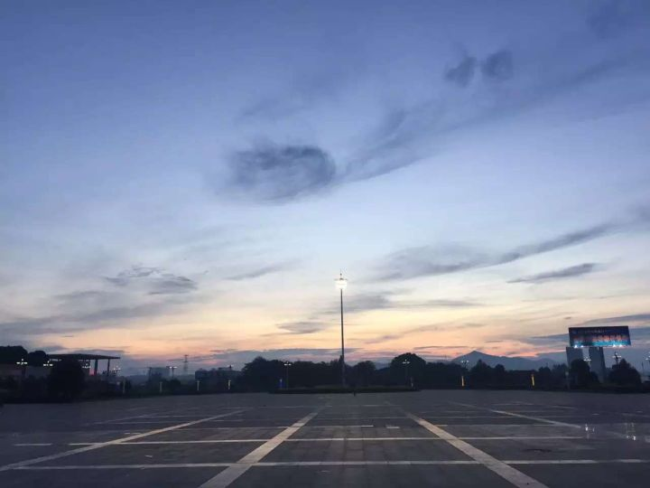

 

&emsp;&emsp;本搭乘从 *成都东* 开来的D2235由武汉至黄石，但到站等待时，才被告知因四川某段水灾，列车取消...且无法改签合适车票，只得退掉重买。最后所坐的D5951，晚点约2小时，更要命的是到*黄石北站*而不是我下张车票的出发地*黄石站*。

&emsp;&emsp;车到之时已晚上11点有余，移动电源电量早已耗尽，又无安卓/WP充电线而无法及时补充。待我从车站旁的便利店给手机充电半响出来之时（这趟动车少有的座位下居然没电源），月明星疏，人迹寥寥，只有三五的士，开来询问去处。报价不菲，当下挥手道不用不用。我原心想，为G/D新修的北站地处荒僻处，老车站应在城区闹市，沿途漫走，定然灯光璀璨，沿路商铺宾馆当鳞次栉比。经武功山一役，鞋子踢石涉水已然报废，上山之时为千方百计减轻重量，又潇洒把鞋垫取出，连通雨伞一并扔了，再兼连日疾走，脚上早已吃不消。但想虽有12KM就权当夜游，支撑不住就就近找地休息。　　

&emsp;&emsp;然而万万没想到，黄石这个地级市的车站命名竟如此奇葩....*黄石站*已然在其荒僻的辖区与治下的大冶交界之处，莫说沿途繁华，算是"城乡结合部"，都是对这五个字的蔑视：少有住家，两侧多山林草地，灯光黯黯，不闻人声。只有偶然身后闷雷般车鸣阵阵，接着是一队趁月黑风高绕城而去的超载卡车，告知我不是太空的孤独旅客。　　

&emsp;&emsp;这次意料之外的事儿，使我无意中踏入了初中/高中都曾学过的大冶市地界（两地在争此站的归属）。至此，此次中部环行，竟然无心栽柳把当年著名的汉冶萍走了一圈。盛宣怀的**十几项第一**，又亲身去过或经历了一项。他在山东创造性地用以工代赈的方法疏浚的小清河，正是流经我县的重要水系之一（这比罗斯福新政修胡佛水坝，这项同样是“以工代赈”的工程早了Ｎ些年）；他创办于1895年和1896年的北洋大学和南洋公学，即今南开七里台和上海徐家汇，都亲身去过。人能如盛宣怀一生，生意成绩至此，夫复何求。　　　

&emsp;&emsp;若在平时，导航说步行需一小时，我通常按半小时计划，因自知步履远快于常速。而这时，抛去背包中所带的一部词典和一本书，平板，移动电源这些此刻俨然好像有几十斤重的东西不说，单单就脚上的水泡和这双有不如无的敝履，也决定这次要结结实实走上三小时，每走一步，脚上水泡和鞋摩擦，痛意袭来，尤其鞋底极薄，踩到路边花生粒大小的石块，即不禁张口伸舌大叫一声。将最后的一卷卫生纸伴同身旁草片树叶放于鞋内，算作鞋垫，略有裨益。　

&emsp;&emsp;这孤独的三小时却似万年！为节约宝贵电量我又不能把音量调到最大让“小苹果”和“民族风”一路相随。身乏体累，这样的行走太过索然无味，痛意袭来或简直就是煎熬。前不挨村后不靠店，秦琼当锏杨志卖刀，彼时我第一想法就是，在空旷无人的公路高歌《国际歌》罢！这不正是许多仁人志士临刑前的最后一句？然而，然而，我个连小学阅读课本上《中国少年先锋队队歌》都还依稀记得的优秀少先队员，居然除去那句“英特纳雄耐尔就一定要实现”，其他一句都想不起来...

&emsp;&emsp;作为一个即将开赴大城市，或许将被同化千人一面失去特色的五线小城市半文艺青年，此刻，我还是别有风范的。黄石所辖的西塞山区，正是在古代诗词尤其唐诗中著名的西塞山所在地。“西塞山前白鹭飞，桃花流水鳜鱼肥。青箬笠，绿蓑衣，斜风细雨不须归。钓台渔父褐为裘，两两三三舴艋舟。能纵棹，惯乘流，长江白浪不曾忧。”这首诗，有一种超然物外恬静自得之感，天地悠悠，万物灵动，任你风来雨去，我自安然物外，道家＜逍遥游＞和柳宗元＜江雪＞的意象，好似融在一起如胶似漆。我甚至觉得，300年后，九死一生的苏轼在黄石北面的黄冈，谱就著名的＜定风波＞和＜前赤壁赋＞时，定然受到了前辈这首小诗的影响。

&emsp;&emsp;西塞山最有名的诗词当属高中所学的＜西塞山怀古＞。诗中前四句，概括了明代小说＜三国演义＞最后一回司马灭孙吴的著名一役，也是小说最后那首总结诗“石头城下无波涛”的出处。

&emsp;&emsp;“人世几回伤往事，山形依旧枕寒流。今逢四海为家日，故垒萧萧芦荻秋。”（必须要承认，我一直以为西塞山应该是东起镇江西到南京这一块的一座江岸小山）。 这后四句有极强的代入感，因为它不光可以从刘禹锡嘴中说出，由当世的你我任何一人说出也完全合情合理。同样生缝四海为家日，面对1800年前那个群星璀璨时代的旧迹，也许同样会唏嘘感慨，只是语言水平所限表达不出来罢！

&emsp;&emsp;这条大江，见证了三家归晋，也同样见证了天下三分。安葬小乔和鲁肃的岳阳，此行路过的赤壁，华容道所在的监利（这里面有"门道"），旧时的柴桑今日的九江，皆是时间大江冲刷，留在岸边的当时遗迹。

&emsp;&emsp;怀古之忧思并没有如滔滔大江滚滚不绝。低头看着孤零零的影子，我惊然想起：出来已有半月，这月三国杀的人物形象和皮肤包是领不到了。儿童节那天白菜价入手的曹冲，也还一次没有用过，和荀彧和华佗的逆天配合只是听人说过自己未曾玩过，等回来一定买瓶汽水，开黑好好玩几局...

&emsp;&emsp;其时明月在天，清风吹叶。抬头望去，目所能及，一条宽阔公路径直向前不见归处，两侧路灯金黄闪耀消失远方。正是：雄关漫道在前，而今迈步走起。走起...
