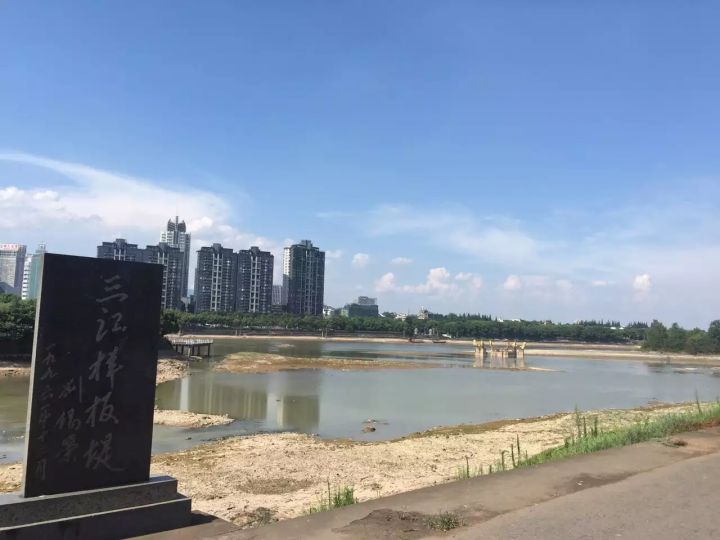

 

金华，又名婺州，其下义乌，永康，东阳，兰溪，武义等县市，皆有名气。

金华江，别称婺江，由义乌江（东阳江在义乌段的称谓）和武义江在市区汇合而成。如同二水三分的武汉三镇，两江也将金华城区一分为三。

通济桥，两江交汇后的婺江上第一座桥，将分居南北两岸的八一南路与八一北路连为一体。

通济桥高悬，离水面数10米。8年前的初冬，一名温州籍23岁女子，“因到金华后未找到男友，而一气之下跳江”。

8年前的那一天，一名28岁的青年军官，驻金华某部机要科副连职中尉参谋孟祥斌，陪前来探望的妻儿幼女恰从此走过。

本素昧平生，却在那一刻，被永远地改变。彼时彼刻，桥上的行人过客，只道有人落水，只知千钧一发危如累卵。

出于军人本职，28岁男子纵身跳下刺骨江中，轻生者得救，救人者身亡。而这一切，都被桥面上前来探望的妻女目睹。这样的场景，太过于残酷。

那刻，与久未谋面的丈夫千里相聚不过几天却又阴阳永隔。其妻也要轻生跳江随夫而去的冲动，像玄慈以身明法后的叶二娘，更像胡一刀死后的胡夫人。

不到3个月，即阖家欢庆的春节，举国同欢之下，鲜有人知道，这个春节，对孤女寡母是何辛酸。

2008年年初，孟祥斌入选感动中国获奖人物，透过屏幕，他的义举为多人所知。那时，我是一名初三学生，对英雄的敬仰，沸腾的满腔热血，一如今日。

“史册，尘封记忆；旧事，江河远去。凭吊，不过竹泪一滴”。

8年后，孟的女儿已有十一二岁，不会再相信他只是“睡着了”。8年，在偌大的中国，偌大的人间，有更多类似于此或更甚于此的悲情剧发生。身处缤乱纷杂的信息爆炸时代，行色匆匆，健忘的人大概多忘却甚或从来未曾记住。

对于普通人，2007.11.30这一天不论发生什么，都只是漫长3万多天并不起眼的一瞬，无论这天发生什么惊天伟岸的壮举，事不关己，也确实并不需刻意记怀。

8年后的今天，一个对于军人极其特殊的日子里，我恰在金华，来到通济桥头，桥上车水马龙，江心绿洲黄宾虹公园亭台内，依稀可见游园者纳凉。烈日炎炎，江水也失去生气，几乎断流。车鸣声伴随蝉叫，构成了这个夏日午后再寻常不过的场景。8年前那个严寒凛冽日子里发生的事情，大概只能清楚留存于死者妻女的脑海，一遍又一遍地循环放映。

我站在柳条下，极目西望。青山虽遮，绿水自流，婺江与衢江在兰溪汇成兰江，北至梅城汇新安江后称为富春江，继续北上到富阳以下即钱塘江。一条千年前挖凿的京杭运河，南北联通了赤县神州海河黄河淮河长江钱塘江五大水系。沿运河北上，过苏州，镇江，扬州，徐州，聊城，即到山东北大门德州，也正是孟的故乡。

天地悠悠，江流滚滚。山川异域，风月同天。我信步走到桥头，追思往事，昔人已去，鱼沉雁杳。孟的事迹不会为人永远记住，孟氏遗孀遗女的境况，虽未曾看到却不难想见。而我能做的，也只是对我尊敬的这位老乡，缅怀以示未曾忘记罢了。

&emsp;&emsp;&emsp;&emsp;&emsp;&emsp;&emsp;&emsp;&emsp;&emsp;&emsp;&emsp;&emsp;&emsp;&emsp;&emsp;&emsp;&emsp;&emsp;&emsp;&emsp;&emsp;于2015/8/1

