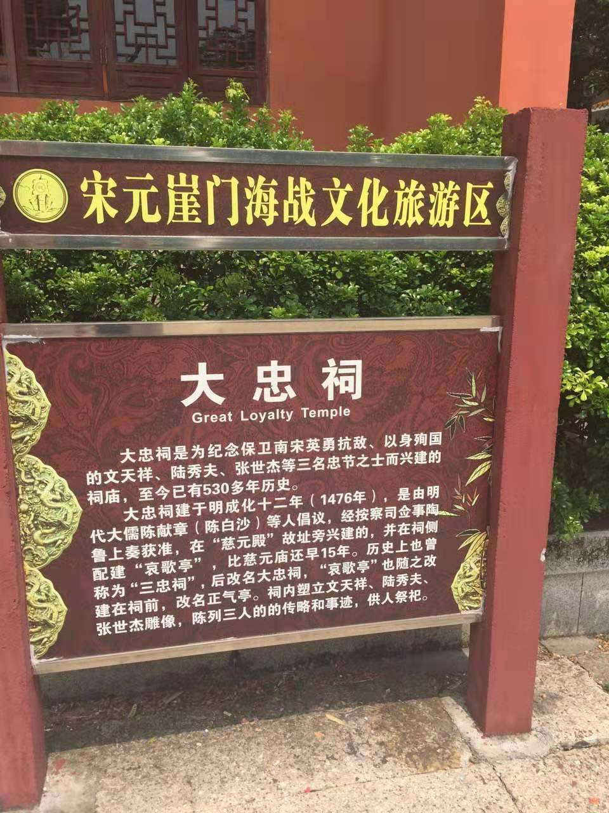
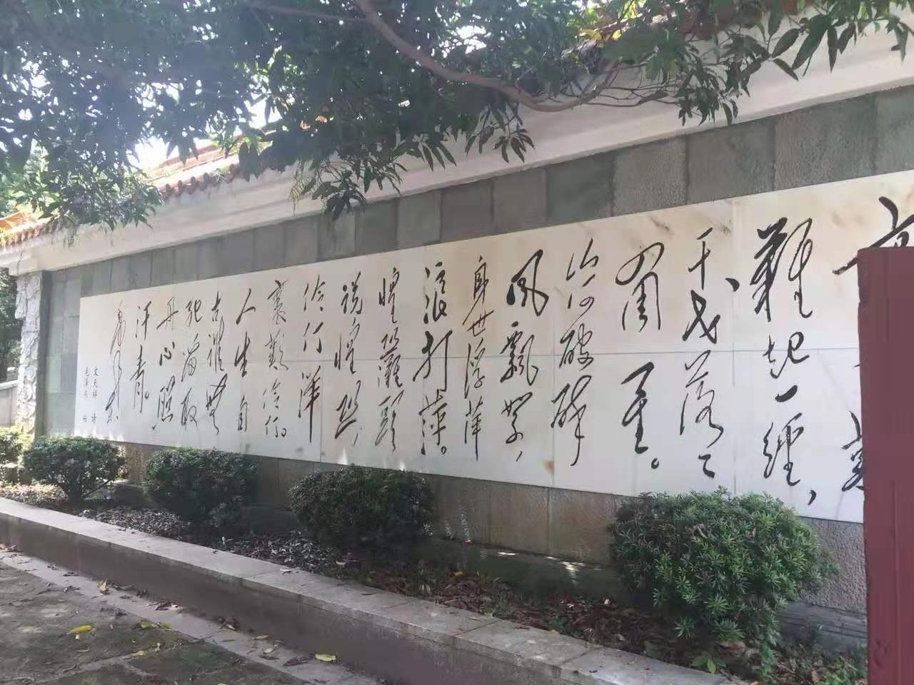
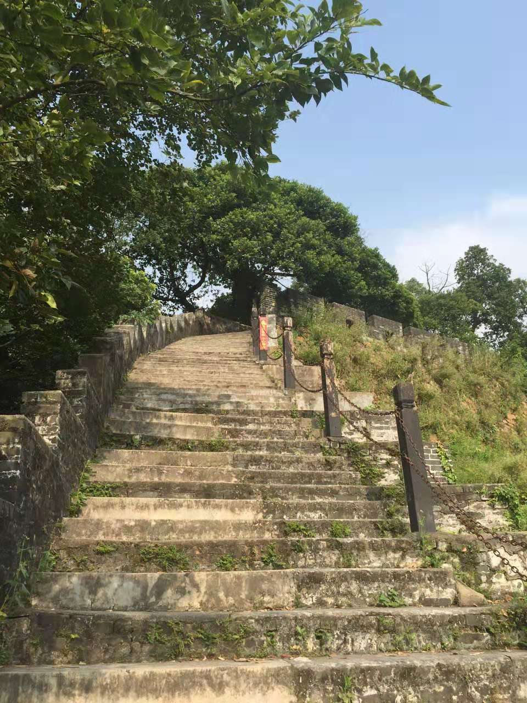
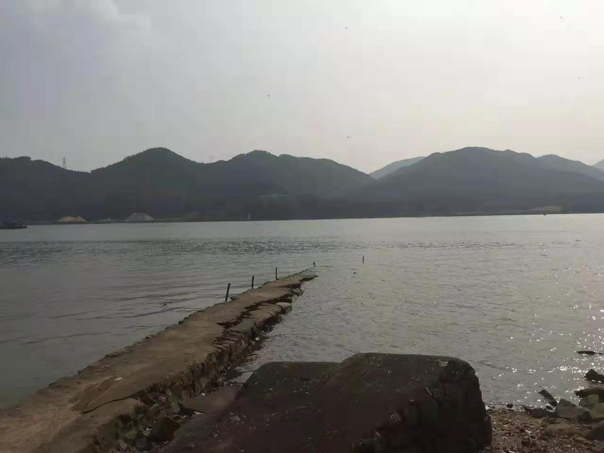
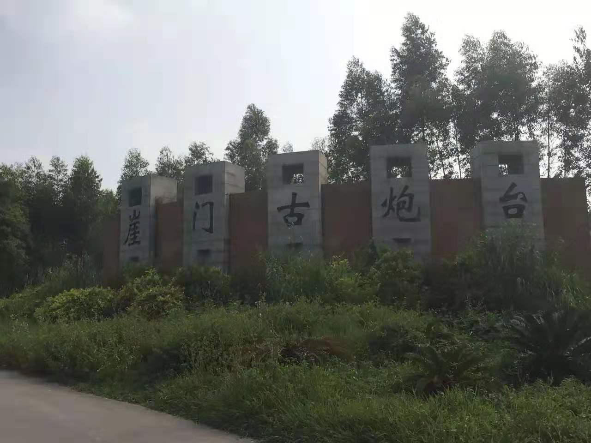
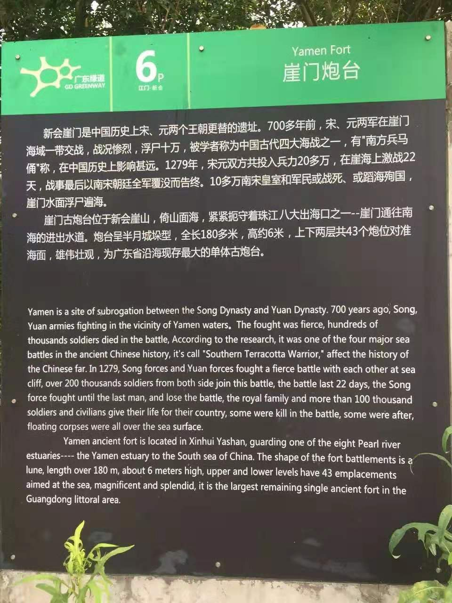

 

---
 
---
目的地，是42公里外的一处古战场遗迹。古代上规模的大战，几乎都发生于长江以北，在这样一个偏远的南隅一角，不会有什么大规模的决战。确实，与长平/官渡/赤壁/肥水之战比，它的规模实在太小太小（真正军人只有几万）。然而，它对整个汉民族的意义和影响，却非其上任何一场战役可比。

长平之战赵国40万生力损失殆尽，秦统天下，只剩时间问题。
官渡之战，河南的曹操战胜河北的袁绍，一统黄河流域。
赤壁之战，另两方是自称兵圣后裔的江东孙氏，和自称大汉皇叔的刘备集团。
孰胜孰败，不过是汉人群体换了个临时头目，归根结底，只是汉民族内部矛盾。

孙刘曹操操劳终生，螳螂背后有黄雀，到头却不过是为司马家族做嫁衣。秦皇汉武时即有的北方异族边患，因为长城，因为李牧和李广们，终不教其过阴山。西晋王朝的八王之乱，终于给了窥伺几百年却终不得进的胡人绝好机会。

虽传统王权所在的北方陷落，但王谢们这样的北方大族举家南迁，终究还是在江南拉扯起半壁江山，为汉人保留了一脉纯净的文化血脉。

与赤壁大战稍有不同的是肥水之战，这两场同样发生于长江上的对垒，都堪称那个时代整个地球上人类最大规模的械斗。肥水之战的一方，是志得意满的异族精英苻坚。如此战东晋败，则汉人失去纯净文化血脉，要提早近1000年。

然而然而，风声鹤唳草木皆兵，八公山下的胜利，让拥兵百万投鞭断流的异族英雄狼狈而逃。
千年来，中原和江南的汉人，打跑了匈奴，同化了突厥契丹，却终究败给了13世纪举世无匹的蒙古铁骑。

崖山战后，南宋流亡朝廷灭亡，汉人的天下在历史上第一次完全沦陷于外族。
有人说“崖山之后无中国，明亡之后无华夏”。（确切地说不该是明亡之后，是李自成的大顺朝灭亡之后）。以今天56个民族同属中华大家庭的角度看，自然是有些言之过甚。但以我自身，一个孔孟邹鲁之地生养的新时期汉族读书人，却只得不情愿又无可奈何地接受。

据由破窗理论推论，第一次失去纯洁被侵占后，第二次第三次的抗争意义，也就没那么大了。因此，虽然同样有叛徒内奸，但与同样属灭国级大战的山海关战役比，我没看到吴三桂这样的特大号汉奸，而看到了汉人知识分子的抗争，看到了威武不屈的文天祥和陆秀夫：

“
天地有正气，杂然赋流形。下则为河岳，上则为日星。
于人曰浩然，沛乎塞苍冥。皇路当清夷，含和吐明庭。
时穷节乃见，一一垂丹青。在齐太史简，在晋董狐笔。
在秦张良椎，在汉苏武节。为严将军头，为嵇侍中血。
为张睢阳齿，为颜常山舌。或为辽东帽，清操厉冰雪。
或为出师表，鬼神泣壮烈。或为渡江楫，慷慨吞胡羯。
或为击贼笏，逆竖头破裂。是气所磅礴，凛烈万古存。
当其贯日月，生死安足论。地维赖以立，天柱赖以尊。
三纲实系命，道义为之根。嗟予遘阳九，隶也实不力。
楚囚缨其冠，传车送穷北。鼎镬甘如饴，求之不可得。
阴房阗鬼火，春院閟天黑。牛骥同一皂，鸡栖凤凰食。
一朝蒙雾露，分作沟中瘠。如此再寒暑，百沴自辟易。
嗟哉沮洳场，为我安乐国。岂有他缪巧，阴阳不能贼。
顾此耿耿在，仰视浮云白。悠悠我心悲，苍天曷有极。
哲人日已远，典刑在夙昔。风檐展书读，古道照颜色。
”

700多年前这场让小小的官冲村和偌大的神州同样翻山倒海的海战，在736年后，已然难觅当年踪迹。潮平两岸阔，风静縠纹平。旧事江河远去，10万具浮尸，无数的断桅残杆，都随滚滚而来的江水，消逝于历史的浩瀚天空，连一个让我找到断剑锈戟的机会都没有。中国多战场遗迹，此地偏居偏僻南中国的偏僻处，山遥路远，凭吊之人不似其他古迹那般频多。然而，比之刘禹锡杜牧王安石苏轼等人吟诵的石头城，乌江亭，赤壁，此战此地的意义，有过而绝无不及。

先人已去700余年，尸骨不存。700年后，先生在天有灵，请收下这个北方齐鲁故地辗转而来的后辈读书人，对本民族英雄无比的尊敬与无尽的景仰。

“我死后，害怕洪水滔天恶评如潮”