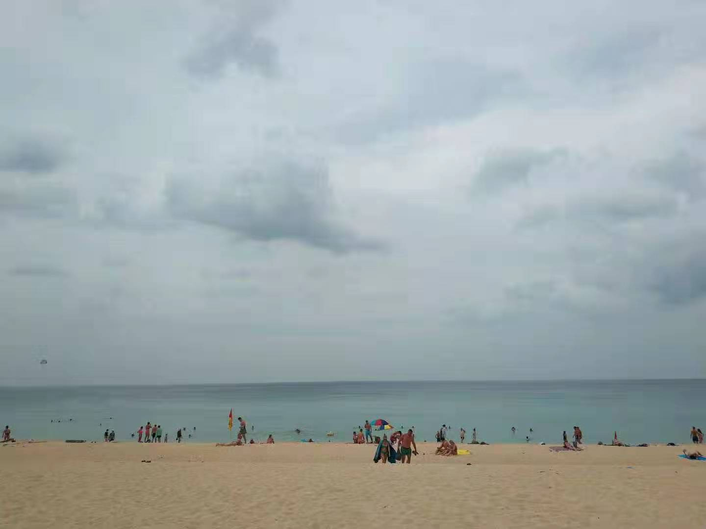

 

I know the significant significance of this canal.  &nbsp;&nbsp;&nbsp;&nbsp;&nbsp;&nbsp;&nbsp;&nbsp;&nbsp;---2014.03.21　

---
 

  

<table><tr><td bgcolor=OldLace>

云中界

through the clouds

从机场到海滨酒店40km路途，一路能见小米，OV，甚至还有国内并不寻常能有的巨大关公像。

中文标注的火锅店，老北京卤肉卷，川菜/滇菜馆，以及各种汉字店名在街头时常出现。宾馆接待人员的普通话，感觉比我几个十里不同音的温州同事还要标准。支付宝/微信支付的标识常常贴在门店最显眼的地方。

路途还有覆盖率极高的7-11，次之的全家。这里左向行驶，路上跑的80%是丰田和本田，10%为三菱和马自达，剩下的10%被福特和通用从强劲的日本竞争对手那里艰难获取。

 
------------------------------------

中国游客占比颇高，也常见金发白肤的欧美人大腹便便走在街头。可能是旅游岛缘故，物价高于泰国其他区域。

餐厅里99%为各地同胞..

慢国内一小时(UTC/GMT +7:00)，所以相比之下，看欧冠或西甲，能稍稍少熬那么一会夜。

热带气候太容易让人昏昏沉沉。

3瓶红牛+1瓶电解质饮料，共需人民币8.4元

被中国人炒起来的班扎恩海鲜市场。

Night Fair

#Shemale Show…#

兼顾各国观众，有西方音乐剧，也有中国传统的宫廷歌舞;有邓丽君音色的<梅>，也有如印度电影里的魔性歌舞;有泰国传统舞曲，有台湾高山族风格曲目。但大多应是对口型的假唱，舞蹈却是真的，观众大多为猎奇，本并没有抱太高期待，却发觉水平其实颇高。…

对这个已成这个国家特色和标志的群体，如果是当事者自愿那自是无可厚非，当尽量摘下有色眼镜；而如果是情非所愿迫不得已，这发生在21世纪是种悲哀。这些自幼服用雌性激素的“男性”寿命很短，大多不超过40岁。

中国过去有“扬州瘦马”一说，几百年前意大利亦为歌剧有阉伶歌手，但而今ta们已因为社会的进步而不被容忍最终趋于消失不见。

这里的公共厕所大多收费，且设备相对老旧，这种景象在中国，出现在20年前我还是孩童时的漫漶记忆中。这里时常能收到泰拳格斗的传单，惊讶的是，格斗者除去妇女，还有儿童。去年引起国内舆论上下一致指责的凉山格斗孤儿一事，在此地却是合理合法。

大概前去欧美日韩，会觉当地经济发达，一切井然有序，细查之下更会发觉国内差距巨大；而在此，只觉得我们这个有志最优秀的国家，已位在中等偏上。

------------------------------------

 

#Similan#

两小时车程,复又一个半小时船程犁波破浪，风光大致如此。几颗群岛点缀，白银盘里青螺。

Donald Duck Bay,中译为"老鸭湾"

------------------------------------

机车环岛

暮落神仙岛,"海夜吞残日"

落日熔金,暮云合璧

日晚渔歌唱，风烟满夕阳。

想在选购琳琅商品的队队人流中，找到几个非我同胞的“外国人”，比在魔都任何一并不算大的综合体，如百盛/汇金 要难得多的多。“目录一览”比龙湖天街或亲橙里做的还要简明易懂。地道的北伦敦腔英语在此不如四川普通话好使。

------------------------------------

#攀牙湾#

海上有仙山,虚无缥缈间.

“五人相对不语，各自想着各人的心事，波涛轻轻打着小舟，只觉清风明月，万古常存，人生忧患，亦复如是，永无断绝”

'忽然之间，一声声极轻柔、极缥缈的歌声散在海上：“到头这一身难逃那一日。百岁光阴，七十者稀。急急流年，滔滔逝水。”却是殷离在睡梦中低声唱着小曲。'

'海鸥应是未忘机，故人今有问归期。'

“江西冷”大卖场

------------------

</td></tr></table>

 

---

 

幼时在姥爷家，喜食“泰国米仁”雪糕。对这个并非发达却可如“英法德美”同样称国的热带国家充满好奇。也曾笑言，“等我长大，带姥爷和姥娘同去”

少时对标安南，各国军力，经济政态，风俗民貌，尽皆了然。胸中有典，笔头千字。慷慨陈言，倚马可待。自负似马幼长，谙熟兵法，冀望世人皆知。

年岁渐长却退一步，觉立足华夏通晓四遭便是殊为不易。做一幕僚似郭奉孝荀令公，或如本朝之刘h或王hn，运筹帷幄，致君尧舜，板荡识忠，侯赢一言。纵在高中，沉迷理化，亦对他信下野，对红衫军黄杉军，对帅哥阿皮实退场，美女英拉登台了若指掌。

“后来长大了”…不能再四体不勤五谷不分，而对这些烂熟于心也曾津津乐道的内容渐觉索然，关注度远逊房价涨跌利率升降，也不及未来规划技术成长。甚至涉此三缄其口，只听诸人讨论诉说，或正或误随机散落在五指山中的几点。

再次“面朝大海”，却不是曾经轻灵少年。姥爷姥娘都不在了，我也再没有幼时天马行空的驰骋。而面对二十年后的“油腻中年”，还是要暗自坚持，为年少时的诸多想法，保留一颗缩龙成寸的星星之火。

&nbsp;&nbsp;&nbsp;&nbsp;&nbsp;&nbsp;&nbsp;&nbsp;&nbsp;&nbsp;&nbsp;&nbsp;&nbsp;&nbsp;&nbsp;&nbsp;&nbsp;&nbsp;&nbsp;&nbsp;&nbsp;&nbsp;&nbsp;&nbsp;&nbsp;&nbsp;&nbsp;&nbsp;&nbsp;&nbsp;&nbsp;&nbsp;&nbsp;&nbsp;&nbsp;&nbsp;&nbsp;&nbsp;&nbsp;&nbsp;&nbsp;&nbsp;&nbsp;&nbsp;&nbsp;&nbsp;`---`2018.11.08

---