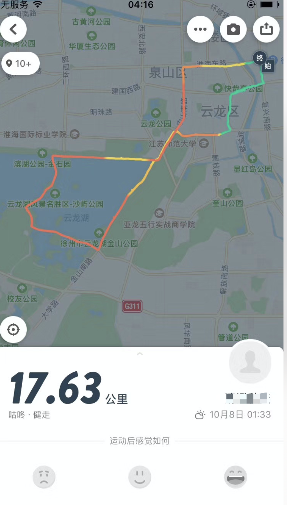
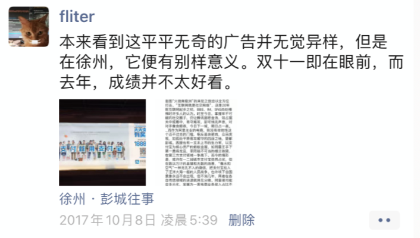

坐上一列绿皮车，经过四小时颠簸，从泗洙河畔的圣人故里，来到兵家必争的徐州。路途注定难熬：拥挤的人群和无处安放的各种大件行李，黝黑发亮的座椅散发独特气味，再兼各种脱鞋脱袜，密不透风的车厢，摩肩擦踵的人群，加上金立和蓝绿机外放的口水歌和王者荣耀，雷打亦不动的呼噜声，以及总会有的因为空间因为行李而起的或大或小的争执，便是风景独到的绿皮车乘坐体验。…

而我却是放空心态，以身处其中的旁观者身份，不动声色细细观察，ta们有的已沟壑深深 布满黄褐色的脸庞，衣装穿的破旧邋遢如我; 有的正年轻，沉醉手机头也不抬。ta们的终点，可能是昆山的工厂，可能是接收上海外卖店的订单。ta们不讨喜甚至让人厌烦，更是绝少共同语言，却与我一样都是进城务工，没再多差别。

在这里，有镁光灯不多关注的更广大更真实的中国。

出站后，明月在天，常被飘荡着的乌云遮没。此时中秋已过，寒意四起，我却分明看到，站外的许多处地方，三三两两横七竖八躺着些和衣而卧的旅人，即便四遭咫尺，便是各式各样的宾馆客房。

我一个人前去云龙湖，看到凌晨两点送餐的外卖小哥，有些犹豫地瞅着红绿灯，旋即点亮手机，查看超时时间。

当我酣畅淋漓围湖骑行近20公里，在湖中路，停车走至木质围栏，看到远方或明或暗的稀疏星辰，月尚圆，人已远。我跑跑跳跳走动着，惊扰了未发觉的不远处，一位带着口罩捂得严严实实的老人家翻动垃圾桶。望着她匆匆远去的身影，便又有些不知从何而来的叹息。

如同全国所有大中城市，这里红旗正招展，宣传俯拾可见。40年来，这个国家从世界第八追赶为第二，并会在不会太久的将来成为世界第一大经济体，成绩瞩目，惊耀世人。然而，这惊世之功，有数以亿万进城务工者的血汗，无数多个[留守老人和留守儿童并不美满的晚年和并不幸福的童年](https://mp.weixin.qq.com/s?__biz=MzI0NDU5NDYxMw==&mid=2247483955&idx=1&sn=97877107cd3f715eb8298e7adf1c1b9d&open_source=weibo_search)。

 

---

 

 

---

 

腾讯阿里对垒，像楚汉时刘项鏖战荥阳。而微信，就是北上伐齐的韩信，它绝不再只是QQ的延伸或替身，其迥然不同的产品理念和对各圈层各年龄人群极尽囊括，以及自成生态的半开放体系，正“在陆地，在空中，在水里；在街上，在桥下，在田野中”，对妄图“火烧南极洲”的来犯之敌给以全方位打击。

“互联网就是社交网络”，这是20年前互联网起步之初，BBS、IM、SNS尚处襁褓时许多人的认为。时至今日，掌握牢不可破的社交圈子，仍让腾讯固若金汤，如占据关中或蜀中，易守难攻，却可悄无声息，对对手蚕食鲸吞，今日下一城，明日占一邑。…

而作为阿里主业的电商，则没有排他性这个迈不过去的门槛，相反是块肥肉，众目虎视，如孤处平原易攻难守的四战之地，楚都彭城。

西楚也有一支未上市的生力军，以支付宝为核心资产的蚂蚁金服，如同霸王手下第一勇将龙且，率同锐不可当的楼兰铁骑，在第三方支付领域一争高下。

而今的情形是，或许在一二线城市支付宝依然占优，但在数以万计的县镇和无数的场景，“像水和空气”一样无孔不入的微信，把支付宝拉入了汪洋大海一般的人民战争。

也许垓下合围景象永远不会出现，但不消几年，两者在各自传统领域的进退就将见分晓。阿里很可能会多元化，发展为一家电商业务收入占比不超过50%的互联网综合服务商。

2017.05.09 于洛阳龙门

 

---

 

能清晰记得1997发生总共不多的三五事，而10年前的2007，却有些漫漶模糊。…

眼前的总进缓存，以为想起时随时可以找到。而把更久远的以前放进硬盘持久化。

还有不到80天，人类纪元里的2017也将从时间刻度划过。而我却还依稀记得，10年前雨雪冰冻，打砸抢烧，动车相撞，特大地震，以及8月8号，我在夜幕沉沉下的人工湖野泳，被湖底的锐物轻轻划伤脚趾。我看到岸边垂柳依依如昔，却不见一人，雾气弥漫，不禁有些孤单。我在8点钟回到家，看到电视屏幕里，几百公里外的北京烟火闪耀。那正是我结束中考，将开始高中的最后一个悠闲假期。而后成绩尚好却并不快乐，以至于近十年后依然心有余悸。可能从那时起，便失去了微笑作为常态的生活，转而是不知因何的闷闷不乐，只有偶现的一些时刻，可以强打精神稍动嘴角。

这不能只归因于“家庭”归因于“长大”，还有分化导致的孤独，孤独引发的迷惘。我再不能像10多年前那样自命不凡，不能再被两个小姑娘满学校追着不亦乐乎的打闹，不能再为一餐盛宴或一次远行而憧憬期待许久。

半个月前，我在凌晨三点的徐州云龙湖，一轮明月辉映下的万顷湖面，透着令人可怖的静谧。我在湖中路一条座椅旁停下，把公共自行车放倒在一旁，和自动售货的机器交互，直到它吐出一瓶凉嗖嗖的维C饮料。我拧开瓶盖，坐在椅上，翘起腿，听着近处潮打岸边寂寞而回，望着远方天水相接的地方。月色和夜色冷冷的，那一刻，我有一种明晰感到的超脱于物外的孤独。而在日常琐屑工作间，在聚会撸串小龙虾时，在许多个日复一日的清晨和深夜，都未曾能感到。