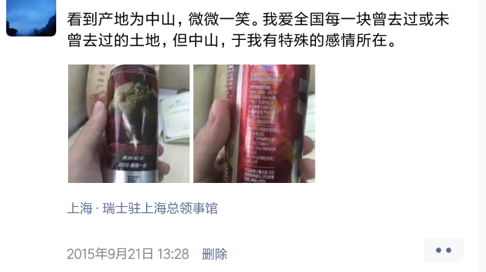

 

目的地，是30公里外的中山先生旧居，来中山必去的景点。
中山是中国唯一一个以人名命名的地级市，这个面积并不大的珠江西侧的秀美小城
处处烙刻着国父的印记。其实，中山近代还出了一位名动上海滩的名伶，民国四大美女之一。但无奈性格如同林妹妹，因陷于无端的绯闻名誉的侵害，年纪轻轻即想不开服药香消玉殒，让人无尽叹惋。再观如今娱乐圈，唯余呵呵

以广州为中心，珠江为轴，东侧是东莞，西侧对应中山，东侧再是深圳，西侧对应同为经济特区的珠海，东侧最外是特区香港，西侧最外是特区澳门。澳门面积实在太小太小，对内地经济拉动作用有限，一定程度使珠海经济体量不及深圳1/5，中山约为东莞1/2。故而经济重心该在广州以东.

---

骑行中途避暑休憩/
在蓝天白云碧水椰林下，开启了新一天的长途奔袭。
把100块的自行车蹬得飞快，呼呼生风，真个是除去铃铛不响，其他地儿都响。
行至半途，看到著名的105国道即京珠高速就在眼前，
这条2700公里长的国家级干道，从北京发出，经津冀鲁豫鄂赣终止于广东珠海。
想起11年踩在天安门广场南面的中国公路零里程点留照一张，
今番已快到由其发出的一条长长线段的终点，四年过去，感慨莫名。

躲在街巷小摊桌旁，吃着豆腐花和哈密瓜，来往车流人群如梭，远方蓝天白云一尘不染。
我突然感觉像在做梦，像一个年少时躺在奶奶家爷爷的竹质躺椅上, 做过的一个有关好多年后遥遥无期的梦。

---

中国收音机博物馆。
对上一代人而言，收音机俨然就是今天的智能手机。
在那么个资讯不发达的年代，有这样一个了解世界的窗口，
有这样一个神奇的 能接收看不到摸不着信号的神器，
实在是比现在拥有近乎人手一部的智能手机要炫酷和有意义得多。
我清楚记得<大侦探福尔摩斯>第一部结尾，
罗伯特·唐尼对Watson说“华生，这 才是未来。”
目光凝视，如炬炯炯。

---

孙文西路步行街沿街走廊下，数半仙摆摊掐指，点化来往路人。被其一拦下，说算一卦，想恰逢乞巧问卦姻缘吧。无奈此前银行取款不成，全身只剩一块两毛，早餐犹未解决。说明财力，让他量力而行。瞎眼半仙也是无语，不想多算，侧脸遥指西山寺，口中念叨有缘人在寺中。。沿街而行，至西山寺，缘石阶上，虽居闹市，却烟雾缭绕古木遮天。到寺中转悠一圈，在风扇下悠闲看着墙壁橱窗内一个个陌生头像，是逝者的家人为其在寺中所买的“神位”，如报纸边角豆腐块大小，满满一墙。我极速回忆，看得哪部古代破案的悬疑片，就是根据庙中的神位信息找到线索一举破案。 

早在远古文明伊始前，那时的先人面对这个世界，有太多的疑惑。月亮星辰的起落，江河的洪汛，疾病与死亡…那时候没有万有引力的概念，不会想到看不见的微生物。于是，无论东方还是西方，都一样产生了神，产生了宗教。漫长的等待，无数代人平凡着地出生与死去后，有了文明之光，有了欧几里得和阿基米德，有了开普勒和伽利略，有了改变所有人世界观的牛顿…后来，人们登上了月球，消灭了天花和鼠疫。然而，我们熟知的远不只是汪洋大海的一片贝壳，但时至今日，仍有许多不解或不能解之惑。对自然，对人生，对纷繁复杂的社会，对尘世三千剪不断的愁丝…

“任何事情解释到最后，都只剩数学和宗教”.

抛下这些如对夜空中浩淼星辰的追寻，此行是为找半仙算中的有缘人。微风吹拂，夹杂善男信女们花一块钱从寺旁所买劣质香火的刺鼻气味，我快速看下四遭，除了跪拜在地上念念有词的大妈，就是前来烧香拜佛的超龄剩女。长叹一声，这不要钱的卦，就是不准啊。

---