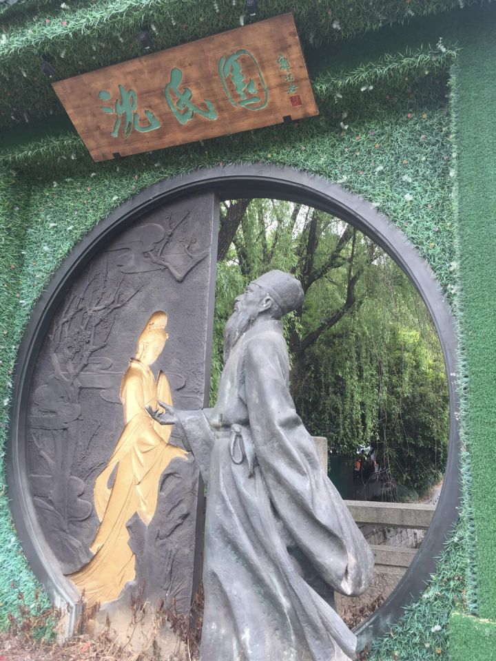
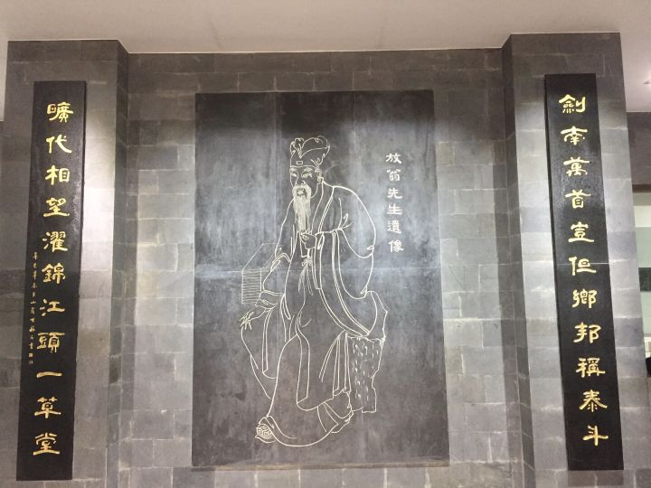
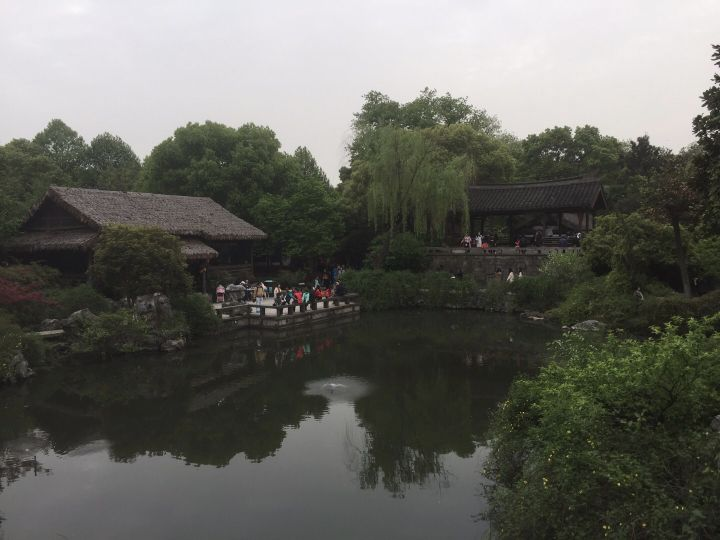
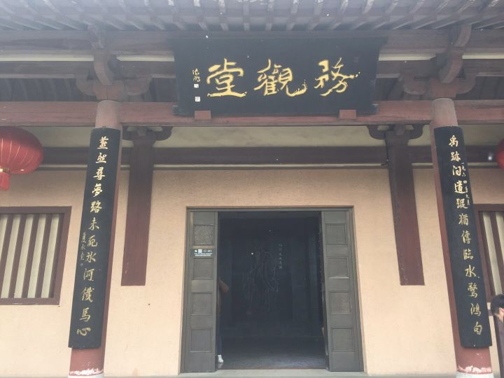

 

陆放翁的一生，少年歌楼，壮年客舟，暮年僧舍，是传奇的一生，多情的一生，壮怀激烈的一生。

与年长他41岁的李清照比，多了些“铁马秋风大散关”“中原北望气如山”“尚思为国戍轮台”的亲身实践，一声临去之时的“家祭无忘告乃翁”，也可和宗泽并称，和800年后“海内尘氛犹未已”一样让后人扼腕唏嘘。而在战乱中青春与幸福一去不返的易安居士，只有对不战而亡的夫婿“至今思项羽”的恨铁不成钢，流离中家破人亡，收藏遗失，又经“二婚”为别有用心的人利用，同是可“深巷明朝卖杏花”的春日，于她是“载不动许多愁”。

而与小他15岁,自小在金占区长大的少年英雄辛弃疾比，他生在临安以南的绍兴，依存些许王羲之贺知章当年的闲适，干戈杀伐离之甚远。他多了“红酥手，黄滕酒”的纠结缠绵，作此词时值科举不第，本是在沈园散心，却看到被恶母拆散的青梅竹马的表妹--也是前妻的唐婉与不弃她的新夫同游，状若春燕双飞。其心中郁结百感并集，时隔千年，依觉分毫不差。唐婉写完同名回复“人成各，今非昨，病魂常似秋千索”，用“难难难，瞒瞒瞒”作答“错错错，莫莫莫”，不久便香消玉殒。

44年后，屡经仕途坎坷人际困顿，已是古稀老翁的陆游重游沈园，佳人梦断香消已四十余年，当年的柳树也年老不再生出纷纷柳絮。但那个小她两岁，28岁便驾鹤西归的明媚少女，那个40多年前的春天，那两首二人“唱和”的<钗头凤>，却纷纷点点浮上这个白首老翁的心头，于是动笔写下了<沈园二首>：

城上斜阳画角哀，沈园非复旧池台。

伤心桥下春波绿，曾是惊鸿照影来。

10年后，85岁的陆游带着未尽的克复中原的雄心大志，与世长辞。

&emsp;&emsp;&emsp;&emsp;2018年清明节,于绍兴