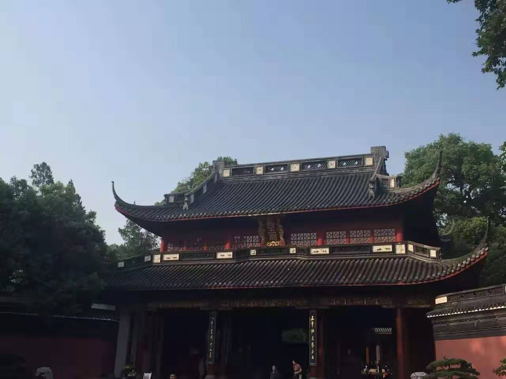
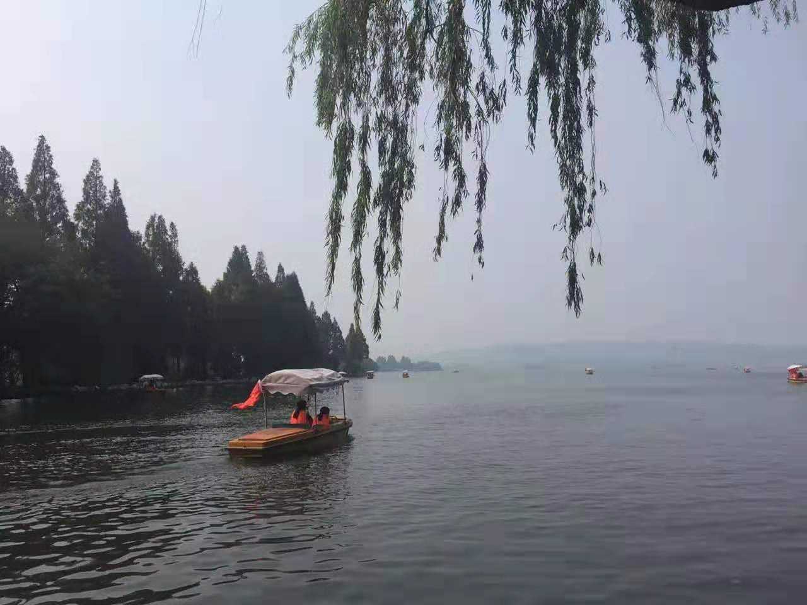
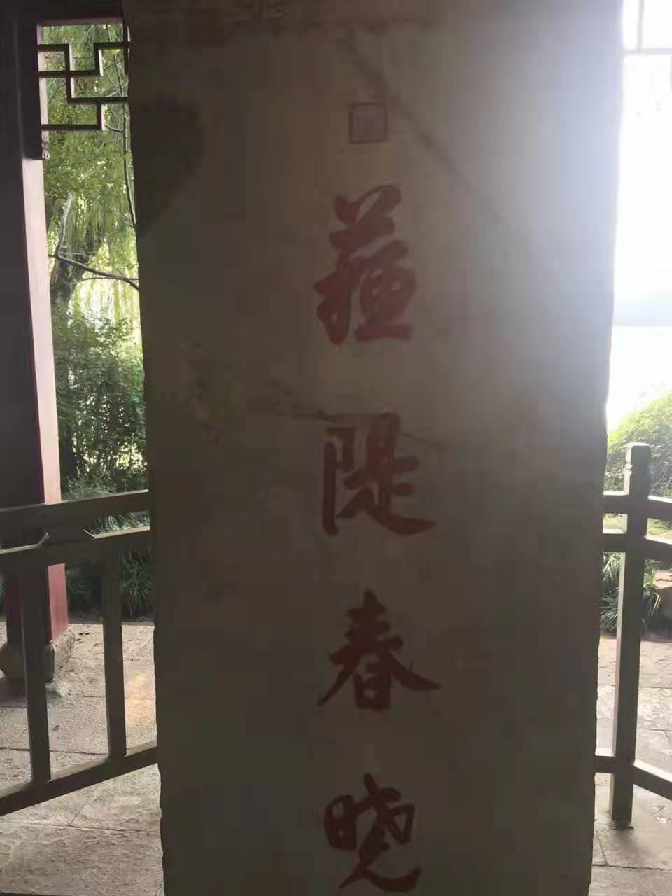

 
上有天堂，下有苏杭。白苏柳永一线文人的吟咏传颂，让此浙城浙湖名贯神州。

自富阳至桐庐一百许里，奇山异水，天下独绝。

这里有魂侑江东的孙氏英烈。

这里“风清听漏惊乡梦，灯下闻歌乱别愁。”

这里“山名天竺堆青黛，湖号钱唐泻绿油。”

这里“烟柳画桥，风帘翠幕，参差十万人家。”

这里有玉龙金凤明珠跌落的城市名片，西湖西子两相宜，是“黑云翻墨未遮山， 白雨跳珠乱入船”，或是“接天莲叶无穷碧，映日荷花别样红”，抑是“雾凇沆砀，天与云、与山、与水，上下一白”。

雷峰塔外，三五讨论是否能寻盛装白蛇的钵盂；灵隐寺旁，焚香念经的老人还会常提吴越王智退黄巢的旧谈。

三潭印月，断桥残雪，南屏晚钟，曲院风荷，柳浪闻莺，金牛出水，平湖秋月，三台梦迹…一个个诗意的名字背后，是同样诗意的故事和风景。

这里青山有幸得埋忠骨，他们是抗击外族侵略的民族英雄。或意图直捣黄龙府重整旧河山，或挽国家于危亡 匡社稷于即颠，或明知事难偏要勉强。他们并称“三杰”，后一位叛徒出卖死于敌手，前两位却是被自己人直接所害。他们是39岁的岳飞，59岁的于谦，42岁的张煌言。

玉泉，之江，西溪，紫金港，华家池，这里有中国最“水”的浙大。淘宝，天猫，阿里巴巴，支付宝，这里有互联网时代最明星的企业。

鲁冠球，宗庆后，冯根生，汪力成，当然还有互联网造就的两位首富，三石和扁哥，他们跨越多个年龄段，涵盖多个领域，他们并非都籍贯在此出生于斯，却把企业重要核心业务甚至总部放于距离上海咫尺之遥的杭州。

这里的GDP刚刚超过1万亿，止位列全国第十。落后于天津，苏州，重庆，成都和武汉。但影响力和潜力，却绝不止第10。这里房屋开启限购，初和北上深一样“待遇”。

这是画卷和诗词，历史和神话里的杭州。当抱以满满期待身至亲临，却不出所料发现，像远望畅阔天际的星空，转头仍要踩在硬邦邦的尘世土地。

/接下