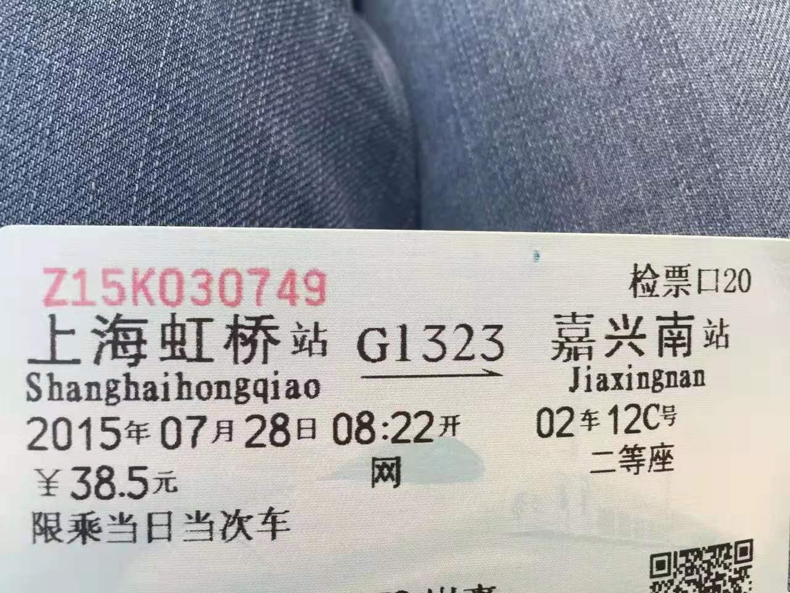
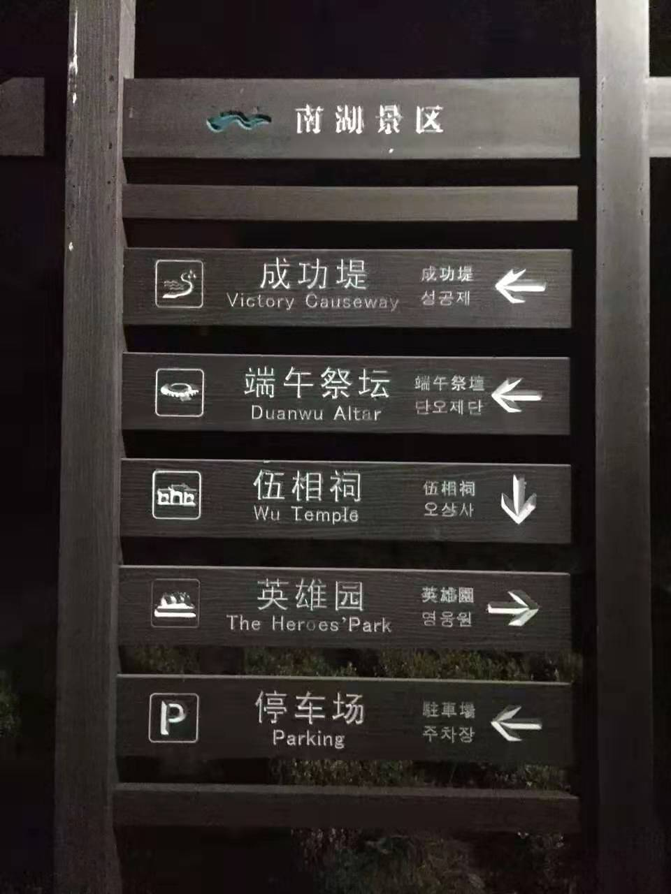
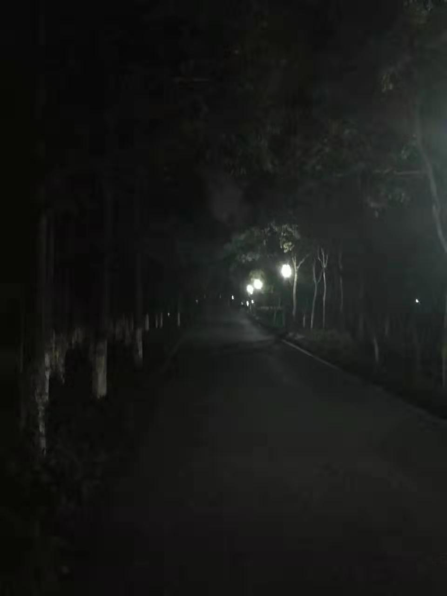
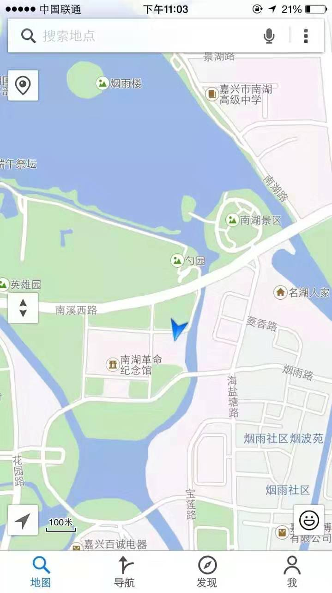
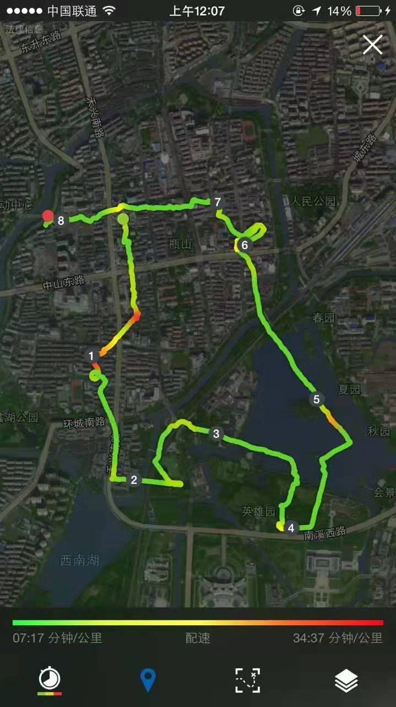
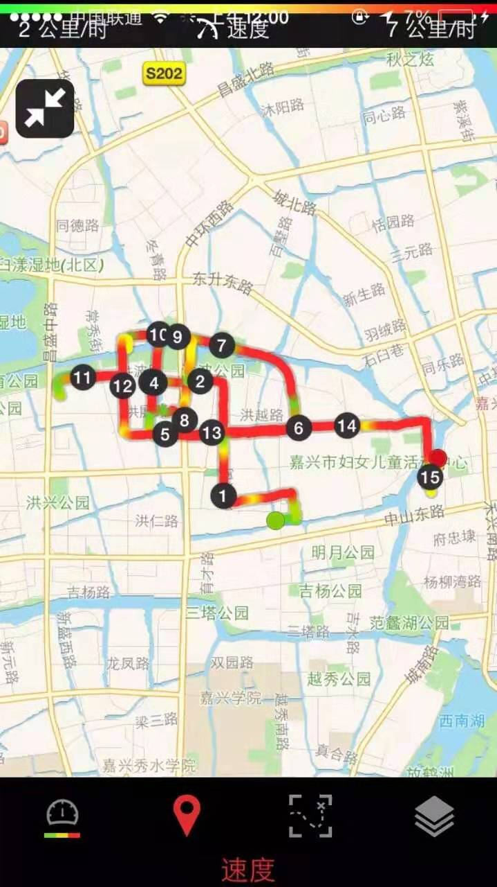
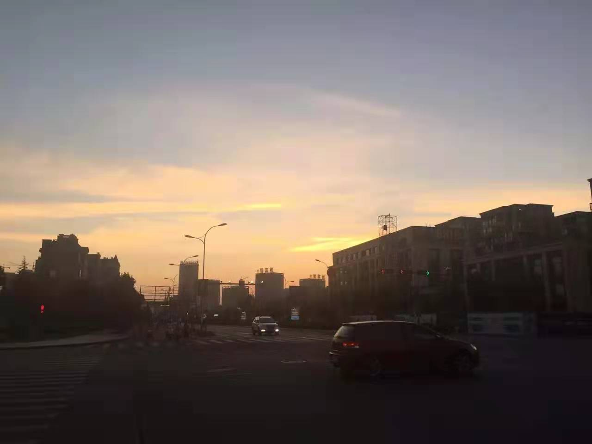
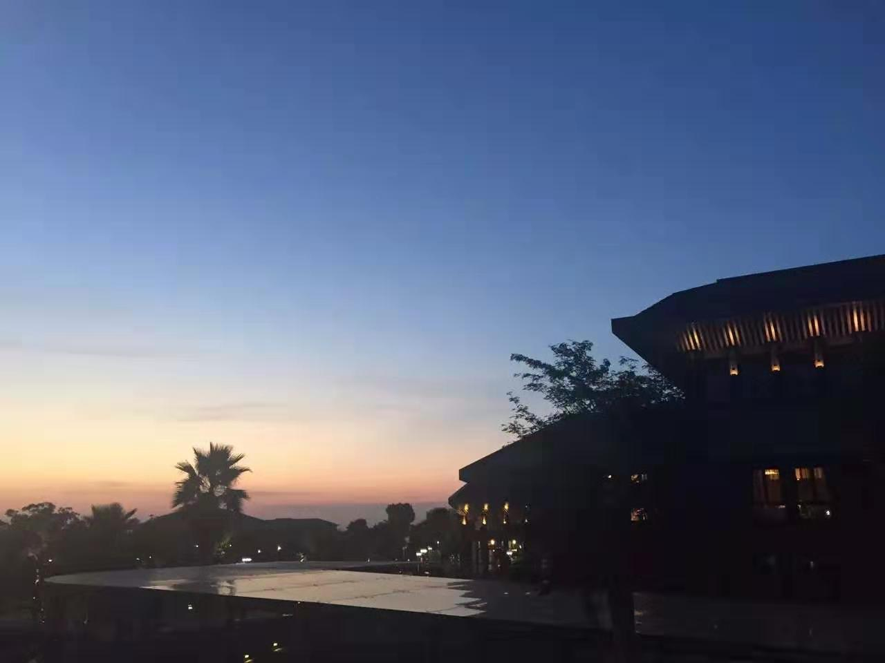
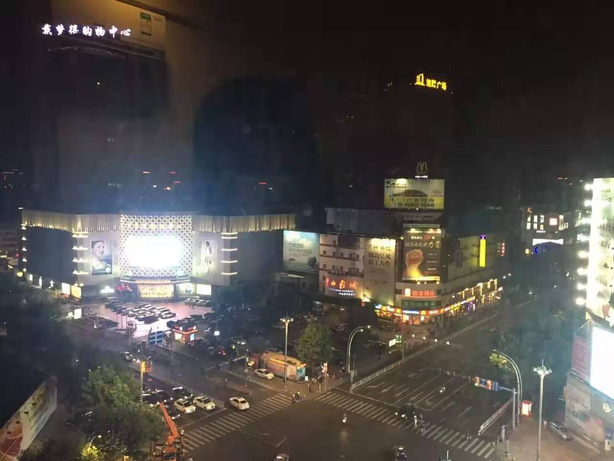
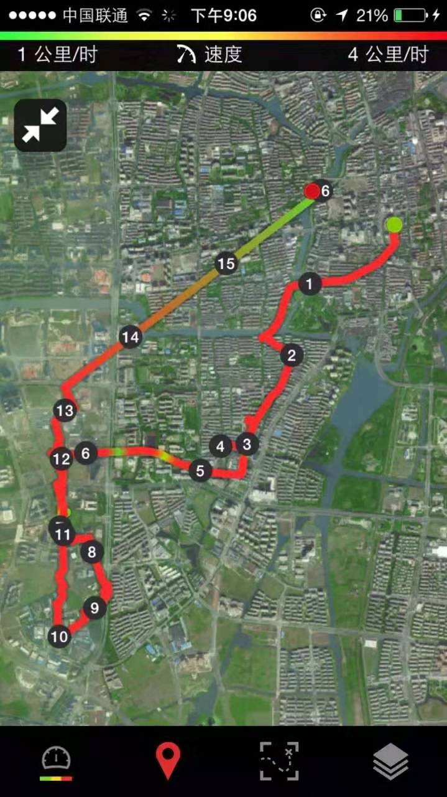

 

90公里，22分钟，从上海法租界到嘉兴南湖。

---

夜绕南湖，清辉照郭；塘水沦涟，与月上下。
桥畔灯影，明灭林外；桥头钓客，噤声如蝇。
此时独行，杂人静默。晚风拂柳，光落荷叶。
万籁俱寂，唯见蝉鸣。唯此一人，爽说爽啊

---

江南大厦—戴梦得为老城中心，
秀洲区政府对面的江南摩尔，则被认为新区的中心。
但亲身骑行，可以负责任地说，这两处中心皆是名大于实，其实索然寡味，
孤处皇坟山水间一洲的希尔顿酒店周遭，
却是仅次于南湖公园的又一大好地方，风景极佳。

