火车从恩施到宜昌这一段，群山起伏，隧道相连。半小时下来大概只有2-3分钟能见天日。

正像是郦道元“自三峡七百里中，两岸连山，略无阙处。重岩叠嶂，隐天蔽日，自非亭午夜分，不见曦月”

---

 

真实版的“群山万壑赴荆门”

实际上，秭归归辖于宜昌而非荆门。且因为区划拆合，昭君故里也已不在秭归，而属兴山县

 

---

“更立西江石壁,截断巫山云雨,高峡出平湖”

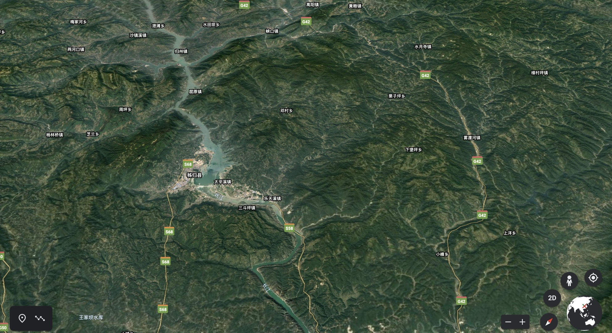

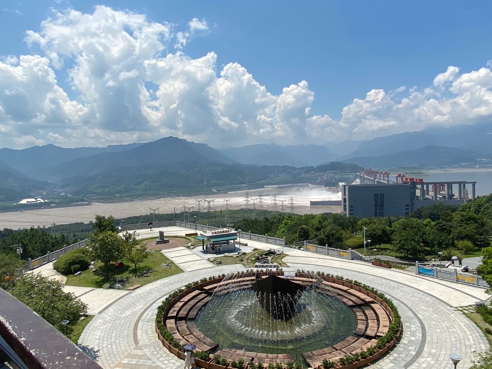

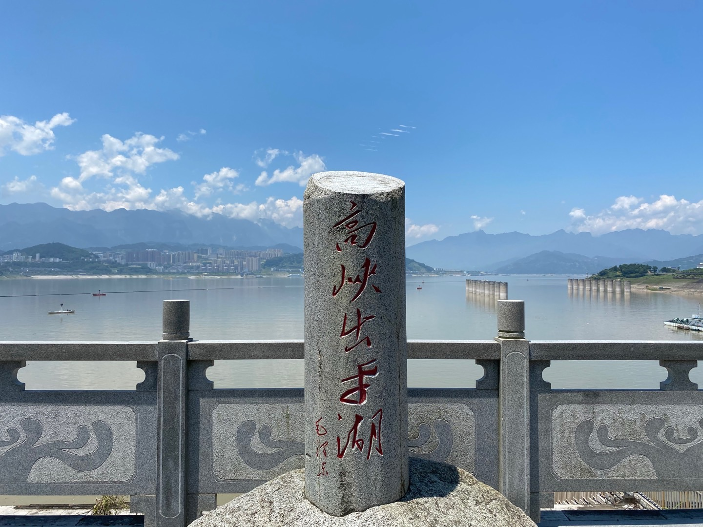

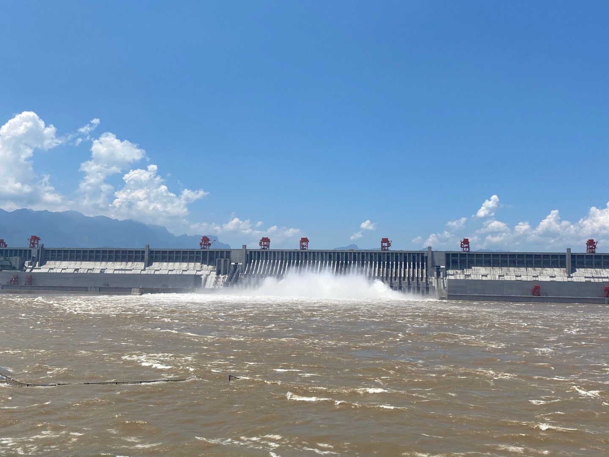

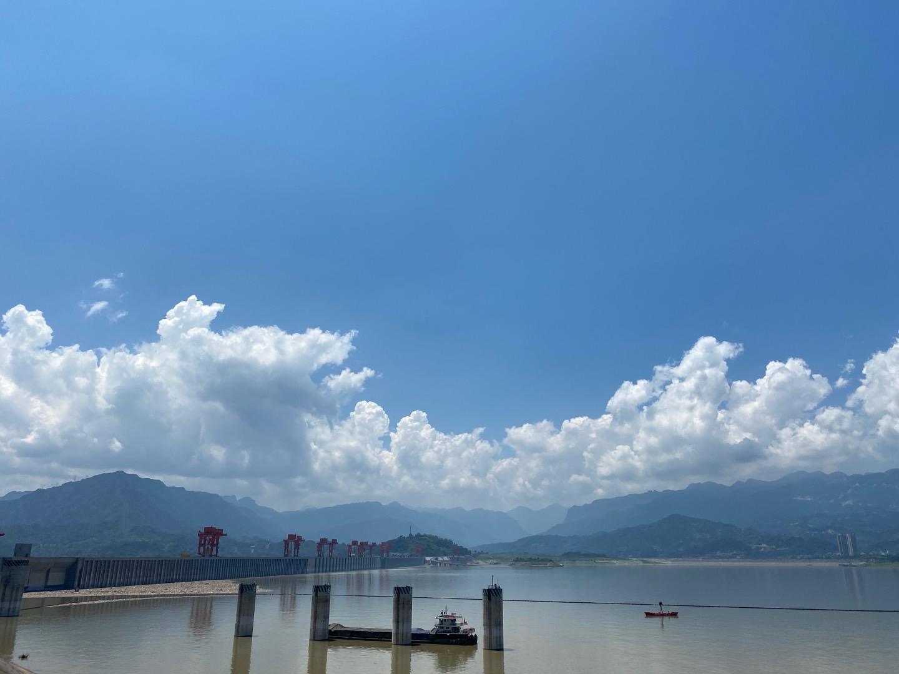

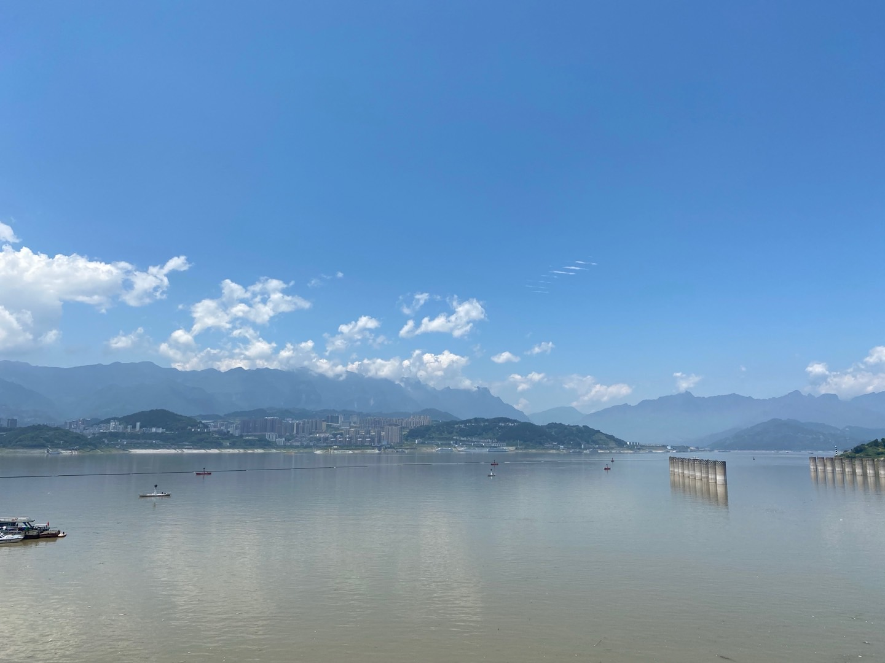

---

 

夏水襄陵，沿溯阻绝。 
朝发白帝，暮到江陵。 
其间千二百里， 
乘奔御风，不足以疾。 

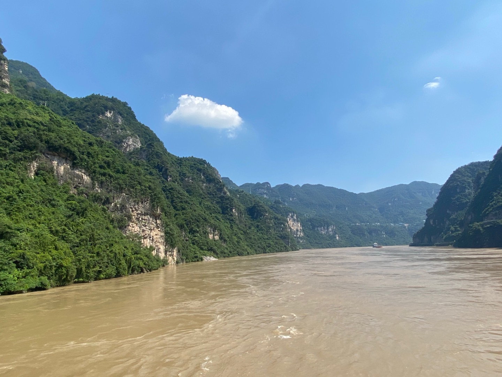

---

长江冲出西陵峡，逐渐从上游的“川江”变为中游的“荆江”，水面从700米，一下子开阔到2000多米。

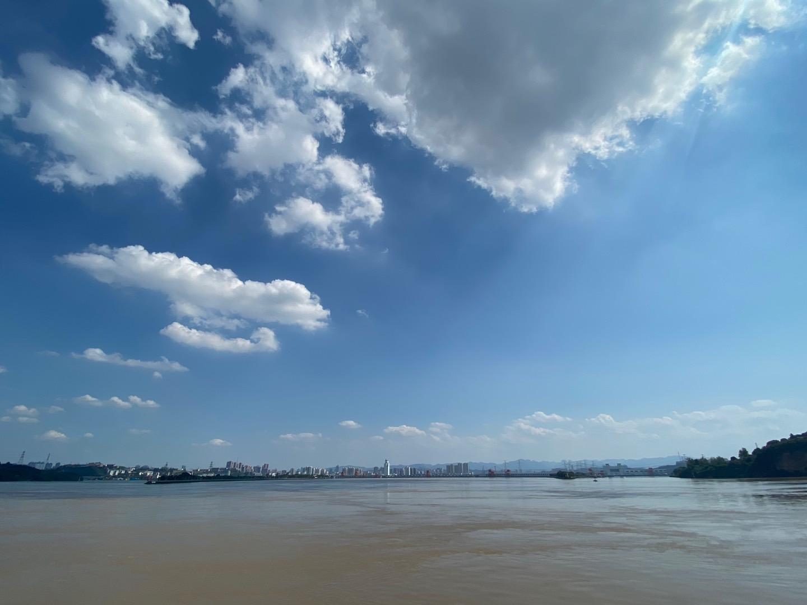

弱冠之年的李白仗剑出川，行舟至荆门山，刹那便被这一江宽广所震慑，投笔写下“山随平野尽，江入大荒流”。彼时的李唐王朝，如同这个大鹏随风九万里的青年，好似有源源不竭的无尽活力，有任人想象驰骋的各样可能。此刻自命才高的青年，想去长安朝堂施展抱负，但离家之际，还是有些矫情地表达“仍怜故乡水，万里送行舟”——像是一个循环，暮年他将不得已沿江逆流而上，却是被流放发配。行至白帝，得闻新皇大赦天下，旋即调转航向，“千里江陵一日还”。

40年后，渔阳鞞鼓天崩地坼。年近花甲多病缠身的暮年老杜，因友人去世生计无着，不得已离开成都草堂，买舟东下。某天夜里，江平波静，皓月孤悬，诗人独立船头，咏出一句“星垂平野阔，月涌大江流”。仰天而叹，颠连无告的凄怆心情再也压抑不住，接着便“名岂文章著，官应老病休”，发起了牢骚。

他自是不知，三年前，这位年长他十多岁的挚友，在长江下游的安徽当涂，“醉酒追月 落水溺亡”。也无法预料，他自己也将在五年后，客死于湘江上的一叶扁舟，“致君尧舜”最终成了笑柄，甚至连“巴峡穿巫峡，襄阳向洛阳”的行程，都未能实现。

青山依旧在，异代不同时。伴随二人而去的，除去诗歌的巅峰，还有盛唐时代这个民族包容万千的雍容气魄。

[起承转合--由陈子昂<国殇>](http://www.dashen.tech/2019/01/20/%E8%B5%B7%E6%89%BF%E8%BD%AC%E5%90%88-%E7%94%B1%E9%99%88%E5%AD%90%E6%98%82-%E5%9B%BD%E6%AE%87/)

[正是江南好风景](http://www.dashen.tech/2019/03/22/%E6%AD%A3%E6%98%AF%E6%B1%9F%E5%8D%97%E5%A5%BD%E9%A3%8E%E6%99%AF/)

[潜山--皖国古都&&安徽之源](http://www.dashen.tech/2018/08/12/%E6%BD%9C%E5%B1%B1-%E7%9A%96%E5%9B%BD%E5%8F%A4%E9%83%BD-%E5%AE%89%E5%BE%BD%E4%B9%8B%E6%BA%90/)

[盛唐之殇--观<长安十二时辰>记](http://www.dashen.tech/2020/01/24/%E7%9B%9B%E5%94%90%E4%B9%8B%E6%AE%87-%E8%A7%82-%E9%95%BF%E5%AE%89%E5%8D%81%E4%BA%8C%E6%97%B6%E8%BE%B0-%E8%AE%B0/)

---

 

葛洲坝船闸，上下落差几十米，连通器原理，实现“水落船低”

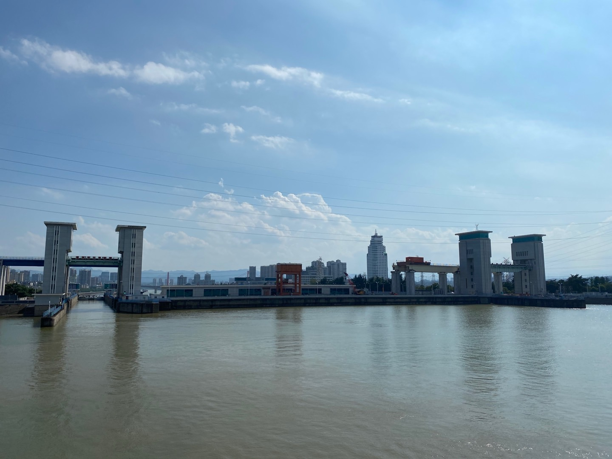

 

宜昌江滨

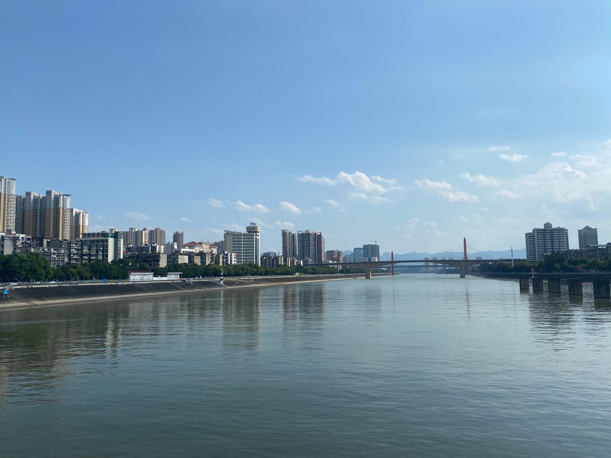

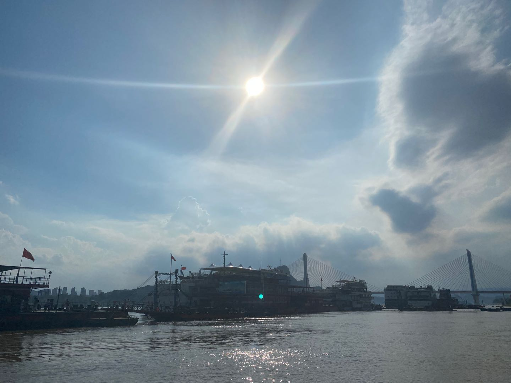

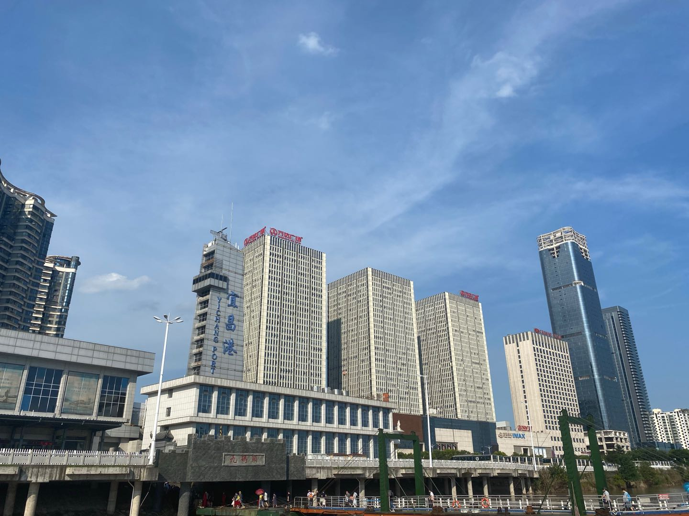

---

经由三峡机场，折返浦东。搭2号线末班车，自此，继7/16号线，这条乘坐近千次，穿越城市东西的繁忙线路，于我实现了首尾贯通。

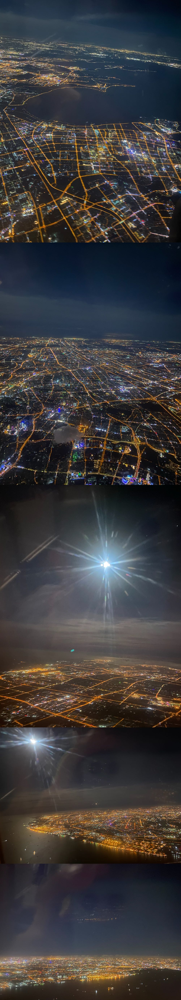

---

 

附：<b>三峡诗作</b>

送友人使夷陵 
— 崔翘 — 
猿鸣三峡里，行客旧沾裳。 
复道从兹去，思君不暂忘。 
开襟春叶短，分手夏条长。 
独有幽庭桂，年年空自芳。 

 

宿空泠峡青树村浦 
— 陈子昂 — 
的的明月水，啾啾寒夜猿。 
客思浩方乱，洲浦寂无喧。 
忆作千金子，宁知九逝魂。 
虚闻事朱阙，结绶骛华轩。 
委别高堂爱，窥觎明主恩。 
今成转蓬去，叹息复何言。 

 

秋夜题夷陵水馆 
— 李涉 — 
凝碧初高海气秋， 
桂轮斜落到江楼。 
三更浦上巴歌歇， 
山影沉沉水不流。 

 

上三峡 
— 李白 — 
巫山夹青天，巴水流若兹。 
巴水忽可尽，青天无到时。 
三朝上黄牛，三暮行太迟。 
三朝又三暮，不觉鬓成丝。 

 

卢溪送别 
— 王昌龄 — 
武陵溪口驻扁舟，溪水随君向北流。 
行到荆门上三峡，莫将孤月对猿愁。 

 

早发白帝城 
— 李白 — 
朝辞白帝彩云间，千里江陵一日还。 
两岸猿声啼不住，轻舟已过万重山。 

 

西陵峡 
— 杨炯 — 
绝壁耸万仞，长波射千里。 
盘薄荆之门，滔滔南国纪。 
楚都昔全盛，高丘烜望祀。 
秦兵一旦侵，夷陵火潜起。 
四维不复设，关塞良难恃。 
洞庭且忽焉，孟门终已矣。 
自古天地辟，流为峡中水。 
行旅相赠言，风涛无极已。 
及余践斯地，瑰奇信为美。 
江山若有灵，千载伸知己。 

 

度荆门望楚 
— 陈子昂 — 
遥遥去巫峡，望望下章台。 
巴国山川尽，荆门烟雾开。 
城分苍野外，树断白云隈。 
今日狂歌客，谁知入楚来。 

 

渡荆门送别 
— 李白 — 
渡远荆门外，来从楚国游。 
山随平野尽，江入大荒流。 
月下飞天镜，云生结海楼。 
仍怜故乡水，万里送行舟。 

 

阁夜 
— 杜甫 — 
岁暮阴阳催短景，天涯霜雪霁寒宵。 
五更鼓角声悲壮，三峡星河影动摇。 
野哭几家闻战伐，夷歌数处起渔樵。 
卧龙跃马终黄土，人事依依漫寂寥。 

 

咏怀古迹五首·其一 
— 杜甫 — 
支离东北风尘际，漂泊西南天地间。 
三峡楼台淹日月，五溪衣服共云山。 
羯胡事主终无赖，词客哀时且未还。 
庾信平生最萧瑟，暮年诗赋动江关。 