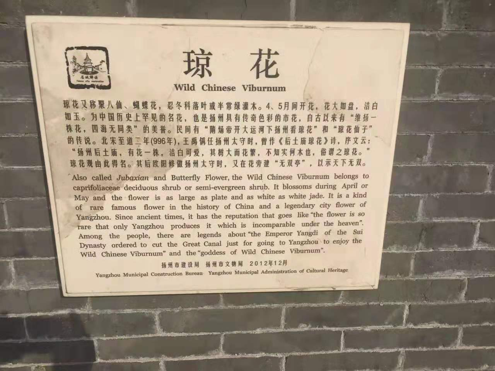

 

丙申庚寅卯日，余至维扬．杨柳新开，梅花半放．漫东关街，彩幌若云，游人如织．过琼花观，暮色弥望，钟声振荡．旧时运河明珠，隋唐今之京沪，三分明月得其二，李杜白苏竞叹．盛况难复，予怀喟然．酒酣饭足，步古运河．灯火依稀，沿道缓行．晚风习习拂柳，霡霂悄悄落河．柳条黄青年复年，河水无声南去，思过往隋炀小杜忠靖之事，心潮不平如登幽州台，遂效前人，赋词一首，名曰＜鹧鸪天 竹西怀古＞．海西锦绣地，不才之作有关门舞刀之感：
 

**晚风拂夜柳，微雨落轻尘。旧时红药为谁哉？杜郎今又来。**
**匹马过荒村，明月照孤坟。犹有流萤绕雷塘，萧氏在何方？**

是为＜鹧鸪天 竹西怀古＞。

---
小注：

①第一句化自王维＜渭城曲＞。

②杜郎为小杜．其在扬州多年，与此城有不解之缘。

[戳此查看更多](http://www.360doc.com/content/14/1101/15/14515055_421690439.shtml)

其＜寄扬州韩绰判官＞：

青山隐隐水迢迢，秋尽江南草未凋。

二十四桥明月夜，玉人何处教吹箫．

二十四桥又名红药桥．词中“红药”即红色的芍药花．小杜此篇常被吟诵扬州的后辈文人化用：

南宋大音律家姜夔的代表作＜扬州慢·淮左名都＞下半阙＇杜郎俊赏，算而今重到须惊。纵豆蔻词工，青楼梦好，难赋深情。二十四桥仍在，波心荡、冷月无声。念桥边红药，年年知为谁生？ ＇。

今人许嵩在＜庐州月＞中有＇桥上的恋人入对出双，桥边红药叹夜太漫长＇，庐州为其家乡合肥并非扬州，此曲意指庐州的月亮依然是当时月亮，但是当年月光下的两个人已经各奔东西．虑小杜《怅诗》'自是寻春去校迟，不须惆怅怨芳时．狂风落尽深红色，绿叶成阴子满枝'，时代虽异事虽不同然有异曲同工之处．

＇杜郎今又来＇句化用自刘禹锡＜再游玄都观＞＇种桃道士归何处，前度刘郎今又来＇，这是桀骜的他在被贬而来写就＜玄都观桃花 ＞＇玄都观里桃千树，尽是刘郎去后栽＇又被贬又归来后的作品．

提及扬州和刘禹锡，不得不提及他著名的＜酬乐天扬州初逢席上见赠＞：

巴山楚水凄凉地，二十三年弃置身。怀旧空吟闻笛赋，到乡翻似烂柯人。

沉舟侧畔千帆过，病树前头万木春。今日听君歌一曲，暂凭杯酒长精神。

这是我特别喜欢的一首诗．而唱和的对象，是大唐诗坛的三号人物，这位写就＜卖炭翁＞＜琵琶行＞悲天悯人的大诗人，同时也是大唐诗坛最浪荡风流的一位，在此能与之媲美的大概只有当世与其并称元白的好友，以哀悼亡妻闻名的元稹和留下＇十年一觉扬州梦，留得青楼薄幸名＇的杜牧．

刘禹锡的贬谪，还能从课本中所学柳宗元在湖南永州所写＜永州八记＞中的＜小石潭记＞与后来在广西柳州所写＜登柳州城楼寄漳汀封连四州＞中窥见一斑：

城上高楼接大荒，海天愁思正茫茫。

惊风乱飐芙蓉水，密雨斜侵薜荔墙。

岭树重遮千里目，江流曲似九回肠。

共来百越文身地，犹自音书滞一乡。

题目中＇连州＇即刘禹锡贬谪之地，此处还有一段二人间往事．

[戳此查看更多](http://blog.sina.com.cn/s/blog_4abe8c3c0100l8re.html)

③匹马过荒村，明月照孤坟。犹有流萤绕雷塘，萧氏在何方？

我独自走过荒郊无人的村落来到埋葬隋炀的雷塘，清幽的月光静静照映在孤坟上．仍然可以看到飘动的萤火虫在这里飞来绕去，可是萧皇后现在在哪里呢？

④雷塘：在今扬州城北．隋唐时为风景胜地。隋炀帝死于江都，李渊建唐以后，以帝王之礼将隋炀帝葬于此

⑤萧氏：即萧后，隋炀帝皇后，一生历经六位帝王．被称＇＇六位帝皇玩＇＇．萧后贤淑，本不逊长孙，马氏，嫁与唐宗洪武则为一代贤后，嫁与隋炀则成＇祸水红颜＇背亡国之锅，＇＇六位帝皇玩＇＇成其摆脱不掉的名号，可见女怕错郎，自古已然．

⑥今人古文水平自然远不及古人，另则生逢四海康平日，生活平淡安稳．缺少写出杜甫辛弃疾那般慷慨悲壮诗词的大背景和大环境，也很庆幸这种缺失．故而今人很难再写出一流古诗词，而现代化的交通和通讯，思乡也不像过去那个时代那般强烈．今人所能写，无非像晏殊慨叹时间匆匆年华不再，或像陈子昂咏怀古迹．此间所写，只是记载一时自娱自乐．