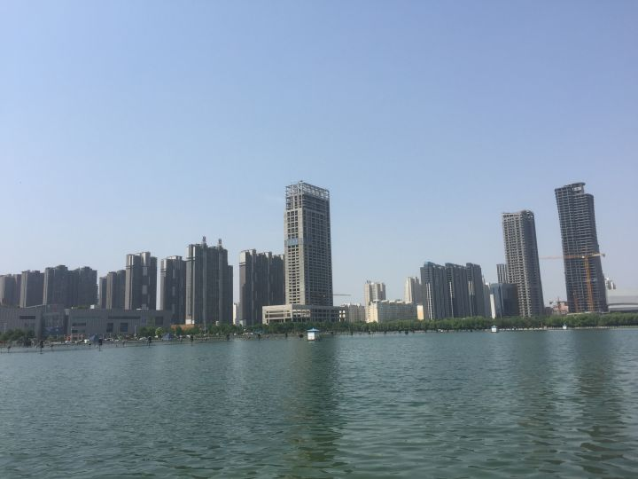

 

梦里少年曾得暇，
长安骑马，洛阳看花。
青史成书，写长安惊鸿舞。 
铭刻成传，尽洛阳风流态。
离歌倾城，唱尽长安繁华。
霓裳多情，凉透洛阳心绪。

<易经>说“河出图，洛出书，圣人则之”。

好瞎BB不好好干活的本地人苏秦说“使我有洛阳二顷田，安能佩六国相印？”果然，只要成功了，说什么都是真理。

太史公说“昔三代之居，皆在河洛之间”。

在洛水之滨用意念艳遇神女、天下一斗才他占八分的曹植说“步登北邙阪，遥望洛阳山”他又说“名都多妖女，京洛出少年”。

玉树临风的潘岳说“终童山东之英妙，贾生洛阳之才子”。

羡慕潘岳容貌却不料“东施效颦”的左思说“崤函有帝皇之宅，河洛为王者之里”，一时洛阳纸贵。

荒淫无道的亡国之君杨广说“清歌凯捷九都水，归宴洛阳宫”。他在春秋吴国开凿基础上，大幅扩修运河，贯通至洛阳且连涿郡，连接五大水系。至元朝翻修时，弃洛阳而取直道，至当时也是今天首都的北京。

和他一样杀兄夺位却成明君典范的李世民说“华林满芳景，洛阳遍阳春”。

和上面这位关系乱糟糟的长寿女皇帝说“铭开武岩侧，图荐洛川中”。

她四儿子的第三个儿子李隆基说“洛阳芳树映天津，灞岸垂杨窣地新”，又说“鼓吹威夷狄，旌轩溢洛阳”。

没有资格参加国内高考的酒鬼李太白说“忆昔洛阳董糟丘，为余天津桥南造酒楼”。他还说“谁家玉笛暗飞声，散入春风满洛城”。这家伙不高不壮却身轻体健通晓剑术，又兼身世成迷再加酗酒，各地不良人 当需特别关照。

小上面这哥们几岁,唐代双璧的另一块，坎坷不顺，一生漂泊流离，忠心社稷却从不被重用，感念民艰却无能为力，只有借助诗文以浇块垒“洛阳昔陷没，胡马犯潼关，天子初愁思，都人惨别颜”，“洛阳一别三千里，胡骑长驱五六年”，东都失陷了，他只剩回忆“昔在洛阳时，亲友相追攀”，“龙门横断野，驿树出城来”，痴痴憧憬着“洛阳大道时再清，累日喜得俱东行”，而闻听果真神奇地收复了，一贯沉郁顿挫的他难得酣畅一泻千里，“即从巴峡穿巫峡，便下襄阳向洛阳”，千年后的后人把他惊喜欲狂手舞足蹈的样子做成了“我很忙”的表情包：看把这老头乐的，同是春天前几年还哀叹“国破山河在，城春草木深”，还是“感时花溅泪，恨别鸟惊心”，没几年这不就成了“白日放歌须纵酒，青春作伴好还乡”。

我的老本家崔颢“寄语洛阳使，为传边塞情”，又有些“我在他乡，望着月光”的意思说“幽冀桑始青，洛阳蚕欲老”。

诗家天子王昌龄说“洛阳亲友如相问，一片冰心在玉壶”。诗画皆通的诗鬼王维说“洛阳女儿对门居，才可容颜十五余”。

长眠于此的诗魔白乐天对比夸耀“何似东都正二月，黄金枝映洛阳桥”。“家本荥上籍占洛阳”的本土诗豪刘禹锡称赞“唯有牡丹真国色，花开时节动京城”。

“百代文宗”韩退之说“当春天地争奢华，洛阳园苑尤纷拏”。

毛主席和我都很喜欢的诗鬼李贺说“洛阳吹别风，龙门起断烟。冬树束生涩，晚紫凝华天”。

明明不胜杯杓却偏偏逞强爱喝，爱弹琴好下棋的老头子欧阳修说“洛阳地脉花最宜,牡丹尤为天下奇”，他来我一样来晚了，却打趣道“曾是洛阳花下客，野芳虽晚不须嗟”。

小时候破坏公物后来从政并很懂历史的司马光说“若问古今兴废事,请君只看洛阳城”。他的老对头拗相公说“汉有洛阳子，少年明是非”。

…

“当代徐霞客”爽哥说，洛阳可能是我唯一愿意留下来长居的中部城市。