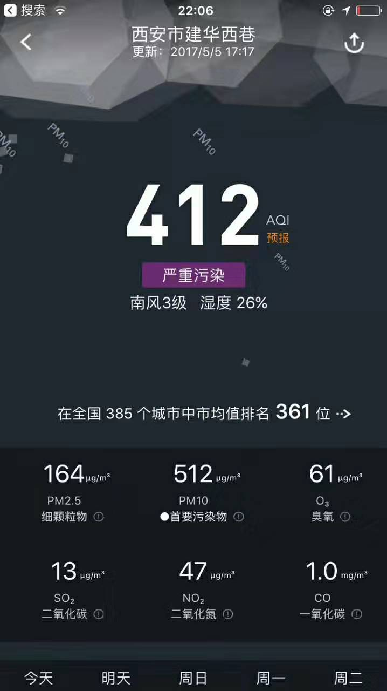
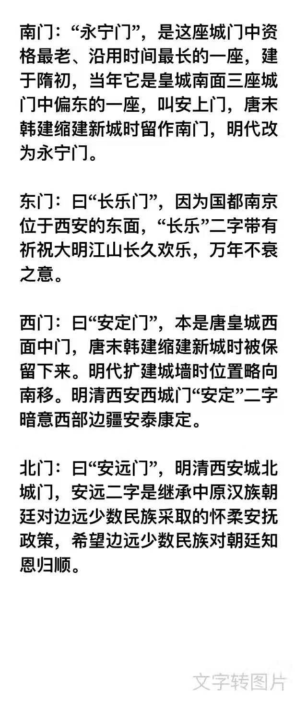

 

<b>

这几枚古旧的邮票，从我第一次放于手掌之间细细端详，已经有足足14年。

这段听来朗朗的文字，从第一次我有些生疏地脱口读出，已经过去了整整12年。

这本残破斑驳的老书，存世已有几十年。从我第一次抖落其上时间的尘埃翻开扉页，也已经将近10年。

这几道石墨划下的笔痕，也有不下9年。这本薄薄的小书让我爱上唐诗，长安洛阳，自此心向往之。

这页那年暑假在夕阳西下的阳台所做的摘写，笔迹已经干了快有8年。清明时分，汴河上下丝丝入画。

一再推延，几历坎坷。我终于成行，一路向西。

然而，我还有太多邮戳遮盖不住的壮美山河未曾亲至，有太多前人笔墨吟诵过的灞桥风月没有目睹。

一个人脚力强健自顾向前，相比三五相随，显是可省却许些琐事，更高效率看更多风景。但更憧憬那天“有钱有闲”，我心甘情愿，放慢匆匆脚步，和挂念着的、期待着的人儿，把袂同游交头窃窃。

</b>

---

### 鼓楼 & 回民街

泡馍与稠酒是我最喜爱的两样西安特产，可惜“鱼与熊掌不可兼得”，想在吃泡馍时佐以黄桂稠酒，在西安几乎是不可能的。因为西安泡馍馆大多是回民所开，西安回民泡馍馆决不卖稠酒。吃泡馍就稠酒的享受只有过两次，一次是去北京新街口的西安饭庄楼上，泡馍是好的，而稠酒是装在玻璃瓶中，喝一瓶开一瓶，且是冷的。另一次是在西安，因去陕西考古所公务，主人坚持请我吃饭，盛情难却，但我提出决不去大饭店，只愿去吃羊肉泡馍，无奈只得主随客便，从考古所出来，往大雁塔方向步行，有一泡馍馆，倒也干净，掰馍聊天之余，偶然瞥见墙边有一木架，上面摆列了一排锡壶，有大小两种。

——赵珩《老饕漫笔》

登上南厢房小姐的闺房，下来时发觉楼梯陡峭，这鞋下生钩的足球脚都要猫着身子小心翼翼，不知几百年前小脚的大小姐下楼一趟是何费劲。我不知悉是否有个歇后语叫“小姐的闺房，易上难下”，不过我拿出手机，搜了下高家大院所在的村子，是否叫做高老庄。

高家大院

---

### 碑林博物馆 && 骡马市步行街

拳毛騧“不嫌金甲重，且去捉飘风”， 
什伐赤“鬣焦朱色落，发断锯长麻”， 
白蹄乌“夜来霜压栈，骏骨折西风”， 
特勒骠“龙脊贴连钱，银蹄白踏烟”， 
飒露紫“竹批双耳峻，风入四蹄轻”， 
青骓马“万里可横行，真堪托死生”。

矗立国宝前， 
心摇如县旌。 
此刻随浮雕一同浮现的， 
是大唐英雄一时风云相聚， 
是凌烟阁二十四功臣的画卷， 
是玄武门兵变帝王家终究是不归路的悲情画面， 
是穷困潦倒的诗圣和多病苦吟的诗鬼謦欬而出的珠玉。 
当然还有那期<贩卖国宝的人>。 

---

### 兴庆宫 && 西安交通大学

>云想衣裳花想容，春风拂槛露华浓。 
若非群玉山头见，会向瑶台月下逢。

>名花倾国两相欢，常得君王带笑看。 
解释春风无限恨，沉香亭北倚阑干。

 

你在樱花道穿行，飞花胜雪 
我在胭脂坡眺望，长安弦月 

你在长安古城边，向西而安 
我在兴庆湖水畔，枝叶擎天

---

### 新城 & 历史博物馆 & 曲江池 & 大雁塔

- 位于城北的新城及市政府

 

- 历史博物馆

大概是博物馆逛的太多，而此又缺少镇馆之宝，这个当之无愧的“地下文物最多”省份的省级博物馆，甚至没能比去过的另几个省的博物馆，能带给我更多的兴奋，感觉有些乏味，味同鸡肋。人文景观像如人文学科，山川湖泊如自然学科，年轻时体力充沛，当多涉猎后者，趁年轻登山揽月，下坝抓虾。…另一个原由是，博物馆存在的价值和意义，必须是服务大多数人，而不能为少数geek。那些在平均水平之上的看客，也不得不赶大集似的跟着走马观花。而伟大的互联网，给了这些形形色色的小众兴趣一席栖身之地。作为善用网络让我病猫成虎又添翼的互联网从业者，如我喜欢这些历史，完全可以不局促于方寸之地，片刻光阴，而可随时随地，格物致知。

 

- 大雁塔

>日宫开万仞,月殿耸千寻。华盖飞团影,幡红曳曲阴。 绮霞遥笼帐,丛珠细网林。寥阔烟云表,超然物外心。

> 黄鹄去不息，哀鸣何所投。 
君看随阳雁，各有稻粱谋。

> 秋色从西来，苍然满关中。 
五陵北原上，万古青濛濛。

---

### 华清池 & 兵马俑

在诗词里，这里 
是“春寒赐浴华清池,温泉水滑洗凝脂”， 
是“长安回望绣成堆,山顶千门次第开”， 
是“山姿水态冠秦疆，美色当初醉李唐”， 
是“骊山语罢清宵半，泪雨霖铃终不怨”， 
是“桓桓双将怒，咄咄一夫危”。 

在现实里，这里门票死贵，亮点乏善。 不值一来又名气死大，属于典型的鸡肋景点。

------------------

已经感受不到“秦王扫六合，虎视何雄哉”的英雄豪气，而“奋六世之余烈,振长策而御宇内,吞二周亡诸侯,履至尊制六合,执敲扑鞭笞天下威振四海”的雄壮画面，也只能从太史公和贾谊苏洵的大块文章中找寻只鳞片羽。

我只在人潮涌动中隔着玻璃，或透过高立的栏杆远远瞥那么一眼。一将功成万骨枯，长平的40万鬼魂，骊山的70万徒役，2000多年后都只是无关痛痒的一个数字，已经体会不到当时的干戈杀伐和生死离别。

祖龙功盖三皇，在前辈基础以战止战结束分裂割据，受限于历史，尤其落后的技术、生产力水平与生产关系，不能过分苛责一个活动在两千多年前的帝王，能有今人的三观和思想。

只是倍觉庆幸，是在1979年后，一堆无机的碳氢氧元素才有序组合，赋予了我有机的生命，而火红的大运动已过，给了我独立思想发展和存在的可能。我无限憧憬儿孙后代人的美好世界：科学技术进步带来的社会更加公正公平；医学进展长足、寿命极大延长、病痛尽可能消除；物质更加丰富贫困线一再提高甚至消失不见；最大可能的包容不同，容许异见；年轻人如初升的太阳，满是喷薄而上的张力，没有沉重的买房结婚负担，更能在“任何一个晚上在任何一个地方说出心中想说，而没有任何恐惧”。

我又深知，正是活动在1979年前的相当多数前辈，在肃杀凛冽的深夜寒风中小心翼翼护佑着微弱的文明之火，在夹缝中匍匐，“迭代式微创新微进步”甚至“进两步退一步”，最终薪尽火传，交棒到新一代人手上。“我们往往会高估此后一两年的变化，而低估此后十年”，面对仰头才见的美好目标，来自尘埃复又归于尘埃的一代人，用这间隙中的几十年有意无意或大或小地向上攀爬，并最终在年老体乏时袒露肩膀，让富有生气的新一代人继续向前。

历史不应该只用来回味，还该在复杂经络的演进中找寻催化剂，助力这个古老大树新发的枝桠，继续蓬勃向前。

          2016.5.5 观景而后感，5.6于旅舍天台。

### 诸大学 & 小雁塔 

- 西安交大雁塔校区

- 西北大学

在我的印象笔记里，一篇几年前的笔记既有“与西南联大对应的，（今天的）天津大学和北京师范转战西北，成立西北联大。抗战胜利回津回京后，原校址就是今天西北大学”。

以方位为名称的高校中，以东南、中南为优，少帅的东北大学次之。西南、西北再次之，及至中北，已经不值一睹。…但美国有所著名的西北大学，无著名的东南中南，在网络上，中美两所“西北大学”常造成混乱。

- 西北工业大学

- 西北电子科技大学

- 西安市博物院

烟雨长安，梦回大唐。风雪无字，吟叹武周。

骊山晚照，披秦地。曲江流饮，绕长安。

然一场暴雨，一阵沙尘，让诗词描绘的画卷浸水沾沙，诗情画意化为乌有。

应当说，这是一座有特色的城市，它的历史无城可比，它的未来难复辉煌。

- 城门

民国时开辟的四个城门，原皆已人名命名。 1949年后，中正门改为解放门。

---

 
 

 

写长安的诗词名篇多不胜举,如题所用<长安古意>,出自"初唐四杰"卢照邻之笔,曾因诗中“梁家画阁中天起，汉帝金茎云外直”得罪武三思而入狱,出狱不久染风疾，服丹药中毒，手足残废。"后转少室山中之东龙门山，又徙居阳翟具茨山下，买园数十亩，疏凿颍水，环绕住宅，预筑坟墓，偃卧其中。"因政治上坎坷失意及长期病痛折磨，最后自投颍水。初唐四杰，俱是下场凄惨.

>长安大道连狭斜，青牛白马七香车。 
玉辇纵横过主第，金鞭络绎向侯家。 
龙衔宝盖承朝日，凤吐流苏带晚霞。 
百尺游丝争绕树，一群娇鸟共啼花。 
游蜂戏蝶千门侧，碧树银台万种色。 
复道交窗作合欢，双阙连甍垂凤翼。 
梁家画阁中天起，汉帝金茎云外直。 
楼前相望不相知，陌上相逢讵相识。 
借问吹箫向紫烟，曾经学舞度芳年。 
得成比目何辞死，愿作鸳鸯不羡仙。 
比目鸳鸯真可羡，双去双来君不见。 
生憎帐额绣孤鸾，好取门帘帖双燕。 
双燕双飞绕画梁，罗帷翠被郁金香。 
片片行云着蝉鬓，纤纤初月上鸦黄。 
鸦黄粉白车中出，含娇含态情非一。 
妖童宝马铁连钱，娼妇盘龙金屈膝。 
御史府中乌夜啼，廷尉门前雀欲栖。 
隐隐朱城临玉道，遥遥翠幰没金堤。 
挟弹飞鹰杜陵北，探丸借客渭桥西。 
俱邀侠客芙蓉剑，共宿娼家桃李蹊。 
娼家日暮紫罗裙，清歌一啭口氛氲。 
北堂夜夜人如月，南陌朝朝骑似云。 
南陌北堂连北里，五剧三条控三市。 
弱柳青槐拂地垂，佳气红尘暗天起。 
汉代金吾千骑来，翡翠屠苏鹦鹉杯。 
罗襦宝带为君解，燕歌赵舞为君开。 
别有豪华称将相，转日回天不相让。 
意气由来排灌夫，专权判不容萧相。 
专权意气本豪雄，青虬紫燕坐春风。 
自言歌舞长千载，自谓骄奢凌五公。 
节物风光不相待，桑田碧海须臾改。 
昔时金阶白玉堂，即今惟见青松在。 
寂寂寥寥扬子居，年年岁岁一床书。 
独有南山桂花发，飞来飞去袭人裾。 