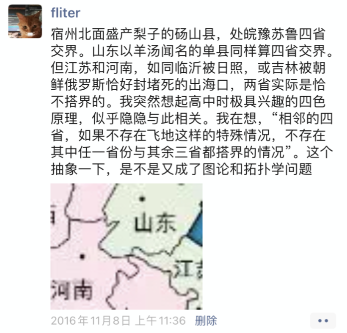
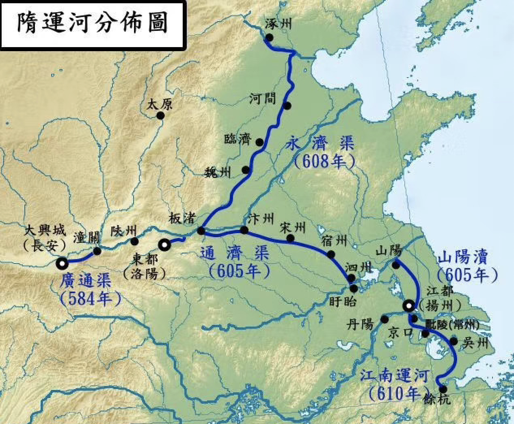
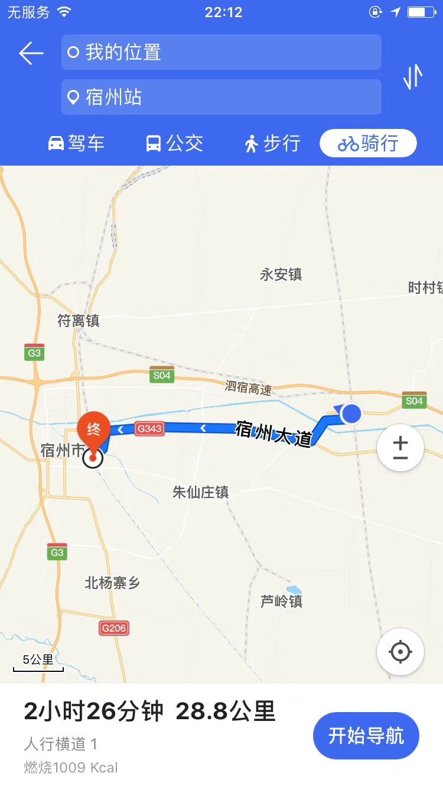
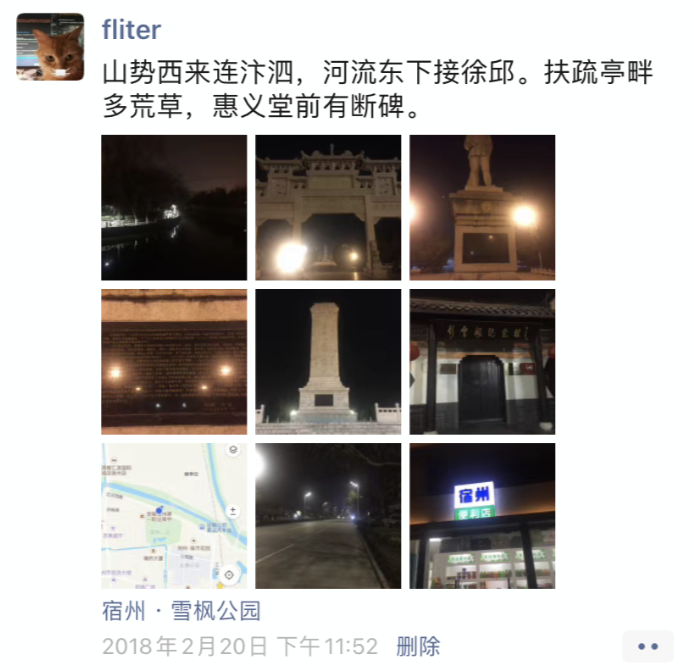
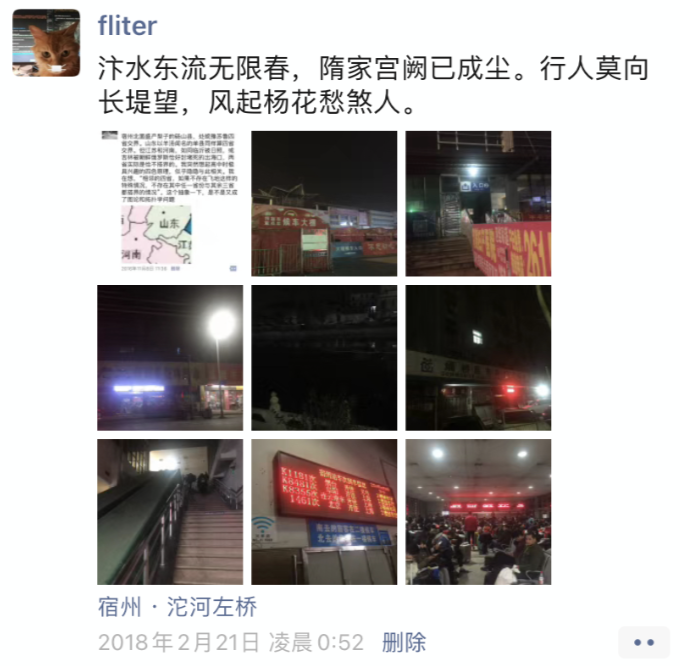
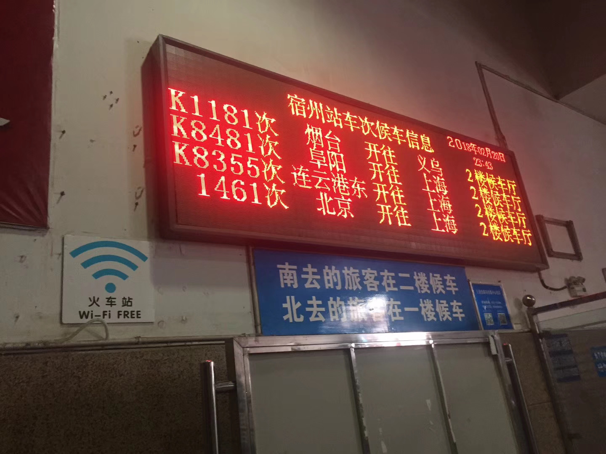
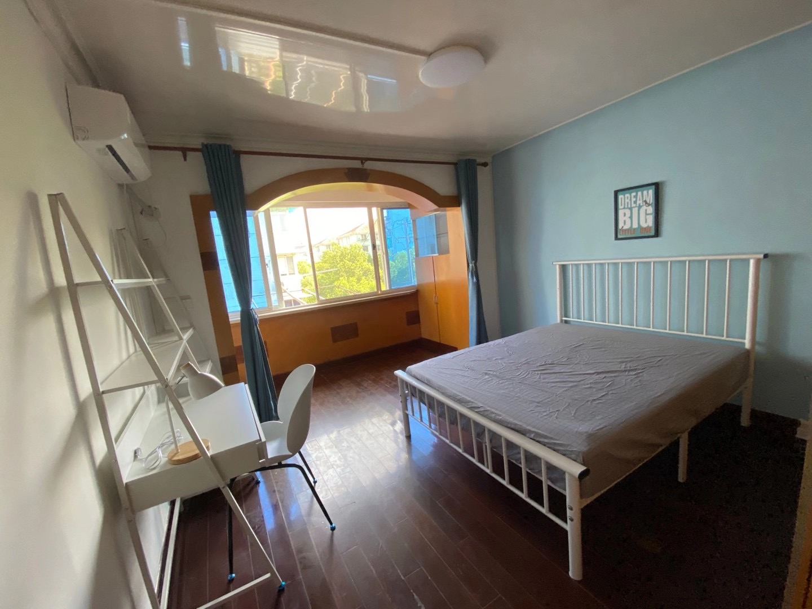
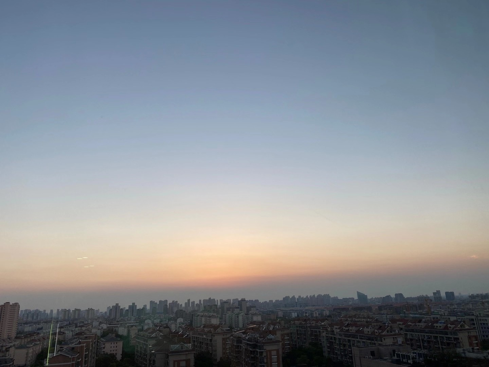

盯着地图看了半天，在天朝实际有这样的情况，但省级行政单位间应该只此一例：甘肃，内蒙，宁夏，陕西四者是任意三者相互交界。这得益于秦陇二省独特的形状

 

---

出生于苏北宿迁，身死于皖北宿州

 

---

大运河改道，洛阳开封宿州，皆是大输家，而山东获益

 

---

 

 

---

 

 

---

 

那年冬，积雪未消，徒步穿城宿州。后来和一相识聊起，值得一去的景点尽数略过。我说在不熟的小城街巷间徘徊走动，看凌晨的早餐店和匆匆而过的行人，也是风景的一种

 

 

---

 

不同于自如每月10%的管理维护费,也有别于链家房东租客各50%的佣金, 巴乐兔,这家房屋中介不对看房的租客收钱,只对房东收取房租价格45%的费用(据我了解  其中11%归公司,34%归个人), 于是很有市场.

带我看房的其中一位,交流中得知当过5年兵,刚刚退伍转业,干这行才几个月...这让我一下肃然起敬又充满好奇,于是交谈许久.

他也养了只猫,小区里捡的,断了尾巴,对枪械已经不感任何兴趣,天天摸习惯了.但我还是忍耐不住, 探讨请教了现役的手枪和步枪.或涉敏感,不做多言.

他96年生人,高中毕业便去从军,自言学习不好,喜欢打游戏.   宿州灵璧人,在海鑫（车晓前夫的企业）所在的运城闻喜县当武警,负责看守大山里的弹药库..不见军人刻板的不苟言笑和拘谨,这兄弟乐天且多言..

非常开心地进行了逾两个小时聊天.  从烈日当空到夕阳西陲他说就喜欢睡觉,在部队很难受,娱乐活动极少,除了站岗训练,其他时间他都躺床上,现在同样如此,晚上打王者荣耀,晚上10点睡,早上10点起.. 在部队站岗是每2个小时一班,一天3次,每隔15分钟可以走动巡视一下.一般义务兵只能做两年,想继续干,除非表现特别好,否则就要xx....见我惊叹,哈哈一笑,说不要把xx想得太高尚,xxxxxx

我问那你呢,他说当时还比较上进,他没xx...为何不继续做下去,而选择转业呢? -不想青春就耗费在大山,攒了些钱就想回去.每月缴满六险二金后到手6000,因为吃喝住宿全无花费,所以可以存住钱,最后退伍时,还有一个19万的转业费. 所以5年他攒了30多万,在同龄人中算是很多的.但问题是转业回到地方后,一切要从头开始..最对口的工作就是保安,或者私人保镖. 但都不喜欢,也可以去本地的公安做民警,编制要考.. 来上海就为赚快钱,做这行每月1万多,做几年就回去了..

但他的战友,很多不能适应这种转变..他在部队是副班长,手底下有10几个人,这样一下子进社会,这种落差很多人都接受不了.班长是92年的,听说这行不错,也想来试试,"但他做不了".  

我疑惑军人毅力应该很不错,怎么会坚持不下去? 他说这个班长比他能吃苦的多,但是不会变通,不灵光,不会说话..."他是真本事升的班长,我是靠吹吹打打做的副班长,大多数人也是靠这"...而后咧嘴一笑.成为排长就是干部了,退伍后地方会安排工作.但需要立功,而和平时期这很困难谈及前几年的一些事端, 他说可以理解.很多人退伍后,马上挥霍了那笔转业费,之后又没有好的谋生手段,于是...

我很遗憾一生中缺失这么一段无法弥补的体验（在研究预备役行不行[捂脸]）,愈发有兴趣.但经他所说,现实和我想象,出入实在略大.想及位高如郭,徐,尚且如此,其下这般也不需啧啧称奇...

最后我问,有没有感觉国家亏欠于你? 他说没有.是他自己选择,而且攒了这么多钱.

但我隐隐感觉,5年最好的时光, 这个薪资和数额,确实不算多..当重新进入社会,能接受挑战和适应转变,还要另作别论.

最后作别，很可能不租而去选公寓，心有愧惭。他倒达观哈哈一笑说正常正常无妨无妨。无以为报，只以脉动两瓶，相约有空再聊。

头前还有一位，是连云港东海县，与我同岁。交谈中向我传授了好些并不逾法又蹊径独辟的生财之道，听得我一惊一愣。…

大热天找房很累，但破圈聊天，这种体验和收获，平时着实难以获得。不能框限于日常几点一线的一亩三分地，更要谨防进入闭目塞听的信息茧房。

渐能理解，风陵渡口的郭襄，兴奋何来。

 

