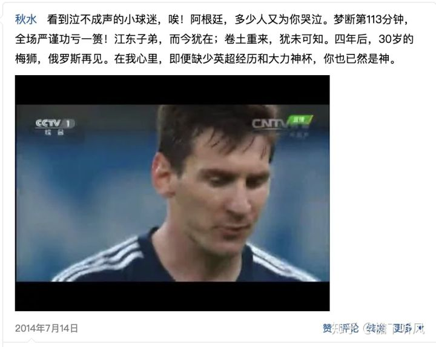

 

梅西C罗,这对过去十年垄断金球的对手,在过去24小时,携手双双出局.

'85前'渐渐离开主流赛事赛场,85后也到职业生涯晚期,

前浪逝去,后浪汹涌,

内马尔,格里兹曼,博格巴,姆巴佩,登贝莱,一批90后甚至95后球员,粉墨登场.

阿根廷的出局,让朋友圈遍野哀鸿,

梅西俱乐部荣誉等身,唯在国家队,缺少一个奖杯.

世事不遂人意者十之八九,作为朋友圈出现频率最高的人,

说无悲无喜显然有所修饰.

但也并不悲恸,

4年前巴西缘锵一球,

便是梅西离大力神杯最近的一刻.

4年后,当年抢走大力神杯的卫冕冠军德国,

没能入围淘汰赛,绝杀的格策则是抱病,莫说没来俄罗斯,俱乐部亦多有坎坷.

四年前他用光了平生所有的运气,像导演伊斯坎布尔奇迹的杰拉德

冯唐易老,

攻击线虽老迈却依旧犀利的阿根廷,

中后场近些年鲜有才俊,

异代不同时,

一代中场大师里克尔梅,

大梅西9岁.

法国(非洲)队实力均衡阵容豪华,

公认的夺冠热门,

单看比分,这场比赛阿根廷比我想象的要体面得多.

败给牌面强一级的法国,且把悬念延续到最后,

阿根廷算是站着倒下.

"梅西是世界第一,受伤的梅西是世界第二",

"梅西这样的球员,就像博尔特和詹姆斯,

是独立于同时代其他球员存在的,能打败他们的,唯有时间".

自古名将如美人，不许人间见白头.

对竞技体育尤是如此.

岂能尽如人愿,但求无愧于心.

梅西有无大力神杯,他的粉丝并不是太care.

只是梅黑会在意.

梅罗临幕,喋喋不休的争吵也会有所消减.

"球王"是有我国特色的称呼和寓意,

而在西方,"球王"仅指贝利,也只是一个称号,

就像"大鲨鱼"专指奥尼尔.

马拉多纳被称"10号",

但他二人在足球史上,就如李杜之于诗歌,

虽然也有诗佛诗豪诗鬼,

但他二人是迥然于这些高一级的存在.

已尽全力,接受天命.

胜利成功自然有狂喜,

但并不总成王败寇,

失败遗憾有时也别有韵味,

刘邦项羽,卫青李广,司马诸葛,

"飞将无时命，庸奴有战勋",

缺憾美,成就了一生未能封侯的李广,

"但使龙城飞将在,不教胡马度阴山",

"林暗草惊风,将军夜引弓",

"君不见沙场征战苦，至今犹忆李将军".

许多年后,面对年轻的球迷,

白发苍苍的鲐背老人,

会颤颤巍巍向儿孙们讲述,

他们年轻时陪伴青春的那个追风少年,

以及这个因为遗憾而永远定格的夏天.

"我给你我的书中所能蕴含的一切悟力，以及我生活中所能有的男子气概和幽默。

我给你一个从未有过信仰的人的忠诚。

我给你我设法保全的我自己的核心——不营字造句，不和梦交易，不被时间、欢乐和逆境触动的核心。

我给你早在你出生前多年的一个傍晚看到的一朵黄玫瑰的记忆。

我给你关于你生命的诠释，关于你自己的理论，你的真实而惊人的存在。

我给你我的寂寞、我的黑暗、我心的饥渴；我试图用困惑、危险、失败来打动你。"

---- "作家们的作家"、阿根廷作家 博尔赫斯

"失败反把失败者变得更崇高了,倒了的波拿巴仿佛比立着的拿破仑还要更高大些。"

----法国作家 维克多·雨果

美洲杯再见!

2018.07.01

清澄秋爽
