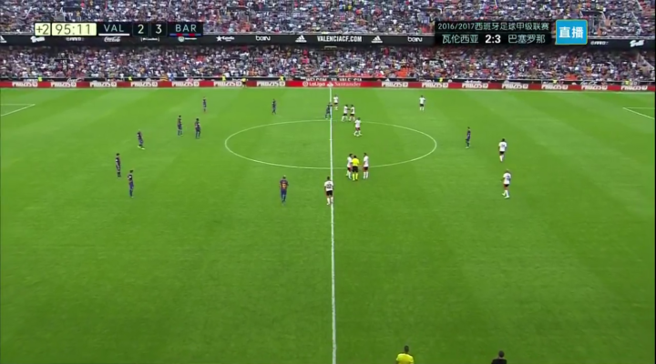

 

这场并不算豪门对决巨星竞技的比赛没成想如此异彩纷呈动人心魄.

刚在欧冠4:0击杀英超榜首曼城的巴萨,兵疲马弊,以残阵对阵江河日下的蝙蝠军团---10多年前,瓦伦西亚尚曾登顶西甲之巅而今风头已然不再.

上半场队魂伊涅斯塔膝盖被撞倒地不起,随后被抬下场,这让无数红蓝球迷眉头紧蹙倍觉不爽:32岁的老白已经年轻不再,每次受伤都可能会让他提前永远离开绿茵场.

随后梅西进球,直至上半场结束形势尚好.

下半场穆尼尔面对旧主取得进球,1:1.

4分钟后,纳尼挑传,罗德里戈跟进左脚凌空打门,比分反超.

这让我心里咯噔一下连连摇头,倘若齐装满员,尤其是要有小白这号中场大脑,剩下30分钟反超尚有可能,可是现在,客场作战,面对攻势如潮的瓦伦西亚,能够扳平比分吗?

6分钟后,巴萨角球机会,作为红蓝军团场上不多的几个高点之一的布教授争顶头球被扑出,苏牙左路爆射进门,2:2扳平.

直至最后伤停补时,双方激烈拼杀但均无斩获.我几乎准备接受平局结果,91分钟50几秒,一次配合,几次前场倒脚,苏牙带球来到禁区被放倒,毫无争议地获得点球...

这最后时刻突如其来的大悬念,让我骨碌一下翻身站起,双手攥拳屏神凝气.欣喜同时又有些忧心忡忡,活脱脱像写<永遇乐 京口北固亭怀古>时的辛弃疾...

我看到梅西站到点球点前,对方门将以扑点球著称,成功率能达42%!

那是短短一刻,但我闪过好多画面,是几个月前欧冠决赛点球点前的格里兹曼,是几个月前百年美洲杯决赛对阵智利面对俱乐部队友布拉沃的梅西,是多年前我第一次看欧冠面对切尔西时的C罗...甚至还有抢七大战最后时刻,轻飘飘一个背传失误而成遗恨的库里...

啊,所幸球进了....当真当是弯臂跃起大啸三声

 

 

是役,多赛一场的巴萨以19分暂时跃居西甲首位,梅西以22球超越萨拉成为对巴伦西亚取得进球最多的球员.射手榜上,本场苏神取得1球梅西收获2球,两人以7球暂居射手榜前二.

这场胜利不易,但希望老白伤情无碍,早日回到赛场.
